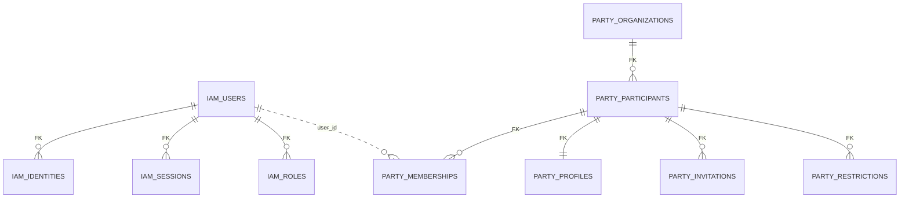
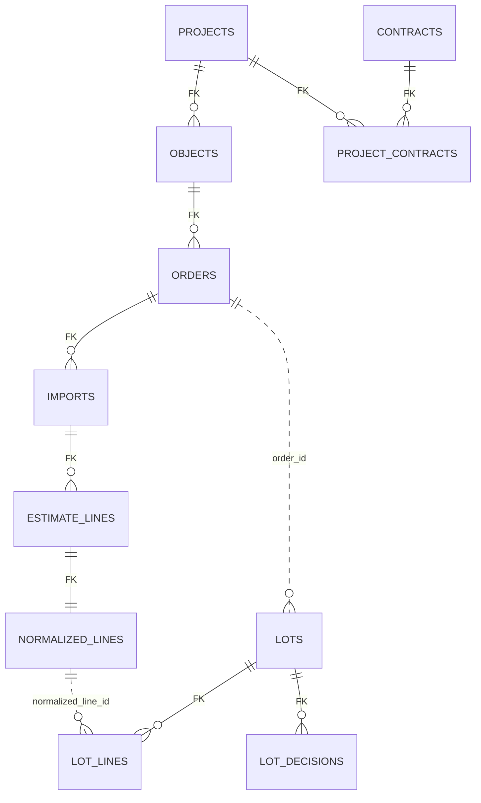
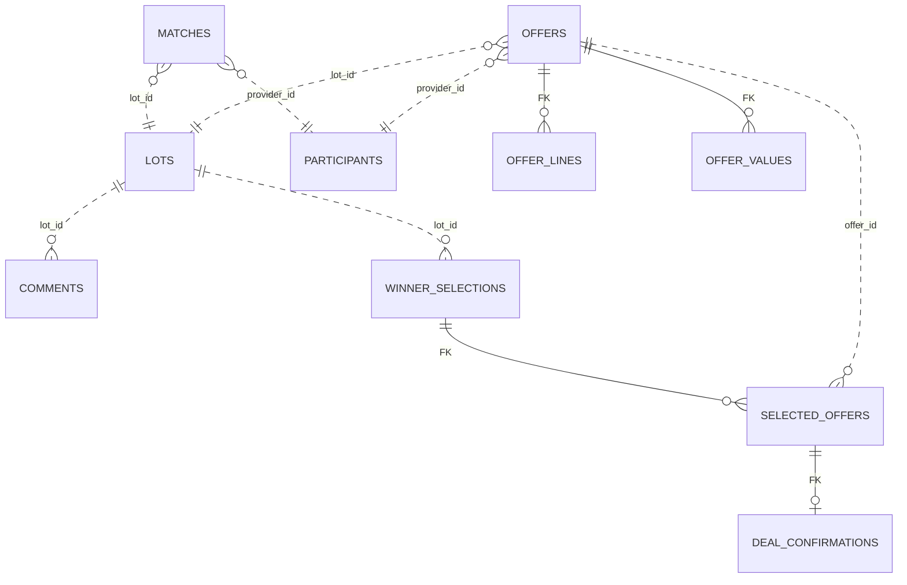
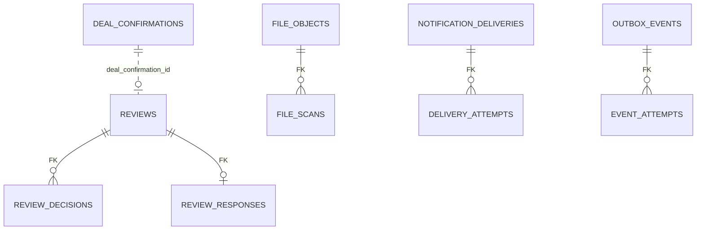

# Логическая модель данных PostgreSQL

Документ детализирует ERD модульного монолита FORUM для MVP 1.0. Он является основой для SQL-миграций и репозиториев на `pg`, но не заменяет исполняемый DDL.

Модель следует [границам модулей и владению данными](./module-boundaries-and-data-ownership.md). Она не содержит заявки на регистрацию, ручного решения по регистрации или статуса верификации: пользователь и участник создаются только после успешной идентификации через Сбер ID или Контур.Диадок.

## 1. Общие правила

- Один кластер PostgreSQL и отдельная схема на модуль. Имя таблицы в SQL всегда квалифицируется схемой.
- Доменные первичные ключи — UUIDv7, создаваемые приложением. Время — `timestamptz` в UTC.
- Денежные значения — `numeric(18,2)`, количества — `numeric(18,3)`. `float` для денег и количества не используется.
- Состояния — `text NOT NULL` с именованным `CHECK`, а не PostgreSQL `ENUM`.
- Внутримодульные связи защищаются внешними ключами. Межмодульная ссылка — UUID без внешнего ключа; существование и доступ проверяются через публичный контракт модуля-владельца.
- Каждый UUID, используемый как связь или фильтр, получает B-tree индекс, если он не является первым столбцом уже существующего индекса.
- `jsonb` применяется только для версионируемых снимков внешних данных, конфигурации шаблонов, исходной структуры импорта и событий. Основные доменные поля не скрываются в JSON.
- Пользователи и участники не удаляются физически. Деактивация и ограничения сохраняют авторство и историю.
- Все изменяемые таблицы имеют `created_at`; таблицы с редактированием — также `updated_at`. Оптимистическая блокировка выполняется полем `version integer NOT NULL DEFAULT 1` там, где возможны конкурентные изменения.
- SQL выполняется параметризованно через `pg`. Межмодульные транзакции открывает прикладной координатор и передаёт один `PoolClient` публичным командам модулей.

## 2. Схемы и владельцы

| Схема | Модуль | Источник истины |
| --- | --- | --- |
| `iam` | Доступ | пользователи, внешние идентичности, локальные учётные данные команды платформы, сессии, роли |
| `party` | Участники и организации | организации, участники, членства, приглашения, профили, ограничения |
| `reference` | Справочники | категории, регионы, единицы измерения, требования, шаблоны и причины решений |
| `estimate` | Проекты и сметы | проекты, объекты, первичные контракты, заказы, импортированные и нормализованные строки |
| `lot` | Лоты и модерация | предложения группировки, лоты, строки, раскрытие, вложения и решения модерации |
| `matching` | Подбор исполнителей | соответствие лота исполнителю и исключения |
| `offer` | Предложения и комментарии | финальные предложения, значения шаблона, покрытие строк, вложения и обсуждение лота |
| `deal` | Выбор победителя | выбор, выбранные предложения, раскрытие контактов, пакет и подтверждение сделки |
| `reputation` | Отзывы и предпочтения | отзывы, ответы, избранные и заблокированные исполнители |
| `file` | Файлы | объект S3 и результаты проверок |
| `notification` | Уведомления | настройки каналов, доставки и попытки |
| `audit` | Аудит | неизменяемые события аудита |
| `analytics` | Аналитика | перестраиваемые операционные проекции и снимки метрик |
| `integration` | Интеграционная доставка | outbox, обработанные события и попытки публикации |

Служебные таблицы pg-boss размещаются в отдельной инфраструктурной схеме `pgboss`. Они не являются доменной моделью и доступны только адаптеру `JobQueue`.

## 3. Компактная ERD

Диаграммы показывают ключевые связи. `FK` означает ограничение внутри одной схемы; пунктирная межсхемная связь в логической модели реализуется UUID без PostgreSQL FK.

### 3.1 Доступ и участники



### 3.2 Проекты, сметы и лоты



### 3.3 Подбор, предложения и сделка



### 3.4 Репутация и инфраструктура



## 4. Таблицы по модулям

В перечне указаны ключевые поля и ограничения. Технические поля времени и версии подразумеваются по правилам раздела 1.

### 4.1 `iam` — доступ

| Таблица | Ключевые поля и ограничения |
| --- | --- |
| `users` | `id`; `email citext UNIQUE`; `email_confirmed_at`; `display_name`; `status CHECK (active, deactivated)` |
| `external_identities` | `id`; `user_id FK`; `provider CHECK (sber_id, kontur_diadoc)`; `subject`; `claims_snapshot jsonb`; `last_authenticated_at`; `UNIQUE (provider, subject)` |
| `email_confirmation_tokens` | `id`; `user_id FK`; `token_hash UNIQUE`; `expires_at`; `consumed_at`; один активный токен на пользователя |
| `local_credentials` | `user_id PK/FK`; `password_hash`; `password_changed_at`; допускается только для вручную созданных аккаунтов команды платформы |
| `credential_reset_tokens` | `id`; `user_id FK`; `token_hash UNIQUE`; `expires_at`; `consumed_at`; только для пользователя с `local_credentials` |
| `sessions` | `id`; `user_id FK`; `refresh_token_hash`; `expires_at`; `revoked_at`; `ip_hash`; `user_agent`; индекс активных сессий `(user_id, expires_at) WHERE revoked_at IS NULL` |
| `role_assignments` | `id`; `user_id FK`; `scope_type CHECK (platform, participant)`; `scope_id`; `role CHECK (administrator, moderator, customer, customer_org_admin, provider, provider_org_admin)`; частичные уникальные индексы `(user_id, role)` для platform scope и `(user_id, scope_id, role)` для participant scope |

У пользователя-участника должна быть хотя бы одна внешняя идентичность. Успешный callback внешнего провайдера создаёт `users`, `external_identities`, роль, данные участника и outbox в одной транзакции. Отдельных полей `verification_status`, `verified_by` и `verification_decision` нет.

Подтверждение email является отдельным условием допуска к прикладным сценариям и не является верификацией участника. Если внешний провайдер передал подтверждённый email, `email_confirmed_at` можно заполнить из доверенного claim; иначе используется одноразовый токен.

### 4.2 `party` — участники и организации

| Таблица | Ключевые поля и ограничения |
| --- | --- |
| `organizations` | `id`; `legal_name`; `inn`; `kpp`; `ogrn`; `legal_form`; `region_id`; `diadoc_box_id`; `UNIQUE (diadoc_box_id)`; индекс `(inn, kpp)` |
| `participants` | `id`; `kind CHECK (organization, individual)`; `role CHECK (customer, provider)`; `legal_status CHECK (legal_entity, individual_entrepreneur, individual_person)`; `organization_id FK NULL`; `individual_user_id NULL`; `status CHECK (active, restricted, deactivated)`; взаимоисключающий `CHECK` для организации и физлица; `CHECK` разрешает физлицу только роль `provider`; `UNIQUE (organization_id, role)` и `UNIQUE (individual_user_id)` |
| `memberships` | `id`; `participant_id FK`; `user_id`; `membership_role CHECK (member, organization_admin)`; `status CHECK (active, deactivated)`; `deactivated_at`; `UNIQUE (participant_id, user_id)` |
| `invitations` | `id`; `participant_id FK`; `email citext`; `invited_by_user_id`; `token_hash`; `expires_at`; `accepted_at`; `cancelled_at`; один активный инвайт на `(participant_id, lower(email))` |
| `participant_profiles` | `participant_id PK/FK`; контактные данные; `region_id`; `experience_text`; `work_geography`; `profile_completed_at` |
| `offer_profiles` | `id`; `participant_id FK`; `request_type CHECK (material, service, equipment_rental, leasing, crew)`; `category_id`; `region_id`; `service_radius_km`; `available`; индексы для подбора по категории, региону и доступности |
| `assigned_workers` | `id`; `participant_id FK`; `full_name`; `specialization`; `description`; `active` |
| `profile_documents` | `id`; `participant_id FK`; `file_id`; `document_requirement_id`; `valid_until`; `status CHECK (active, expired, revoked)` |
| `participant_restrictions` | `id`; `participant_id FK`; `reason_id`; `comment`; `imposed_by_user_id`; `starts_at`; `ends_at`; `lifted_at`; индекс активных ограничений |
| `administrator_change_requests` | `id`; `participant_id FK`; `requested_by_user_id`; `proposed_user_id`; `status CHECK (pending, approved, rejected, cancelled)`; `decided_by_user_id`; `decision_comment` |

`user_id`, `individual_user_id`, `region_id`, `category_id`, `file_id`, `reason_id` и `document_requirement_id` являются межмодульными ссылками без FK. Смена администратора организации остаётся модерируемым служебным процессом и не является модерацией регистрации участника.

### 4.3 `reference` — справочники

| Таблица | Ключевые поля и ограничения |
| --- | --- |
| `categories` | `id`; `parent_id FK NULL`; `code UNIQUE`; `name`; `request_type`; `active`; индекс дерева `(parent_id, active)` |
| `regions` | `id`; `parent_id FK NULL`; `code UNIQUE`; `name`; `active` |
| `units` | `id`; `code UNIQUE`; `name`; `symbol`; `active` |
| `document_requirements` | `id`; `category_id FK`; `legal_status`; `name`; `required`; `active` |
| `offer_templates` | `id`; `category_id FK`; `version`; `status CHECK (draft, active, archived)`; `activated_at`; `UNIQUE (category_id, version)` |
| `offer_template_fields` | `id`; `template_id FK`; `code`; `label`; `field_type`; `required`; `position`; `validation jsonb`; `UNIQUE (template_id, code)` |
| `moderation_reasons` | `id`; `content_type CHECK (lot, review, review_response)`; `code`; `name`; `active`; `UNIQUE (content_type, code)` |
| `restriction_reasons` | `id`; `code UNIQUE`; `name`; `active` |

Изменение активного шаблона не меняет уже отправленные предложения: `offer.offers` хранит конкретные `template_id` и `template_version`, а значения полей — снимок отправленного ответа.

### 4.4 `estimate` — проекты и сметы

| Таблица | Ключевые поля и ограничения |
| --- | --- |
| `projects` | `id`; `customer_id`; `name`; `description`; `status CHECK (active, archived)`; индекс `(customer_id, status, updated_at DESC)` |
| `primary_contracts` | `id`; `customer_id`; `number`; `name`; `contract_date`; `customer_reference`; `UNIQUE (customer_id, number)` |
| `project_contracts` | `project_id FK`; `contract_id FK`; составной PK |
| `construction_objects` | `id`; `project_id FK`; `name`; `address`; `region_id`; `description`; индекс `(project_id, created_at)` |
| `construction_orders` | `id`; `object_id FK`; `name`; `status CHECK (draft, importing, ready, needs_clarification, archived)`; индекс `(object_id, status, updated_at DESC)` |
| `imported_estimates` | `id`; `order_id FK`; `source_file_id`; `import_status CHECK (queued, processing, completed, failed)`; `source_structure jsonb`; `idempotency_key`; `error_summary`; `UNIQUE (order_id, idempotency_key)` |
| `estimate_lines` | `id`; `import_id FK`; `source_sheet`; `source_row`; `source_values jsonb`; `description`; `quantity`; `unit_text`; `UNIQUE (import_id, source_sheet, source_row)` |
| `normalized_estimate_lines` | `id`; `estimate_line_id FK UNIQUE`; `request_type`; `category_id`; `unit_id`; `quantity`; `region_id`; `needed_from`; `needed_to`; `requirements`; `normalization_status CHECK (normalized, ambiguous, clarified, excluded)`; `clarified_by_user_id`; индекс `(normalization_status, category_id)` |

Импорт сохраняет исходный файл в `file.file_objects` и исходную структуру строк. Повтор worker-задачи безопасен благодаря `idempotency_key` и уникальности координат исходной строки.

### 4.5 `lot` — лоты и модерация контента

| Таблица | Ключевые поля и ограничения |
| --- | --- |
| `lot_suggestions` | `id`; `order_id`; `status CHECK (proposed, accepted, rejected)`; `rule_version`; `created_by_user_id` |
| `lot_suggestion_lines` | `suggestion_id FK`; `normalized_line_id`; `quantity`; составной PK |
| `lots` | `id`; `order_id`; `customer_id`; `suggestion_id FK NULL`; `title`; `request_type`; `category_id`; `region_id`; `status`; `partial_fulfillment`; `offer_deadline`; `published_at`; `collection_closed_at`; `version`; индексы клиента и открытых лотов |
| `lot_lines` | `id`; `lot_id FK`; `normalized_line_id`; `description_snapshot`; `quantity`; `unit_id`; `requirements_snapshot`; `position`; `UNIQUE (lot_id, normalized_line_id)` |
| `lot_disclosures` | `lot_id PK/FK`; явные поля раскрытия проекта, объекта и заказа; `disclosure_version`; без неявного доступа к исходным сущностям |
| `lot_attachments` | `id`; `lot_id FK`; `file_id`; `kind`; `position`; `UNIQUE (lot_id, file_id)` |
| `lot_moderation_decisions` | `id`; `lot_id FK`; `revision`; `decision CHECK (published, rejected)`; `reason_id`; `comment`; `moderator_user_id`; `created_at`; `UNIQUE (lot_id, revision)` |

Ограничение состояния `lots.status`:

```sql
CHECK (status IN (
  'draft', 'in_moderation', 'published', 'collecting_offers',
  'offer_collection_closed', 'winner_chosen', 'completed',
  'rejected_by_moderator', 'withdrawn', 'offer_deadline_expired'
))
```

Основные индексы:

- `(customer_id, status, updated_at DESC)` для кабинета заказчика;
- `(status, offer_deadline) WHERE status IN ('published', 'collecting_offers')` для закрытия по дедлайну;
- `(category_id, region_id, request_type, offer_deadline) WHERE status IN ('published', 'collecting_offers')` для подбора;
- `(order_id, created_at)` для навигации из заказа.

Только `normalized` или `clarified` строки могут попасть в `lot_lines`; это правило проверяет команда создания лота через публичный запрос модуля смет. Публикация лота и `LotPublished` записываются в одной транзакции.

### 4.6 `matching` — подбор исполнителей

| Таблица | Ключевые поля и ограничения |
| --- | --- |
| `lot_provider_matches` | `id`; `lot_id`; `provider_id`; `rule_version`; `matched_at`; `visible`; `revoked_at`; `reason_snapshot jsonb`; `UNIQUE (lot_id, provider_id)` |
| `match_exclusions` | `id`; `lot_id`; `provider_id`; `reason CHECK (customer_block, participant_restriction, profile_mismatch, missing_document, unavailable)`; `active`; `created_at`; уникальный активный индекс `(lot_id, provider_id, reason) WHERE active` |

Основной индекс видимых лотов исполнителя: `(provider_id, matched_at DESC, lot_id) WHERE visible AND revoked_at IS NULL`. Избранное не создаёт match и не обходит правила соответствия; блокировка заказчиком исключает только будущую видимость.

### 4.7 `offer` — предложения и комментарии

| Таблица | Ключевые поля и ограничения |
| --- | --- |
| `offers` | `id`; `lot_id`; `provider_id`; `submitted_by_user_id`; `template_id`; `template_version`; `total_amount numeric(18,2)`; `currency char(3) DEFAULT 'RUB'`; `delivery_or_work_days`; `conditions`; `submitted_at`; `UNIQUE (lot_id, provider_id)` |
| `offer_line_items` | `id`; `offer_id FK`; `lot_line_id`; `quantity`; `amount`; `conditions`; `UNIQUE (offer_id, lot_line_id)` |
| `offer_values` | `id`; `offer_id FK`; `field_code`; типизированные `value_text`, `value_number`, `value_boolean`, `value_date`, `value_json`; `CHECK` допускает ровно одно значение; `UNIQUE (offer_id, field_code)` |
| `offer_attachments` | `id`; `offer_id FK`; `file_id`; `kind`; `UNIQUE (offer_id, file_id)` |
| `lot_comments` | `id`; `lot_id`; `provider_id`; `author_user_id`; `author_side CHECK (customer, provider)`; `parent_id FK NULL`; `body`; `comment_type CHECK (question, answer, offer_clarification)`; `created_at` |
| `lot_clarifications` | `id`; `lot_id`; `author_user_id`; `body`; `created_at` |

У `offers` нет `status`, `draft`, `updated_at` и `withdrawn_at`: запись создаётся только при финальной отправке и не редактируется. Уникальность `(lot_id, provider_id)` гарантирует одно предложение исполнителя на лот. При `partial_fulfillment = false` сумма количеств `offer_line_items` должна полностью покрывать строки лота; это транзакционный инвариант команды отправки.

Индекс `(lot_id, submitted_at DESC)` поддерживает основной порядок предложений. Для комментариев используются `(lot_id, provider_id, created_at)` и `(lot_id, created_at)`; API исполнителя всегда добавляет фильтр `provider_id`, поэтому вопросы других исполнителей ему не видны.

### 4.8 `deal` — выбор победителя и пакет сделки

| Таблица | Ключевые поля и ограничения |
| --- | --- |
| `winner_selections` | `id`; `lot_id`; `customer_id`; `selected_by_user_id`; `selected_at`; `comment`; `UNIQUE (lot_id)` |
| `selected_offers` | `id`; `selection_id FK`; `offer_id`; `provider_id`; `final_amount`; `final_conditions`; `UNIQUE (selection_id, offer_id)` |
| `selected_offer_lines` | `selected_offer_id FK`; `lot_line_id`; `quantity`; составной PK; обеспечивает непересекающееся покрытие при частичном исполнении |
| `contact_disclosures` | `id`; `lot_id`; `viewer_participant_id`; `subject_participant_id`; `reason CHECK (customer_selected_provider, customer_all_respondents)`; `disclosed_at`; `UNIQUE (lot_id, viewer_participant_id, subject_participant_id, reason)` |
| `deal_packages` | `id`; `selection_id FK UNIQUE`; `snapshot jsonb`; `generated_file_id`; `generated_at`; `version` |
| `deal_confirmations` | `id`; `selected_offer_id FK UNIQUE`; `confirmed_by_user_id`; `confirmed_at`; `note` |

Выбор победителей, закрытие сбора предложений, создание выбранных предложений, записей раскрытия контактов и `WinnersSelected` выполняются одной транзакцией координатора. Заказчик после выбора видит контакты всех откликнувшихся исполнителей; только выбранные исполнители видят контакты заказчика; исполнители не получают контакты друг друга.

### 4.9 `reputation` — отзывы и предпочтения

| Таблица | Ключевые поля и ограничения |
| --- | --- |
| `reviews` | `id`; `deal_confirmation_id`; `customer_id`; `provider_id`; `lot_id`; `category_id`; `score CHECK (score BETWEEN 1 AND 10)`; `body`; `status CHECK (in_moderation, published, rejected)`; `published_at`; `UNIQUE (deal_confirmation_id)` |
| `review_moderation_decisions` | `id`; `review_id FK`; `revision`; `decision CHECK (published, rejected)`; `reason_id`; `comment`; `moderator_user_id`; `UNIQUE (review_id, revision)` |
| `review_responses` | `id`; `review_id FK UNIQUE`; `provider_id`; `author_user_id`; `body`; `status CHECK (in_moderation, published, rejected)`; `published_at` |
| `review_response_decisions` | `id`; `response_id FK`; `revision`; `decision CHECK (published, rejected)`; `reason_id`; `comment`; `moderator_user_id`; `UNIQUE (response_id, revision)` |
| `favorite_providers` | `customer_id`; `provider_id`; `created_by_user_id`; `created_at`; составной PK |
| `provider_blocks` | `customer_id`; `provider_id`; `created_by_user_id`; `created_at`; `removed_at`; уникальный активный индекс `(customer_id, provider_id) WHERE removed_at IS NULL` |

Отзыв создаётся только для существующего `deal_confirmation_id`. Категория, заказчик, исполнитель и лот копируются как неизменяемый снимок для истории и быстрых выборок. Публикация остаётся отдельной модерацией контента и не связана с регистрацией участника.

### 4.10 `file` — AWS S3

| Таблица | Ключевые поля и ограничения |
| --- | --- |
| `file_objects` | `id`; `bucket`; `object_key`; `original_name`; `content_type`; `size_bytes`; `checksum_sha256`; `status CHECK (pending_upload, quarantined, available, rejected)`; `created_by_user_id`; `uploaded_at`; `available_at`; `rejected_at`; `UNIQUE (bucket, object_key)` |
| `file_scan_results` | `id`; `file_id FK`; `scanner`; `scanner_version`; `result CHECK (clean, infected, error)`; `details jsonb`; `scanned_at`; индекс `(file_id, scanned_at DESC)` |

Связь файла с доменной сущностью хранится у доменного владельца: например, `lot.lot_attachments`, `offer.offer_attachments`, `party.profile_documents`, `estimate.imported_estimates.source_file_id`. Полиморфной таблицы `file_links` нет. Размер одного файла ограничивается 25 МБ, совокупный размер вложений лота или предложения — 200 МБ; лимит проверяется до выдачи presigned URL и повторно при завершении загрузки.

### 4.11 `notification` — уведомления

| Таблица | Ключевые поля и ограничения |
| --- | --- |
| `notification_settings` | `id`; `participant_id`; `user_id NULL`; `event_type`; `channel CHECK (email, telegram, max)`; `enabled`; `destination_ref`; отдельные частичные уникальные индексы для настроек участника и пользователя |
| `notification_deliveries` | `id`; `event_id`; `participant_id`; `user_id NULL`; `channel`; `template_code`; `payload jsonb`; `status CHECK (pending, processing, delivered, failed, cancelled)`; `available_at`; `delivered_at`; `idempotency_key UNIQUE` |
| `delivery_attempts` | `id`; `delivery_id FK`; `attempt_no`; `started_at`; `finished_at`; `outcome`; `provider_message_id`; `error_code`; `UNIQUE (delivery_id, attempt_no)` |

Индекс worker: `(available_at, id) WHERE status IN ('pending', 'failed')`. Настройки относятся только к внешним каналам: внутренний центр уведомлений в MVP не создаётся.

### 4.12 `audit`, `analytics`, `integration`

| Таблица | Ключевые поля и ограничения |
| --- | --- |
| `audit.audit_events` | `id`; `occurred_at`; `actor_user_id`; `actor_participant_id`; `action`; `entity_type`; `entity_id`; `correlation_id`; `ip_hash`; `data jsonb`; индексы `(entity_type, entity_id, occurred_at DESC)`, `(actor_user_id, occurred_at DESC)`, `(correlation_id)` |
| `analytics.operational_projections` | `projection_name`; `scope_type`; `scope_id`; `data jsonb`; `source_position`; `updated_at`; составной PK; данные можно полностью перестроить из доменных событий |
| `analytics.metric_snapshots` | `id`; `metric_code`; `scope_type`; `scope_id`; `period_start`; `period_end`; `value numeric`; `dimensions jsonb`; уникальность метрики, области и периода |
| `integration.outbox_events` | `sequence bigint GENERATED ALWAYS AS IDENTITY`; `event_id UUID UNIQUE`; `aggregate_type`; `aggregate_id`; `event_type`; `schema_version`; `occurred_at`; `correlation_id`; `payload jsonb`; `available_at`; `published_at`; `last_error` |
| `integration.processed_events` | `consumer`; `event_id`; `processed_at`; составной PK для идемпотентности обработчиков |
| `integration.event_delivery_attempts` | `id`; `event_id`; `adapter`; `attempt_no`; `started_at`; `finished_at`; `outcome`; `error_code`; `UNIQUE (event_id, adapter, attempt_no)` |

Outbox worker выбирает записи по частичному индексу `(available_at, sequence) WHERE published_at IS NULL` с `FOR UPDATE SKIP LOCKED`. Событие считается доставленным после подтверждения текущего адаптера. Семантика остаётся at-least-once при локальной доставке и после перехода на Kafka.

Аудит append-only: прикладная роль имеет только `INSERT` и разрешённые `SELECT`, без `UPDATE` и `DELETE`. На объёме до 1000 пользователей начальное партиционирование не требуется; его вводят только по измеренным объёму и планам запросов.

## 5. Транзакционные границы

| Сценарий | Одна транзакция |
| --- | --- |
| Регистрация после Сбер ID / Диадок | `iam.users`, внешняя идентичность, роль, `party`-участник/организация/членство, `ParticipantRegistered` в outbox |
| Импорт сметы | создание записи импорта и задания; каждый идемпотентный пакет распознанных строк фиксируется атомарно |
| Отправка лота на модерацию | проверка полноты, перевод состояния, снимок раскрытия, `LotSubmittedForModeration` |
| Публикация или отклонение лота | решение модератора, состояние лота, соответствующее доменное событие |
| Отправка предложения | проверка match и дедлайна, `offers`, значения, строки, вложения, `OfferSubmitted` |
| Выбор победителей | выбор, покрытие строк, закрытие лота, раскрытие контактов, пакет сделки, `WinnersSelected` |
| Подтверждение сделки | `deal_confirmations`, состояние лота при выполнении условий, `DealConfirmed` |
| Публикация отзыва | решение модератора, состояние, `ReviewPublished` |

AWS S3, внешняя идентификация, email, мессенджеры и будущая Kafka не участвуют в транзакции PostgreSQL. Их вызовы выполняются до команды как подтверждённый вход либо после commit через outbox/job с идемпотентным ключом.

## 6. Контроль доступа к данным

- Каждый репозиторий получает `participantId`, `userId` и разрешённую область из прикладного сценария; доверять идентификатору из URL без серверной авторизации нельзя.
- Запросы заказчика фильтруют данные по `customer_id`; запросы исполнителя к лотам — через активный `lot_provider_matches`.
- Контакты читаются только через `DealEligibility` и существующую `contact_disclosures`.
- Исходная смета и данные проекта никогда не выдаются исполнителю по одному `lot_id`; API читает снимок `lot_disclosures` и данные лота.
- Доступ к S3 выдаётся только для `file_objects.status = 'available'` после проверки доменного владельца связи.
- Поля внешнего провайдера и персональные данные сохраняются минимально; токены Сбер ID и Диадок в БД не сохраняются.

## 7. Порядок реализации миграций

1. Базовые расширения (`citext`), схемы и роли БД.
2. `iam`, `party`, `reference` и `integration` как основа регистрации и событий.
3. `file`, затем `estimate` и `lot`.
4. `matching`, `offer`, `deal` и `reputation`.
5. `notification`, `audit`, `analytics` и инфраструктурная схема pg-boss.

Каждая миграция имеет прямой и обратный сценарий для структурных изменений. Индексы на заполненных больших таблицах в промышленной среде создаются `CONCURRENTLY` отдельной нетранзакционной миграцией. Начальные миграции пустой БД могут создавать индексы обычным способом.

## 8. Следующий артефакт

После утверждения модели следует описать публичные REST-контракты и каталог доменных событий: команды, ответы, ошибки, версии payload и правила идемпотентности. Затем таблицы переводятся в исполняемые SQL-миграции по вертикальным срезам MVP.

Требование синхронизировано с ТЗ: участники входят и восстанавливают доступ только через Сбер ID или Контур.Диадок. Локальный пароль и его восстановление доступны только вручную созданным аккаунтам команды платформы.
