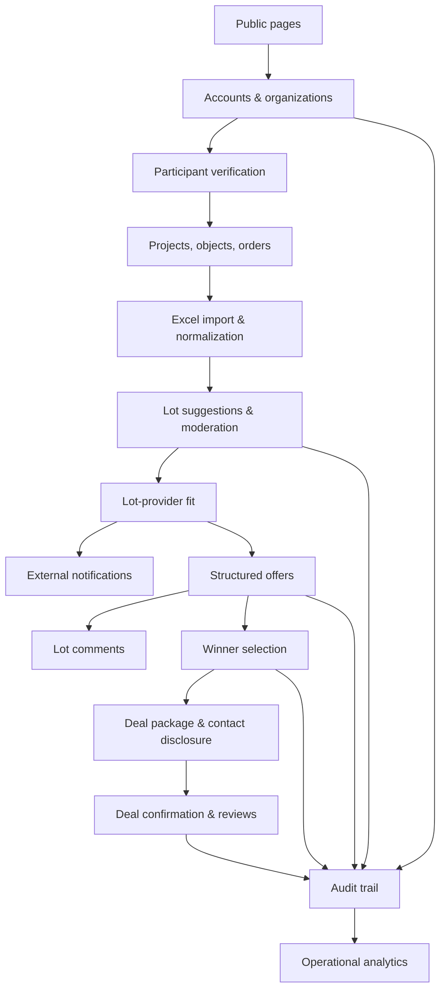
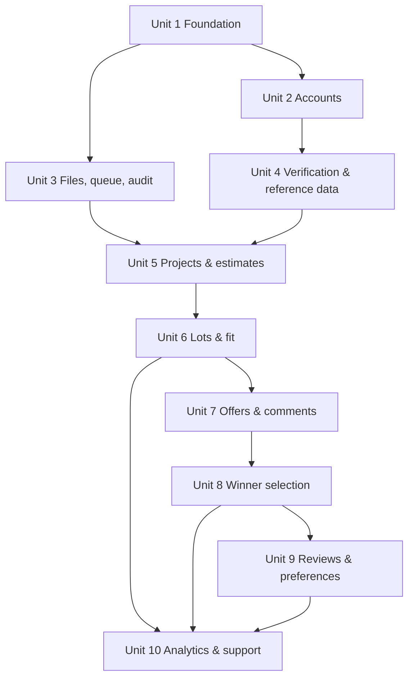

# feat: Создать MVP платформы распределения строительных заказов

## Обзор

Создать первую версию модерируемой B2B-платформы распределения строительных заказов, описанной в `docs/product/M00-product-index.md` и связанных модульных документах.

Рекомендуемая форма реализации — модульный монолит на TypeScript: одно приложение Next.js App Router с доменными модулями в `src/modules`, PostgreSQL как источником истины, миграциями Prisma, S3-совместимым хранилищем вложений и фоновым worker на Redis для импорта и уведомлений. Такой подход проще в эксплуатации, чем микросервисы, и при этом сохраняет чёткие границы модулей.

## Контекст задачи

Малым и средним строительным компаниям, которые исполняют государственные или крупные корпоративные контракты, нужен надёжный способ превращать строительные сметы в модерируемые лоты, показывать их только подходящим проверенным исполнителям, собирать структурированные предложения, выбирать одного или нескольких победителей, раскрывать контакты и сохранять достаточную историю аудита для чувствительного к доверию B2B-процесса.

В MVP продукт намеренно не становится публичным маркетплейсом, платформой исполнения договоров, системой ЭДО, платежной системой или публичным каталогом исполнителей. Эти исключения — часть продуктовой формы, а не упущения.

## Трассировка требований

- R1. Поддержать раздельную регистрацию заказчика и исполнителя, подтверждение email, восстановление пароля, пользователей организаций, администраторов организаций, приглашение и деактивацию пользователей.
- R2. Поддержать ручную проверку заказчиков и исполнителей модератором до доступа к ключевым функциям.
- R3. Поддержать проекты, строительные объекты, заказы-сметы, импорт Excel, сохранение исходной сметы, нормализованные строки, обработку неоднозначных строк и предложения лотов.
- R4. Поддержать жизненный цикл лота, определяемый платформой минимальный объём раскрытия, редактирование заказчиком, проверку модератором, причины отклонения, публикацию, снятие, истечение дедлайна, закрытие сбора предложений и доработку лота без предложений.
- R5. Показывать исполнителям только видимые лоты, определённые сопоставлением лота и исполнителя; учитывать профиль предложений, регион или радиус работ, правовой статус, обязательные документы, доступность и блокировки конкретным заказчиком.
- R6. Поддержать одно финальное структурированное предложение от исполнителя на лот, шаблоны по категориям, вложения, сортировку по дате отправки, экспорт предложений в Excel и отсутствие черновиков, редактирования, отзыва и повторной отправки.
- R7. Поддержать комментарии к лоту, приватные вопросы исполнителя, ответы заказчика, общие уточнения заказчика и ограничение доступа к контактам до выбора победителя.
- R8. Поддержать выбор одного или нескольких победителей, частичное исполнение при разрешении заказчика, правила раскрытия контактов и формирование пакета сделки без договоров, ЭДО и платежей.
- R9. Поддержать отзывы после выбора победителя только после подтверждения заказчиком состоявшейся сделки, оценку от 1 до 10, модерацию и один модерируемый ответ исполнителя.
- R10. Поддержать избранных и заблокированных исполнителей для конкретного заказчика; избранное — только визуальная метка, а заблокированные исполнители не видят будущие лоты этого заказчика.
- R11. Поддержать внешние уведомления через выбранные пользователем email, Telegram и MAX; внутреннего центра уведомлений в MVP нет.
- R12. Поддержать аналитику заказчика, исполнителя, модератора и администратора платформы, описанную в продуктовой документации, а также экспорт предложений.
- R13. Поддержать справочники платформы, шаблоны предложений, причины отклонения, аудит, форму обращения в поддержку, публичные страницы, русскоязычный адаптивный web-интерфейс и отсутствие публичных каталогов лотов и исполнителей.

## Границы объёма

- Нет ЭДО, подписания договоров, закрывающих документов, платежей, эскроу, комиссий, подписок и транзакционных сборов.
- Нет публичного каталога лотов, публичного каталога исполнителей и учётной записи, одновременно выступающей заказчиком и исполнителем.
- Нет нативных мобильных приложений, многоязычного интерфейса, 2FA, внутреннего центра уведомлений, черновиков предложений, редактирования или отзыва предложений, повторных предложений и умного ранжирования.
- В MVP нет проверки телефона, интеграции с ИНН, полноценного helpdesk, интеграций с 1С, CRM и государственными закупками.

### Отложено в отдельные задачи

- Базовая проверка по ИНН, проверка телефона и полноценный helpdesk остаются верхними задачами бэклога в `docs/backlog.md`.
- Умное ранжирование предложений, ЭДО, исполнение договоров, закрывающие документы, платежи, подписки, транзакционные сборы и расширенная репутация остаются задачами следующих версий в `docs/backlog.md`.
- Выбор production-провайдеров email, размещения Telegram-бота, учётных данных интеграции MAX, поставщика объектного хранилища и среды развёртывания выполняется при настройке реализации.

## Контекст и исследования

### Контекст репозитория

- `docs/product/M00-product-index.md` и связанные модульные документы — источник истины по продукту.
- `CONTEXT.md` определяет язык проекта и должен оставаться согласованным по мере уточнения терминов реализации.
- `docs/product/M03-auth-legal-entities.md` фиксирует ручную проверку участников.
- `docs/product/M09-deal-package.md` фиксирует MVP транзакции на дальнем пакете.
- `docs/product/M05-lot-creation.md` фиксирует раскрытие данных лота, определяемое платформой.
- `docs/product/M00-product-index.md` фиксирует форму модерируемой B2B-платформы.
- `Brandbook/` содержит брендовые материалы для визуальной идентичности после начала разработки UI.
- В репозитории нет кода приложения, AGENTS.md и наработок в `docs/solutions/`.

### Внешние источники

— Маршрутизатор приложений Next.js поддерживает серверные компоненты React и серверные функции, а обработчики маршрутов предоставляют пользователям возможность обработок внутри маршрутов `app`.
- Prisma Migrate хранит изменения схемы БД в контролируемой версиями истории SQL-миграций.
- OWASP рекомендует надёжное хеширование паролей и защитную проверку загрузки файлов: разрешённые расширения, проверку типа не только по client-заголовкам, генерируемые имена файлов, лимиты размера и проверку прав на загрузку.
- BullMQ предоставляет фоновые задачи на Redis, повторы, задержки, планирование и параллелизм worker-процессов.
- Next.js документирует Playwright и Vitest как поддерживаемые инструменты E2E- и unit-тестирования.

## Ключевые технические решения

- **Использовать модульный монолит, а не микросервисы:** продукт един, а доменные границы должны быть сильными; микросервисы добавят операционную сложность до того, как MVP подтвердит рабочие процессы.
- **Использовать Next.js App Router с TypeScript:** единое full-stack web-приложение соответствует адаптивному MVP и объединяет кабинеты, обработчики маршрутов, серверные изменения и API в одном развёртываемом модуле.
- **Использовать PostgreSQL и миграции Prisma:** платформа хранит много состояний и аудита, имеет реляционную модель; история миграций должна версионироваться с первого дня.
- **Использовать собственную аутентификацию по учётным данным с безопасным хешированием и серверными сессиями:** регистрация, модерация, пользователи организаций, приглашения и подтверждение email — ключевые понятия домена, поэтому аутентификацией должно владеть приложение.
- **Использовать S3-совместимое объектное хранилище для вложений:** файлы не должны храниться в Git или БД; метаданные и правила доступа хранятся в PostgreSQL.
- **Использовать BullMQ с Redis для фоновых задач:** импорт смет, доставка уведомлений, генерация экспорта и хуки сканирования вложений не должны блокировать запросы.
- **Реализовать аудит как общий доменный сервис с самого начала:** модерация, выбор победителя, раскрытие контактов, отзывы, деактивация пользователей и ограничения требуют трассируемости.
- **Сохранить русский интерфейс и разделение по ролям:** группы маршрутов и навигация должны разделять публичные, заказчицкие, исполнительские, модераторские и административные поверхности.

## Открытые вопросы

### Решено при планировании

- **Какой стек заложить в план для нового продукта?** Модульный монолит на TypeScript и Next.js с PostgreSQL, Prisma, S3-совместимыми хранилищами, рабочими процессами Redis/BullMQ, Vitest и Playwright.
- **Начинать ли разработку всех модулей одновременно?** Нет. Реализовать зависимые этапы: сначала аккаунты, модерацию и аудит, затем заказы и лоты, далее предложения и выбор победителя, после — репутацию, аналитику и полировку.

### Отложено до реализации

- **Точная целевая среда production-развёртывания:** определить после выбора окружения и хостинга.
- **Точный email-провайдер, настройка Telegram-бота и детали интеграции MAX:** спроектировать адаптеры сейчас, а реальные учётные данные подключить при реализации или развёртывании.
- **Точные эвристики нормализации Excel:** начать с детерминированных правил парсера и ручной обработки неоднозначностей, затем уточнить на реальных сметах.
- **Точный поставщик объектного хранилища и сканирования на вредоносное ПО:** сначала реализовать абстракцию хранилища и проверку файлов, затем подключить провайдера сканирования.

## Структура результата

```text
.
├── package.json
├── next.config.ts
├── tsconfig.json
├── docker-compose.yml
├── .env.example
├── prisma/
│   ├── schema.prisma
│   ├── migrations/
│   └── seed.ts
├── src/
│   ├── app/
│   │   ├── (public)/
│   │   ├── (customer)/
│   │   ├── (provider)/
│   │   ├── (moderator)/
│   │   ├── (admin)/
│   │   └── api/
│   ├── modules/
│   │   ├── accounts/
│   │   ├── verification/
│   │   ├── reference-data/
│   │   ├── projects/
│   │   ├── estimates/
│   │   ├── lots/
│   │   ├── offers/
│   │   ├── comments/
│   │   ├── winner-selection/
│   │   ├── reviews/
│   │   ├── notifications/
│   │   ├── files/
│   │   ├── analytics/
│   │   ├── support/
│   │   └── audit/
│   ├── workers/
│   └── shared/
├── tests/
│   ├── unit/
│   ├── integration/
│   └── e2e/
└── docs/
    └── plans/
```

Это ориентир по структуре. Исполнитель может скорректировать имена файлов под конвенции выбранного фреймворка, но должен сохранить границы модулей.

## Высокоуровневый технический дизайн

> *Схема показывает целевой подход и служит ориентиром для проверки, а не спецификацией для дословного воспроизведения. Исполнитель использует её как контекст, а не как код.*



### Матрица доступа и видимости

Эта матрица — контракт уровня планирования для серверной авторизации. Маршрутизация UI должна её отражать, но обработчики маршрутов и серверные действия обязаны применять её независимо.

| Поверхность | Заказчик | Исполнитель | Модератор | Администратор |
|---|---|---|---|---|
| Публичные страницы | Чтение | Чтение | Чтение | Чтение |
| Проекты, объекты и заказы заказчика | Только своя организация | Нет доступа | Только контекст модерации/поддержки | Только контекст аудита/поддержки |
| Черновик лота до публикации | Только своя организация | Нет доступа | Очередь проверки после отправки | Только контекст аудита/поддержки |
| Опубликованный лот | Только своя организация | Только при видимости через сопоставление | Доступ для проверки/аудита | Только контекст аудита/поддержки |
| Предложение исполнителя | Только лот своего заказчика | Только собственное предложение | Контекст проверки/аудита | Только контекст аудита/поддержки |
| Комментарии к лоту | Заказчик видит всё в своём лоте | Исполнитель видит только свою ветку | Контекст проверки/аудита | Только контекст аудита/поддержки |
| Контакты исполнителя | Заказчик видит после выбора победителя | Нет доступа к контактам других исполнителей | Только контекст аудита/поддержки | Только контекст аудита/поддержки |
| Контакты заказчика | Своя организация | Только выбранный исполнитель | Только контекст аудита/поддержки | Только контекст аудита/поддержки |
| Отзывы | Доступные заказчику/исполнителю поверхности после модерации | Собственные опубликованные отзывы/ответы | Очередь модерации | Только контекст аудита/поддержки |

## Поэтапная поставка

### Этап 1: Основа платформы

Создать каркас проекта, базу данных, аутентификацию, организации, роли, работу с файлами, worker-процессы, аудит и начальные справочники. Без этой основы остальные функции ненадёжны.

### Этап 2: Поток заказчика

Реализовать проекты, объекты, заказы, импорт смет, нормализацию, предложения лотов, модерацию лотов, раскрытие данных, вложения и расчёт видимых лотов.

### Этап 3: Поток исполнителя

Реализовать видимые исполнителю лоты, комментарии, структурированные предложения, экспорт, выбор победителя, раскрытие контактов, пакет сделки, уведомления и связанные кабинеты.

### Этап 4: Доверие, аналитика и доработка

Реализовать отзывы, избранное, блокировки исполнителей, аналитику, поддержку, финальное покрытие UI по ролям и стабилизацию E2E-сценариев.

## Блоки реализации



- [ ] **Блок 1: Основа приложения и дизайн-система**

**Цель:** Создать каркас web-приложения на TypeScript, локальную инфраструктуру, тестовые основы, правила окружения и базу UI с учётом бренда.

**Требования:** R13

**Зависимости:** Нет

**Файлы:**
- Создать: `package.json`
- Создать: `next.config.ts`
- Создать: `tsconfig.json`
- Создать: `eslint.config.mjs`
- Создать: `vitest.config.ts`
- Создать: `playwright.config.ts`
- Создать: `docker-compose.yml`
- Создать: `.env.example`
- Создать: `src/app/layout.tsx`
- Создать: `src/app/(public)/page.tsx`
- Создать: `src/shared/ui/`
- Создать: `src/shared/config/`
- Создать: `src/shared/brand/`
- Тест: `tests/unit/shared/config.test.ts`
- Тест: `tests/e2e/public-pages.spec.ts`

**Подход:**
- Создать приложение Next.js App Router с настройками TypeScript серверного рендеринга по умолчанию.
- Настроить PostgreSQL и Redis в `docker-compose.yml` для локальной разработки.
- Добавить Vitest для доменных и unit-тестов, Playwright — для браузерных сценариев.
- Создать небольшую внутреннюю UI-основу, использующую материалы `Brandbook/` без копирования или изменения брендбука.
- Оставить публичные страницы минимальными: лендинг, вход, точки входа в регистрацию, восстановление пароля, заглушка подтверждения email, юридические страницы и контакты.

**Правила:**
- Используйте `docs/product/M01-landing-page.md`, `docs/product/M02-auth-individuals.md` и `docs/product/M03-auth-legal-entities.md` для общедоступных страниц и ролей адресов.
- Использовать `Brandbook/` как визуальный источник логотипа, цветов и брендовых материалов.

**Тестовые сценарии:**
- Успешный: публичный лендинг показывает русскоязычное позиционирование платформы и отдельные точки регистрации заказчика и исполнителя.
- Успешный: юридические маршруты и контакты открываются без аутентификации.
- Граничный: отсутствие обязательной переменной окружения выдаёт типизированную ошибку конфигурации при запуске приложения.
- Интеграционный: Playwright открывает публичный лендинг локального приложения без ошибок консоли из-за отсутствующих брендовых материалов.

**Проверка:**
- Приложение запускается локально при доступных сервисах базы данных и Redis.
- Публичная оболочка существует, а тестовые инструменты запускаются без продуктовых данных.
- Все запланированные каталоги модулей можно добавить без изменения верхнего уровня структуры.

- [ ] **Блок 2: Аккаунты, организации, роли, сессии и приглашения**

**Цель:** Реализовать собственную аутентификацию по учётным данным, разделение аккаунтов участников, подтверждение email, восстановление пароля, пользователей и администраторов организаций, приглашения и деактивацию.

**Требования:** R1, R13

**Зависимости:** Блок 1

**Файлы:**
- Создать: `prisma/schema.prisma`
- Создать: `prisma/migrations/`
- Создать: `src/modules/accounts/`
- Создать: `src/app/(public)/register/customer/`
- Создать: `src/app/(public)/register/provider/`
- Создать: `src/app/(public)/login/`
- Создать: `src/app/(public)/password-recovery/`
- Создать: `src/app/(customer)/settings/users/`
- Создать: `src/app/(provider)/settings/users/`
- Тест: `tests/unit/accounts/password-policy.test.ts`
- Тест: `tests/unit/accounts/roles.test.ts`
- Тест: `tests/integration/accounts/registration.test.ts`
- Тест: `tests/integration/accounts/invitations.test.ts`
- Тест: `tests/e2e/auth-registration.spec.ts`

**Подход:**
- Смоделировать пользователей, сессии, аккаунты участников, профили заказчиков и исполнителей, правовой статус, назначения ролей в организациях, приглашения, токены подтверждения email и сброса пароля.
- Гарантировать, что один аккаунт зарегистрированной организации не может одновременно быть заказчиком и исполнителем; для разных ролей требуются отдельные записи аккаунта.
- Назначать первого проверенного пользователя организации её администратором; передачу роли администратора обрабатывать позднее через заявку модератору.
- Разрешить администраторам организаций заказчика и исполнителя приглашать и деактивировать пользователей; для исполнителя-физлица поведение администратора организации отсутствует.
- Хешировать пароли современным алгоритмом в соответствии с рекомендациями OWASP.
- Использовать безопасные серверные cookies сессий и middleware/guards для маршрутов с разграничением по ролям.
- Предоставить авторизацию через общие серверные policy-helper'ы, используемые обработчиками маршрутов, серверными действиями, загрузчиками и фоновыми задачами; состояние UI клиента никогда не является единственной проверкой прав.

**Примечание по реализации:** Сначала реализовать и протестировать доменные правила, затем подключать UI-формы.

**Правила:**
- Термины `CONTEXT.md`: `Single Participant Role`, `Customer Organization Administrator`, `Provider Organization Administrator`, `Email Confirmation`, `Email Password Recovery`.

**Тестовые сценарии:**
- Успешный: заказчик регистрируется, подтверждает email и остаётся без доступа к сценариям заказчика до проверки модератором.
- Успешный: исполнитель-юрлицо регистрируется с данными профиля предложений и остаётся без доступа до проверки модератором.
- Успешный: администратор организации заказчика приглашает пользователя, тот подтверждает email и получает доступ к тому же аккаунту заказчика.
- Граничный: исполнитель-физлицо не может создавать приглашения от имени администратора организации исполнителя.
- Граничный: деактивированный пользователь не может войти, но созданные им записи остаются связаны с организацией.
- Ошибка: регистрация отклоняет дублирующий email, отсутствие обязательного правового статуса и попытку создать гибридный аккаунт заказчика-исполнителя.
- Интеграционный: guards маршрутов не допускают заказчика в кабинет исполнителя, исполнителя — в кабинет заказчика, а непроверенных участников — к ключевым сценариям.
- Интеграционный: прямые вызовы route handler или server action с поддельным идентификатором организации или участника отклоняются, даже если пользователь имеет действующую сессию другой организации.

**Проверка:**
- Жизненный цикл аккаунта, правила ролей в организации и ограничения маршрутов соответствуют спецификации.
- Ни один продуктовый модуль не использует публичную саморегистрацию для аккаунтов модератора или администратора платформы.

- [ ] **Блок 3: Хранение файлов, фоновые задачи, аудит и аккаунты команды платформы**

**Цель:** Создать общую инфраструктуру для вложений, фоновой обработки, журнала аудита, аккаунтов команды платформы и операционной безопасности.

**Требования:** R11, R13

**Зависимости:** Блоки 1 и 2

**Файлы:**
- Изменить: `prisma/schema.prisma`
- Создать: `src/modules/files/`
- Создать: `src/modules/audit/`
- Создать: `src/modules/notifications/queue.ts`
- Создать: `src/workers/index.ts`
- Создать: `src/modules/platform-team/`
- Создать: `src/app/(admin)/team/`
- Тест: `tests/unit/files/validation.test.ts`
- Тест: `tests/unit/audit/audit-event.test.ts`
- Тест: `tests/integration/files/upload.test.ts`
- Тест: `tests/integration/audit/audit-trail.test.ts`
- Тест: `tests/integration/workers/queue.test.ts`

**Подход:**
- Хранить метаданные файлов в PostgreSQL, а байты файлов — в S3-совместимом хранилище.
- Разрешить PDF, DOCX, XLSX, JPG и PNG. Отклонять архивы, исполняемые файлы, недопустимые расширения, неверно определённый тип, файлы более 25 МБ и суммарные вложения лота или предложения более 200 МБ.
- Генерировать ключи хранилища отдельно от отображаемых имён; никогда не доверять имени файла, переданному клиентом.
- Создать сервис аудита с инициатором, контекстом организации/участника, целевой сущностью, типом события, метаданными и временной меткой.
- Создать основу фоновых задач для импорта смет, доставки уведомлений и генерации экспорта.
- Создать управление аккаунтами команды платформы для аккаунтов модераторов и администраторов, создаваемых администратором.

**Примечание по реализации:** Считать проверку файлов и аудит критичными для безопасности; написать тесты ошибок до добавления UI загрузки.

**Правила:**
- Рекомендации OWASP по загрузке файлов: разрешённые расширения, проверка типа, генерируемые имена, лимиты размера и проверка прав на загрузку.
- Термины `CONTEXT.md`: `Allowed Attachment Types`, `Attachment Size Limits`, `Audit Trail`, `Platform Team Account`.

**Тестовые сценарии:**
- Успешный: авторизованный пользователь загружает PDF менее 25 МБ, метаданные сохраняются с сгенерированным ключом хранилища.
- Граничный: суммарные вложения ровно 200 МБ принимаются, свыше 200 МБ — отклоняются.
- Ошибка: ZIP, RAR, исполняемое расширение, поддельный тип содержимого, слишком большой файл и неавторизованная загрузка отклоняются.
- Успешный: создание действия модерации записывает соответствующее событие аудита с инициатором и целью.
- Ошибка: неуспешная задача уведомления повторяется и сохраняет метаданные ошибки, не блокируя исходный запрос.
- Интеграционный: администратор платформы создаёт аккаунт модератора, а модератор не может сам зарегистрироваться через публичные маршруты.

**Проверка:**
- Вложения, создание задач и журнал аудита доступны последующим блокам через стабильные интерфейсы модулей.
- Поведение загрузки, критичное для безопасности, покрыто до использования вложений лотов и предложений.

- [ ] **Блок 4: Проверка, модерация, справочные данные и шаблоны предложений**

**Цель:** внедрить рабочие процессы модератора, которые контролируют участников, лоты, обзоры и администрируют шаблоны предложений и справочные данные.

**Требования:** R2, R4, R6, R9, R13.

**Зависимости:** Блок 2, Блок 3

**Files:**
- Изменить: `prisma/schema.prisma`
- Создать: `src/modules/verification/`
- Создать: `src/modules/reference-data/`
- Создать: `src/modules/moderation/`
- Создать: `src/modules/offers/templates/`
- Создать: `src/app/(moderator)/verification/`
- Создать: `src/app/(moderator)/reference-data/`
- Создать: `src/app/(moderator)/offer-templates/`
- Создать: `src/app/(moderator)/moderation/`
- Тест: `tests/unit/verification/status-transitions.test.ts`
- Тест: `tests/unit/reference-data/templates.test.ts`
- Тест: `tests/integration/moderation/participant-verification.test.ts`
- Тест: `tests/integration/moderation/rejection-reasons.test.ts`
- Тест: `tests/e2e/moderator-verification.spec.ts`

**Подход:**
- Состояния проверки модели, решения модератора, причины отклонения, комментарии, запросы на изменение организации-администратора и причины ограничения участников.
- Задайте исходные справочные данные по категориям лотов, типам услуг/материалов/оборудования, регионам, подразделениям, требованиям к документам, шаблонам предложений, причинам отклонения от модерации и причинам ограничения участия.
- Создавайте очереди модераторов для проверки клиентов, проверки поставщиков, запросов на изменение администратора организации и последующей модерации партий/обзоров.
- Обеспечьте возможность проверки изменений справочных данных.
- Сделать шаблоны предложений для конкретных категорий настраиваемыми модератором, но не клиентом или поставщиком.

**Схемы, которым следует следовать:**
- ЗЗМАСК0ЗЗ
- Термины `CONTEXT.md`: `Customer Verification`, `Provider Verification`, `Moderator`, `Reference Data`, `Offer Template`, `Moderation Rejection`.

**Тестовые сценарии:**
- Счастливый путь: модератор утверждает клиента, и клиент получает доступ к рабочим процессам клиента.
- Счастливый путь: модератор утверждает поставщика, и поставщик может получить доступ к рабочим процессам поставщика после создания профилей предложений.
- Путь ошибки: для отклонения модератором необходимо указать причину справочных данных и комментарий модератора.
- Крайний случай: смена администратора организации клиента требует одобрения модератора и сохраняет предыдущую историю пользователей.
- Крайний случай: удаление или отключение категории справочных данных, которая уже используется лотами, блокируется или переводится в неактивное состояние.
- Интеграция: утвержденное состояние участника разблокирует информационные панели на уровне ролей, но не обходит правила видимости на уровне партии.

**Проверка:**
- Очереди ручной проверки и модерации существуют до того, как любая рыночная активность становится возможной.
- Справочные данные и шаблоны предложений могут поддерживать создание лотов и структурированные предложения.

- [ ] **Блок 5: Проекты, объекты, заказы, импорт Excel, нормализация и предложения лотов**

**Цель.** Внедрить иерархию на стороне клиента и конвейер обработки оценок, который преобразует оценки Excel в нормализованные строки и лоты, предлагаемые платформой.

**Требования:** R3

**Зависимости:** Блок 2, Блок 3, Блок 4

**Files:**
- Изменить: `prisma/schema.prisma`
- Создать: `src/modules/projects/`
- Создать: `src/modules/estimates/`
- Создать: `src/modules/lots/suggestions/`
- Создать: `src/app/(customer)/projects/`
- Создать: `src/app/(customer)/objects/`
- Создать: `src/app/(customer)/orders/`
- Тест: `tests/unit/estimates/parser.test.ts`
- Тест: `tests/unit/estimates/normalization.test.ts`
- Тест: `tests/unit/lots/suggestions.test.ts`
- Тест: `tests/integration/customer/orders-import.test.ts`
- Тест: `tests/e2e/customer-estimate-import.spec.ts`
- Крепление: `tests/fixtures/estimates/`

**Подход:**
- Модельный проект, строительный объект, заказ на строительство, импортированные метаданные сметы, ссылка на исходный файл, строки сметы, нормализованные строки сметы, неоднозначные строки сметы и предложения лотов.
- Сохраняйте импортированный исходный файл и исходные ссылки на строки/разделы для обеспечения доверия клиентов и возможности отслеживания.
- Нормализуйте строки по категориям запросов на аренду материалов, услуг или оборудования, используя детерминированные правила и справочные данные.
- Помечать строки с низким уровнем достоверности или неподдерживаемые строки как неоднозначные; неоднозначные строки не могут быть включены в лот до тех пор, пока они не будут разъяснены клиентом или модератором.
- Создавайте редактируемые предложения лотов из нормализованных строк по типу, категории, контексту региона/объекта, времени и требованиям к документу.
- Разрешить клиенту выбирать, разрешено ли частичное выполнение при подготовке предложений лотов для модерации.

**Примечание по выполнению.** Перед уточнением эвристики добавьте тесты синтаксического анализа и нормализации с помощью фикстур.

**Схемы, которым следует следовать:**
- `docs/product/M04-order-publication.md` и `docs/product/M05-lot-creation.md`.
- Термины `CONTEXT.md`: `Imported Estimate`, `Normalized Estimate Line`, `Ambiguous Estimate Line`, `Lot Suggestion`.

**Тестовые сценарии:**
- Счастливый путь: клиент создает проект, объект, заказ, загружает смету в Excel и получает нормализованные строки и предложения по партиям.
- Счастливый путь: исходный файл оценки и исходные идентификаторы строк остаются доступными из нормализованных строк.
- Крайний случай: пустая электронная таблица, неподдерживаемый формат книги, отсутствующие количества и неизвестные единицы измерения создают явные ошибки или неоднозначные строки.
- Крайний случай: строка со смешанной формулировкой материала/услуги помечена как неоднозначная и исключена из предложения по лоту до тех пор, пока не будет уточнена.
- Путь ошибки: непроверенный клиент не может создать проект/заказ или импортировать смету.
- Интеграция: уточненная неоднозначная строка может быть включена в более позднее предложение по лоту, и аудит записывает разъяснения.

**Проверка:**
- Клиент может перейти от создания проекта к редактируемым предложениям по лотам, не вводя полную смету вручную.
- Ни одно предложение лота не содержит двусмысленных строк.

- [ ] **Блок 6: Жизненный цикл лота, раскрытие информации, вложения, соответствие и уведомления о лоте**

**Цель:** внедрить рабочий процесс публикации лотов, раскрытие информации на платформе, проверку модератором, видимый для поставщика расчет лотов, черные списки клиентов и внешние уведомления о лотах.

**Требования:** R4, R5, R10, R11.

**Зависимости:** Блок 3, Блок 4, Блок 5

**Files:**
- Изменить: `prisma/schema.prisma`
- Создать: `src/modules/lots/`
- Создать: `src/modules/lots/disclosure/`
- Создать: `src/modules/lots/fit/`
- Создать: `src/modules/notifications/channels/`
- Создать: `src/app/(customer)/lots/`
- Создать: `src/app/(provider)/lots/`
- Создать: `src/app/(moderator)/lots/`
- Тест: `tests/unit/lots/lifecycle.test.ts`
- Тест: `tests/unit/lots/disclosure.test.ts`
- Тест: `tests/unit/lots/fit.test.ts`
- Тест: `tests/integration/lots/moderation-publication.test.ts`
- Тест: `tests/integration/notifications/lot-notifications.test.ts`
- Тест: `tests/e2e/lot-publication-visibility.spec.ts`

**Подход:**
- Проект лота модели, модерация, публикация, сбор предложений, закрытие сбора предложений, выбор победителя, завершение, отклонение, отзыв и истекший срок.
- Обеспечьте соблюдение установленных платформой минимальных полей раскрытия информации; Изменения клиента не могут удалять поля, необходимые поставщикам для подготовки предложений.
- Прикрепляйте файлы лотов через модуль общих файлов и включайте вложения в обзор модератора.
- Внедрить расчет соответствия на основе типа предложения, категории, региона/радиуса обслуживания, юридического статуса, документов, доступности и заблокированных поставщиков для конкретного клиента.
- Отправляйте уведомления о лотах только тем поставщикам, которым доступен опубликованный лот и чьи выбранные внешние каналы включают доступных поставщиков.
- Внедрить фильтры видимых лотов поставщика по типу, категории, региону, сроку и состоянию отправленного предложения.
- Сохраняйте достаточно доказательств соответствия/видимости, чтобы объяснить, почему провайдер может видеть многое во время публикации, в то же время пересчитывая доступ при чтении, чтобы учитывать последующие блоки или изменения профиля.

**Схемы, которым следует следовать:**
- ЗЗМАСК0ЗЗ
- Термины `CONTEXT.md`: `Lot Lifecycle`, `Lot Disclosure`, `Visible Lot`, `Lot-Provider Fit`, `Lot Notification`, `Blocked Provider`.

**Тестовые сценарии:**
- Счастливый путь: клиент отправляет отредактированный лот на модерацию, модератор одобряет его, и подходящие поставщики могут его увидеть.
- Счастливый путь: провайдер получает уведомление по выбранному каналу, когда участок становится видимым.
- Пограничный случай: категория соответствия поставщика, но за пределами радиуса обслуживания лот не виден.
- Крайний случай: поставщик, заблокированный этим клиентом, не может видеть будущие лоты и не получает уведомлений.
- Путь ошибки: попытка клиента удалить поля, обязательные для раскрытия информации, отклонена до отправки на модерацию.
- Путь ошибки: отклоненный лот сохраняет причину/комментарий модератора и возвращается клиенту на доработку.
- Интеграция: видимость опубликованного лота меняется при изменении профиля предложения поставщика или черного списка клиентов.
- Интеграция: поставщик не может получить доступ к лоту по прямому URL-адресу, если лот больше не виден после изменения профиля или черного списка.

**Проверка:**
- Поставщик может видеть только лоты, разрешенные правилами состояния публикации, соответствия и черного списка.
- Доставка уведомлений ставится в очередь и подлежит проверке, а не отправляется в виде неконтролируемой широковещательной рассылки.

- [ ] **Блок 7: Структурированные предложения, комментарии, сортировка, экспорт и ограничения предложений**

**Цель:** внедрить отправку предложений поставщиков, шаблоны для конкретных категорий, вложения предложений, комментарии к лотам, пояснения, списки предложений клиентов и экспорт предложений в Excel.

**Требования:** R6, R7, R12

**Зависимости:** Блок 3, Блок 4, Блок 6

**Files:**
- Изменить: `prisma/schema.prisma`
- Создать: `src/modules/offers/`
- Создать: `src/modules/comments/`
- Создать: `src/modules/exports/`
- Создать: `src/app/(provider)/offers/`
- Создать: `src/app/(customer)/offers/`
- Создать: `src/app/(customer)/comments/`
- Тест: `tests/unit/offers/submission-rules.test.ts`
- Тест: `tests/unit/comments/visibility.test.ts`
- Тест: `tests/unit/exports/offers-xlsx.test.ts`
- Тест: `tests/integration/offers/offer-submission.test.ts`
- Тест: `tests/integration/comments/lot-comments.test.ts`
- Тест: `tests/e2e/provider-offer-flow.spec.ts`

**Подход:**
- Отображение форм предложений из шаблонов категорий, управляемых модератором.
- Обеспечьте наличие одного окончательного предложения для каждого поставщика на лот, без черновиков, правок, отзыва и дублирования заявок.
- Разрешить вложения предложений посредством общей проверки и хранения файлов.
- Сортировка предложений по дате подачи: по умолчанию самые новые; разрешить клиенту отменить/изменить порядок дат.
- Внедрить комментарии к лотам между поставщиком и клиентом, где клиент видит все, а поставщик видит только свои вопросы и ответы клиента.
- Внедрить пояснения к лотам для клиентов, видимые для всех поставщиков, которые могут видеть лот.
- Создайте экспорт клиентов в Excel для предложений в партии.

**Схемы, которым следует следовать:**
- Термины `CONTEXT.md`: `Offer`, `Offer Template`, `Offer Attachment`, `Offer Ranking`, `Lot Comment`, `Lot Clarification`, `Offer Export`.

**Тестовые сценарии:**
- Счастливый путь: видимый поставщик отправляет полное предложение, используя шаблон категории, и оно появляется в списке предложений клиента.
- Крайний случай: тот же поставщик не может подать второе предложение на один и тот же лот.
- Путь ошибки: поставщик не может отправить предложение после крайнего срока, после завершения сбора предложений, после выбора победителя или для невидимого лота.
- Путь ошибки: предложение вложения запрещенного типа или чрезмерного размера отклонено.
- Счастливый путь: поставщик отправляет уточняющий комментарий после подачи предложения, а само предложение остается неизменным.
- Крайний случай: поставщик не может видеть вопросы и ответы других поставщиков.
- Интеграция: клиенты экспортируют предложения, и электронная таблица содержит отправленные поля предложений, даты отправки и данные бесконтактного профиля поставщика.

**Проверка:**
- Ограничения предложения соответствуют решениям MVP и не могут быть обойти через пользовательский интерфейс или обработчики маршрутов.
- Видимость комментариев защищает конфиденциальность поставщика до выбора победителя.

- [ ] **Блок 8: Выбор победителя, раскрытие контактных данных, пакет сделок и внешние уведомления**

**Цель:** реализовать выбор одного или нескольких победителей, обработку частичного выполнения, правила раскрытия контактов, формирование пакета сделок и уведомления клиентов/поставщиков.

**Требования:** R8, R11

**Зависимости:** Блок 6, Блок 7

**Files:**
- Изменить: `prisma/schema.prisma`
- Создать: `src/modules/winner-selection/`
- Создать: `src/modules/deal-package/`
- Создать: `src/modules/contact-disclosure/`
- Создать: `src/app/(customer)/winner-selection/`
- Создать: `src/app/(provider)/deal-package/`
- Тест: `tests/unit/winner-selection/rules.test.ts`
- Тест: `tests/unit/contact-disclosure/visibility.test.ts`
- Тест: `tests/integration/winner-selection/select-winners.test.ts`
- Тест: `tests/integration/deal-package/deal-package.test.ts`
- Тест: `tests/e2e/customer-winner-selection.spec.ts`

**Подход:**
- Разрешить клиенту выбирать одно или несколько выигрышных предложений для лота.
- Поддержка частичного исполнения, когда клиент включил ее на лоте; записать, какое выбранное предложение охватывает какую часть или строки лота.
- Закрыть сбор предложений сразу после выбора победителя, в том числе если он выбран до истечения крайнего срока.
- Раскрывать контакты поставщика только заказчику после выбора победителя, для всех поставщиков, подавших предложения по этому лоту.
- Раскрывать профиль клиента и контакты только избранным поставщикам.
- Убедитесь, что поставщики услуг никогда не видят контакты друг друга.
- Создайте пакет сделок из выбранных предложений, окончательных условий, документов, видимости контактов и истории комментариев, необходимых для продолжения работы за пределами платформы.

**Примечание по выполнению.** Выполняйте тесты раскрытия контактов перед подключением пользовательского интерфейса, поскольку это важно для конфиденциальности.

**Схемы, которым следует следовать:**
- `docs/product/M08-winner-selection.md` и `docs/product/M09-deal-package.md`
- Термины `CONTEXT.md`: `Выбор победителя`, `Deal Package`, `Раскрытие контактов после выбора победителя`, `Customer Contact Disclosure`.

**Тестовые сценарии:**
- Счастливый путь: покупатель выбирает одного победителя, и лот закрывается.
- Счастливый путь: клиент выбирает нескольких победителей для лота с частичным выполнением, и каждый выбранный поставщик получает доступ к контактам с клиентом.
- Крайний случай: клиент не может выбрать предложение от поставщика, который не участвовал в этом лоте.
- Крайний случай: невыбранный поставщик не видит профиль клиента или контакты после выбора победителя.
- Путь ошибки: контакты поставщика остаются скрытыми до выбора победителя, даже если поставщик прикрепил файлы предложений.
- Интеграция: клиент может видеть контакты всех поставщиков, подавших предложения после выбора победителя; провайдеры не могут видеть контакты друг друга.
- Интеграция: пакет сделок включает выбранные предложения, документы, условия, контакты и соответствующую историю общения без рабочих процессов по контрактам/платежам.

**Проверка:**
- Выбор победителя закрывает рыночный поток и создает артефакт передачи MVP без начала исполнения контракта.
- Раскрытие контактов соответствует всем правилам спецификации.

- [ ] **Блок 9: Отзывы, избранные исполнители, заблокированные исполнители и отображение репутации исполнителя**

**Цель.** Реализовать процедуру проверки после сделки, модерацию, ответы поставщиков, избранное, заблокированных поставщиков и закрытую информацию о репутации.

**Требования:** R9, R10

**Зависимости:** Модуль 8

**Files:**
- Изменить: `prisma/schema.prisma`
- Создать: `src/modules/reviews/`
- Создать: `src/modules/provider-preferences/`
- Создать: `src/app/(customer)/reviews/`
- Создать: `src/app/(provider)/reviews/`
- Создать: `src/app/(moderator)/reviews/`
- Тест: `tests/unit/reviews/review-eligibility.test.ts`
- Тест: `tests/unit/provider-preferences/blocklist.test.ts`
- Тест: `tests/integration/reviews/review-moderation.test.ts`
- Тест: `tests/integration/provider-preferences/favorites-blocked.test.ts`
- Тест: `tests/e2e/reviews-preferences.spec.ts`

**Подход:**
- Разрешить клиенту отмечать «сделка состоялась» только для выбранных провайдеров.
- Разрешить просмотр только после заключения сделки, только для выбранных поставщиков, с оценкой 1–10 и коротким текстом.
- Модерация отзывов перед публикацией; требовать причину отклонения/комментарий для отклоненных отзывов.
- Разрешить поставщику подавать один публичный ответ после публикации обзора; умеренный ответ перед публикацией.
- Разрешить клиенту отмечать видимого поставщика как избранного или заблокированного после взаимодействия с предложением или выбором победителя.
- Статус «Избранное» добавляет в списки предложений только визуальный маркер.
- Статус «Заблокировано» предотвращает будущую видимость лота и уведомления о будущих лотах для этой пары клиент/поставщик без удаления истории.

**Схемы, которым следует следовать:**
- Термины `CONTEXT.md`: `Отзыв после выбора победителя`, `Review Response`, `Deal Took Place`, `Favorite Provider`, `Blocked Provider`.

**Тестовые сценарии:**
- Счастливый путь: клиент подтверждает, что сделка состоялась, отправляет отзыв с оценкой 1–10, модератор одобряет, и отзыв появляется в профиле поставщика.
- Крайний случай: оценка отзыва ниже 1 или выше 10 отклоняется.
- Путь ошибки: клиент не может просмотреть невыбранного поставщика, поставщика, сделка которого не была подтверждена, или поставщика из партии другого клиента.
- Счастливый путь: поставщик отправляет один ответ на одобренный отзыв, и модератор его одобряет.
- Крайний случай: поставщик не может создать второй ответ на один и тот же отзыв.
- Интеграция: блокировка поставщика удаляет этого поставщика из видимости будущих лотов и уведомлений, сохраняя при этом старые предложения/историю.
- Интеграция: любимый провайдер отображается с визуальным маркером, но не получает уведомления о приоритете.

**Проверка:**
- Репутация и предпочтения ограничиваются видимыми/допустимыми отношениями и не создают общедоступный каталог поставщиков.

- [ ] **Блок 10: Аналитика, поддержка, информационные панели и усиление рабочего процесса E2E**

**Цель:** Полные информационные панели ролей, операционные показатели, форма запроса на поддержку, окончательная навигация и сквозное покрытие всего MVP.

**Требования:** R12, R13

**Зависимости:** Блоки 1–9.

**Files:**
- Создать: `src/modules/analytics/`
- Создать: `src/modules/support/`
- Создать: `src/app/(customer)/analytics/`
- Создать: `src/app/(provider)/analytics/`
- Создать: `src/app/(moderator)/analytics/`
- Создать: `src/app/(admin)/analytics/`
- Создать: `src/app/(customer)/support/`
- Создать: `src/app/(provider)/support/`
- Создать: `src/app/(moderator)/dashboard/`
- Создать: `src/app/(admin)/dashboard/`
- Тест: `tests/unit/analytics/metrics.test.ts`
- Тест: `tests/integration/analytics/role-metrics.test.ts`
- Тест: `tests/integration/support/support-request.test.ts`
- Тест: `tests/e2e/customer-mvp-happy-path.spec.ts`
- Тест: `tests/e2e/provider-mvp-happy-path.spec.ts`
- Тест: `tests/e2e/moderator-admin-happy-path.spec.ts`

**Подход:**
- Создавайте показатели клиентов для каждого лота: количество предложений, статус лота, оставшееся время выполнения и выбор победителя.
- Создание показателей поставщика: отправленные предложения, дата подачи, статус соответствующего лота и выбранное/не выбранное состояние.
- Создание показателей модератора/администратора: ожидающие проверки клиентов/поставщиков, ожидающие модерации лотов/обзоров, опубликованные/открытые лоты, отправленные предложения, лоты без предложений, количество зарегистрированных клиентов/поставщиков, поставщики по категориям работ и среднее время модерации.
- Добавьте форму запроса на поддержку, которая отправляет сообщение на электронную почту поддержки и записывает отправку для аудита/отслеживания.
- Убедитесь, что на каждой информационной панели роли отображаются разделы, указанные в проекте: включена аналитика, нет внутреннего центра уведомлений, нет общедоступных каталогов.
- Добавьте окончательные рабочие процессы E2E, которые доказывают рыночный цикл MVP от регистрации до модерации, импорта оценок, публикации лота, предложения поставщика, выбора победителя, подтверждения сделки и проверки.

**Схемы, которым следует следовать:**
- `docs/product/M12-analytics.md`, `docs/product/M11-support.md` и `docs/product/M00-product-index.md`.

**Тестовые сценарии:**
- Счастливый путь: на информационной панели клиента отображаются показатели лота после подачи предложения и выбора победителя.
- Счастливый путь: на панели поставщиков отображаются отправленные предложения и выбранное/не выбранное состояние.
- Счастливый путь: на панели модератора/администратора отображаются очереди проверки, очереди модерации и счетчики операций.
- Крайний случай: метрики учитывают границы организации и не учитывают личные данные других клиентов в аналитике клиентов.
- Путь ошибки: форма поддержки отклоняет пустое сообщение или неверные метаданные контакта.
- Интеграция: полный поток E2E включает регистрацию клиентов, одобрение модератора, импорт оценок, модерацию лотов, видимость поставщиков, отправку предложений, выбор победителя, раскрытие контактов, подтверждение сделки, модерацию отзывов и обновление показателей информационной панели.

**Проверка:**
- Каждая роль может перемещаться по всему рабочему пространству MVP.
- Аналитика отражает фактическое сохраняющееся состояние и учитывает границы конфиденциальности.
- Тесты E2E охватывают основной рыночный цикл.

## Общесистемное воздействие

– **График взаимодействия**: общедоступная регистрация, панели мониторинга на уровне ролей, очереди модераторов, фоновые рабочие, хранилище объектов, каналы уведомлений и аналитика — все они имеют общие границы между участниками и учетными записями.
– **Паритет авторизации:** для каждой поверхности клиента/поставщика/модератора/администратора требуются одинаковые проверки политик в пользовательском интерфейсе, действиях сервера, обработчиках маршрутов, экспорте, загрузках и фоновых заданиях.
– **Распространение ошибок:** действия пользователя должны отображать сообщения об ошибках на русском языке; службы домена должны возвращать типизированные ошибки проверки; Фоновые задания должны фиксировать сбои и повторять попытки, когда это безопасно.
– **Риски жизненного цикла штата:** состояния лотов, окончательность предложения, выбор победителя, раскрытие контактов, подтверждение сделки, право на проверку и изменения в черном списке должны быть транзакционными, где это возможно, чтобы избежать частичных изменений видимости.
- **Паритет поверхности API:** действия сервера, обработчики маршрутов и элементы управления пользовательского интерфейса должны применять одни и те же правила авторизации; никогда не полагайтесь только на отключенный пользовательский интерфейс.
– **Интеграционное покрытие.** Потоки E2E необходимы, поскольку многие правила пересекают границы учетной записи, модерации, видимости лотов, предложений и раскрытия контактов.
- **Неизмененные инварианты:** нет общедоступных каталогов, нет внутреннего центра уведомлений, нет рабочих процессов платежей/контрактов, нет черновиков/изменений/отзывов предложений, нет интеллектуального ранжирования предложений и нет гибридной учетной записи клиента-поставщика.

## Риски и зависимости

| Риск | Смягчение последствий |
|------|------------|
| Для одного MVP возможности велики | Выполняйте поэтапно и держите отложенные элементы вне области реализации. |
| Пользовательская аутентификация может быть чувствительной к безопасности | Используйте хеширование паролей в соответствии с OWASP, сеансы на стороне сервера, защиту маршрутов, интеграционные тесты и избегайте сложностей 2FA/проверки по телефону в MVP. |
| Загрузка файлов может привести к утечке контактов или небезопасного контента | Проверяйте тип/размер, генерируйте ключи хранилища, ограничивайте доступ по роли и объекту, включайте видимость модерации и оставляйте сканирование на наличие вредоносных программ в качестве расширения, поддерживаемого поставщиком. |
| Ошибки видимости лотов/раскрытия контактов могут привести к раскрытию конфиденциальных данных | Централизовать службы авторизации и раскрытия контактов; протестируйте перед подключением пользовательского интерфейса; прикрыть заявлениями о конфиденциальности E2E. |
| Форматы оценок Excel сильно различаются | Сохраняйте исходный файл, сохраняйте детерминированную нормализацию, перенаправляйте неопределенные строки в неоднозначное состояние и добавляйте тесты синтаксического анализатора на основе фикстур по мере поступления реальных образцов. |
| Каналы уведомлений могут иметь ограничения, специфичные для поставщика | Создавайте адаптеры каналов на базе одного интерфейса уведомлений; начните с метаданных доставки и ошибок в очереди. |
| Аналитика может случайно пересечь границы арендаторов | Запрашивайте метрики с помощью методов обслуживания на уровне организации и включайте межклиентские тесты на отказ. |

## Документация/оперативные примечания

- Держите `CONTEXT.md` в курсе, когда реализация устанавливает русские имена или термины домена.
— Добавьте инструкции по настройке в `README.md` во время модуля 1, включая настройку локального PostgreSQL/Redis/объектного хранилища и необходимые переменные среды.
- Добавлена ​​документация по исходным данным для справочных данных и учетных записей начальной загрузки модератора/администратора.
- Добавляйте оперативные примечания для работников очередей и конфигурацию поставщика уведомлений перед любым производственным развертыванием.
- Игнорировать `.superpowers/`; это планирование/мозговой штурм данных рабочей области, а не источника продукта.

## Источники и ссылки

- Документация продукта: `docs/product/M00-product-index.md`.
- Модель домена: `CONTEXT.md`.
- Правила модуля: `docs/product/M03-auth-legal-entities.md`, `docs/product/M05-lot-creation.md`, `docs/product/M09-deal-package.md`, `docs/product/M00-product-index.md`.
- Отставание: `docs/backlog.md`
- Активы бренда: `Brandbook/`.
- Next.js App Router: https://nextjs.org/docs/app
- Next.js Route Handlers: https://nextjs.org/docs/app/getting-started/route-handlers
- Next.js forms and Server Actions: https://nextjs.org/docs/app/guides/forms
- Prisma Migrate: https://www.prisma.io/docs/orm/prisma-migrate
- OWASP Password Storage Cheat Sheet: https://cheatsheetseries.owasp.org/cheatsheets/Password_Storage_Cheat_Sheet.html
- OWASP File Upload Cheat Sheet: https://cheatsheetseries.owasp.org/cheatsheets/File_Upload_Cheat_Sheet.html
- BullMQ docs: https://docs.bullmq.io/
- Next.js testing guides: https://nextjs.org/docs/app/guides/testing
- Playwright: https://playwright.dev/
- Vitest: https://vitest.dev/
