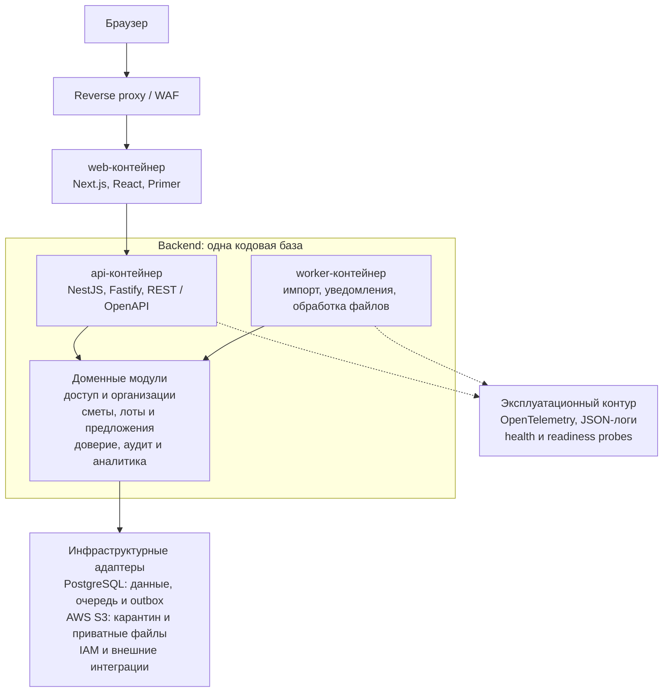

## Дизайн
- Дизайн-система:
	- Официальный сайт Primer - [primer.style](https://primer.style/)
	- Компоненты Primer для Figma - https://primer.style/product/components/
- Макеты платформы: https://www.figma.com/design/WT2IPB0eHD9ULCPENEktwp/%D0%9C%D0%B0%D0%BA%D0%B5%D1%82%D1%8B-2.0?node-id=0-1&p=f&t=0PXm89MH3CyGbp1J-0
- Брендбук и лого: [[logo_main.pdf]]
- Иконки Primer - https://primer.style/octicons/

# Технический стек

## MVP 1.0

Архитектура: модульный монолит
- Backend: TypeScript, Node.js 24 LTS, NestJS + Fastify
- БД: PostgreSQL, прямой доступ через `pg` и SQL без ORM/Prisma
- Хранилище для файлов: AWS S3
- Фоновые задачи: pg-boss через порт `JobQueue`
- Доменные события: transactional outbox через порт `EventBus`, совместимый с последующим переходом на Kafka
- API: REST, OpenAPI 3.0
- Frontend: Next.js + React + Primer React.
- Docker + Kubernetes-ready
- Авторизация через Сбер ID и OpenID от Контур.Диадок

## MVP 2.0

Архитектура: выделить отдельные микросервисы
- Backend: TypeScript, Node.js 24 LTS, NestJS + Fastify
- БД: PostgreSQL
- Хранилище для файлов: AWS S3 через S3-совместимый порт хранения
- API: REST, OpenAPI 3.0
- Frontend: Next.js + React + Primer React.
- Docker + Kubernets
- Авторизация через Госуслуги и IAM ГосТех

При выборе технологий в первую очередь смотреть на перечь решений для ГосТех (Platform V от Сбер) - [[Услуги Platform V]].

## Архитектурная схема MVP 1.0

`web`, `api` и `worker` запускаются как отдельные контейнеры, но используют одну backend-кодовую базу. Каждый доменный модуль владеет своей логикой и обращается к другим модулям только через публичные интерфейсы. Критичные бизнес-операции выполняются в одной транзакции PostgreSQL.

Такая форма позволяет независимо масштабировать `web`, `api` и `worker`. При переносе на Platform V меняются инфраструктурные адаптеры и конфигурация развертывания, а не доменная логика.

## Архитектурные документы

- [Границы модулей и владение данными](../architecture/module-boundaries-and-data-ownership.md) — владельцы таблиц, публичные контракты, события, outbox и соответствие Platform V.
- [Логическая модель данных PostgreSQL](../architecture/postgresql-data-model.md) — схемы модулей, таблицы, ключи, ограничения, индексы, состояния и транзакционные границы.
- [ADR-0005: внешняя идентификация без модерации регистрации](../adr/0005-external-identification-without-registration-moderation.md) — аккаунт создаётся только после успешного ответа Сбер ID или Контур.Диадок; отдельного статуса верификации нет.
