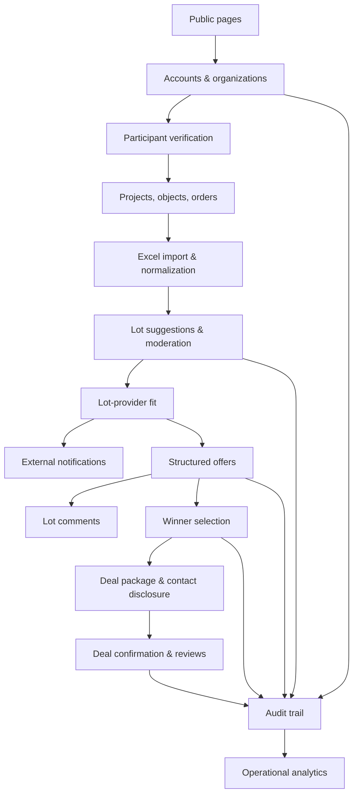
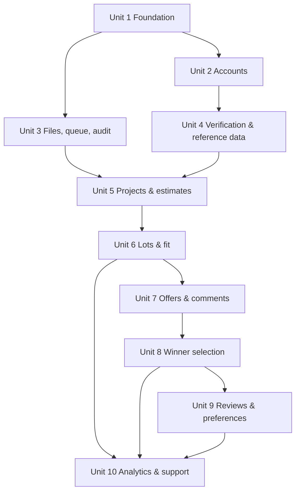

# feat: Build construction order distribution MVP

## Overview

Build the first version of the moderated B2B construction order distribution platform described in `docs/superpowers/specs/2026-07-04-construction-order-distribution-platform-design.md`.

The recommended implementation shape is a TypeScript modular monolith: a single Next.js App Router application with domain modules under `src/modules`, PostgreSQL as the source of truth, Prisma migrations, S3-compatible object storage for attachments, and a Redis-backed background worker for imports and notifications. This keeps the MVP operationally simpler than microservices while still giving the implementation clear module boundaries.

## Problem Frame

Small and medium construction companies executing state or large corporate contracts need a trusted way to turn construction estimates into moderated lots, expose those lots only to suitable verified providers, collect structured offers, choose one or more winners, disclose contacts, and preserve enough audit history to support a trust-sensitive B2B workflow.

The product deliberately avoids becoming a public marketplace, contract execution platform, EDO system, payment system, or public provider directory in the MVP. Those exclusions are part of the product shape, not omissions.

## Requirements Trace

- R1. Support separate customer and provider registration, email confirmation, password recovery, organization users, organization administrators, user invitation, and deactivation.
- R2. Support manual moderator verification for customers and providers before core platform access.
- R3. Support projects, construction objects, construction orders, Excel estimate import, source estimate preservation, normalized estimate lines, ambiguous-line handling, and lot suggestions.
- R4. Support lot lifecycle, platform-defined minimum disclosure, customer editing, moderator review, rejection reasons, publication, withdrawal, deadline expiry, offer collection close, and no-offer revision.
- R5. Show providers only visible lots produced by lot-provider fit; respect provider offer profiles, region/service radius, legal status, required documents, availability, and customer-specific blocked providers.
- R6. Support one final structured offer per provider per lot, category-specific offer templates, offer attachments, submission-date sorting, Excel offer export, and no drafts/edit/withdraw/retry.
- R7. Support lot comments, provider-private questions, customer answers, public customer clarifications, and pre-winner contact restrictions.
- R8. Support winner selection with one or more winners, partial fulfillment when enabled by customer, contact disclosure rules, and deal package formation without contracts, EDO, or payments.
- R9. Support post-winner reviews only after customer confirms the deal took place, rating 1-10, moderation, and one moderated provider response.
- R10. Support favorites and customer-specific blocked providers; favorites are only visual markers and blocked providers do not see future lots from that customer.
- R11. Support external notifications through user-selected email, Telegram, and MAX channels; no internal notification center in MVP.
- R12. Support customer, provider, moderator, and platform-admin analytics described in the spec, plus offer export.
- R13. Support platform reference data, offer templates, rejection reasons, audit trail, support request form, public pages, Russian-only responsive web UI, and no public lot/provider catalogs.

## Scope Boundaries

- No EDO, contract signing, closing documents, payments, escrow, commissions, subscriptions, or transaction fees.
- No public lot catalog, public provider catalog, or account that acts as both customer and provider.
- No native mobile apps, multilingual UI, 2FA, internal notification center, provider offer drafts, offer editing, offer withdrawal, duplicate offers, or smart offer ranking.
- No phone verification, INN integration, full helpdesk workflow, 1C, CRM, or government procurement integrations in MVP.

### Deferred to Separate Tasks

- Basic INN verification, phone verification, and full helpdesk workflow remain top backlog items in `docs/backlog.md`.
- Smart offer ranking, EDO, contract execution, closing documents, payments, subscriptions, transaction fees, and advanced reputation remain future-version work in `docs/backlog.md`.
- Production provider choices for email, Telegram bot hosting, MAX integration credentials, object storage vendor, and deployment target are configuration decisions to make during implementation setup.

## Context & Research

### Relevant Repo Context

- `docs/superpowers/specs/2026-07-04-construction-order-distribution-platform-design.md` is the origin design and product source of truth.
- `CONTEXT.md` defines project language and should stay aligned as implementation terms settle.
- `docs/adr/0001-manual-provider-verification.md` records manual participant and lot verification.
- `docs/adr/0002-mvp-stops-at-deal-package.md` records the MVP boundary around deal package formation.
- `docs/adr/0003-platform-defined-lot-disclosure.md` records platform-defined lot disclosure.
- `docs/adr/0004-moderated-b2b-distribution-platform.md` records the moderated B2B platform shape.
- `Brandbook/` contains brand assets to use for visual identity once UI implementation starts.
- No existing application code, AGENTS.md, or `docs/solutions/` learnings are present.

### External References

- Next.js App Router supports React Server Components and Server Functions, and Route Handlers provide custom request handlers inside `app` routes.
- Prisma Migrate keeps database schema changes in version-controlled SQL migration history.
- OWASP recommends strong password hashing and defensive file-upload validation, including allowed extensions, file type validation beyond client headers, generated filenames, size limits, and authorized upload checks.
- BullMQ provides Redis-backed background jobs, retries, delays, scheduling, and worker concurrency.
- Next.js documents Playwright and Vitest as supported testing options for E2E and unit testing.

## Key Technical Decisions

- **Use a modular monolith, not microservices:** the spec explicitly favors one product with strong domain boundaries; microservices would add operational complexity before the MVP proves workflows.
- **Use Next.js App Router with TypeScript:** a single full-stack web application fits the responsive web MVP and keeps dashboards, route handlers, server-side mutations, and API endpoints in one deployable unit.
- **Use PostgreSQL and Prisma migrations:** the platform is state-heavy, audit-heavy, and relational; migration history must be versioned from day one.
- **Use first-party credential auth with secure password hashing and server-side sessions:** registration, moderation, organization users, invitations, and email confirmation are core domain concepts; auth should be owned by the app rather than shaped around a social-login provider.
- **Use S3-compatible object storage for attachments:** files should not live in Git or the database; metadata and access rules live in PostgreSQL.
- **Use BullMQ with Redis for background jobs:** estimate imports, notification delivery, export generation, and attachment scanning hooks should not block request/response flows.
- **Implement audit as a shared domain service from the start:** moderation, winner selection, contact disclosure, reviews, user deactivation, and restrictions all require traceability.
- **Keep UI Russian-only and role-scoped:** route groups and navigation should separate public, customer, provider, moderator, and administrator surfaces.

## Open Questions

### Resolved During Planning

- **Which stack should the greenfield plan assume?** Use a TypeScript Next.js modular monolith with PostgreSQL, Prisma, S3-compatible storage, Redis/BullMQ workers, Vitest, and Playwright.
- **Should implementation start with all product modules at once?** No. Build in dependency-ordered phases that first establish account, moderation, and audit foundations, then ordering/lots, then offers/winner selection, then reputation/analytics/polish.

### Deferred to Implementation

- **Exact production deployment target:** defer until environment and hosting preferences are known.
- **Exact email provider, Telegram bot setup, and MAX integration details:** design adapters now; wire real provider credentials during implementation/deployment.
- **Exact Excel normalization heuristics:** start with deterministic parser rules and manual ambiguity handling; refine after testing real sample estimates.
- **Exact object storage provider and malware scanning provider:** implement storage abstraction and file validation first; attach scanning provider when available.

## Output Structure

```text
.
├── package.json
├── next.config.ts
├── tsconfig.json
├── docker-compose.yml
├── .env.example
├── prisma/
│   ├── schema.prisma
│   ├── migrations/
│   └── seed.ts
├── src/
│   ├── app/
│   │   ├── (public)/
│   │   ├── (customer)/
│   │   ├── (provider)/
│   │   ├── (moderator)/
│   │   ├── (admin)/
│   │   └── api/
│   ├── modules/
│   │   ├── accounts/
│   │   ├── verification/
│   │   ├── reference-data/
│   │   ├── projects/
│   │   ├── estimates/
│   │   ├── lots/
│   │   ├── offers/
│   │   ├── comments/
│   │   ├── winner-selection/
│   │   ├── reviews/
│   │   ├── notifications/
│   │   ├── files/
│   │   ├── analytics/
│   │   ├── support/
│   │   └── audit/
│   ├── workers/
│   └── shared/
├── tests/
│   ├── unit/
│   ├── integration/
│   └── e2e/
└── docs/
    └── plans/
```

This tree is directional scope guidance. The implementing agent may adjust filenames if the chosen framework scaffold creates nearby conventions, but module boundaries should remain intact.

## High-Level Technical Design

> *This illustrates the intended approach and is directional guidance for review, not implementation specification. The implementing agent should treat it as context, not code to reproduce.*



### Access And Visibility Matrix

This matrix is the planning-level contract for server-side authorization. UI routing should mirror it, but route handlers and server actions must enforce it independently.

| Surface | Customer | Provider | Moderator | Administrator |
|---|---|---|---|---|
| Public pages | Read | Read | Read | Read |
| Customer projects/objects/orders | Own organization only | No access | Moderation/support context only | Audit/support context only |
| Lot draft before publication | Own organization only | No access | Review queue when submitted | Audit/support context only |
| Published lot | Own organization only | Only if visible through lot-provider fit | Review/audit access | Audit/support context only |
| Provider offer | Owning customer lot only | Own provider offer only | Review/audit context | Audit/support context only |
| Lot comments | Customer sees all on own lot | Provider sees only own thread | Review/audit context | Audit/support context only |
| Provider contacts | Customer sees after winner selection | No provider-to-provider contact access | Audit/support context only | Audit/support context only |
| Customer contacts | Own organization | Selected provider access only | Audit/support context only | Audit/support context only |
| Reviews | Eligible customer/provider surfaces after moderation | Own published reviews/responses | Moderation queue | Audit/support context only |

## Phased Delivery

### Phase 1: Platform Foundation

Establish project scaffolding, database, auth, organizations, roles, files, workers, audit, and seed reference data. Nothing else is reliable until this exists.

### Phase 2: Customer Order Flow

Build projects, objects, orders, estimate import, normalization, lot suggestions, lot moderation, disclosure, attachments, and visible-lot computation.

### Phase 3: Provider Market Flow

Build provider visible lots, comments, structured offers, exports, winner selection, contact disclosure, deal package, notifications, and related dashboards.

### Phase 4: Trust, Analytics, and Polish

Build reviews, favorites, blocked providers, analytics, support, final role-scoped UI coverage, and E2E hardening.

## Implementation Units



- [ ] **Unit 1: Application foundation and design system**

**Goal:** Scaffold the TypeScript web application, local infrastructure, test harnesses, environment conventions, and brand-aware UI foundation.

**Requirements:** R13

**Dependencies:** None

**Files:**
- Create: `package.json`
- Create: `next.config.ts`
- Create: `tsconfig.json`
- Create: `eslint.config.mjs`
- Create: `vitest.config.ts`
- Create: `playwright.config.ts`
- Create: `docker-compose.yml`
- Create: `.env.example`
- Create: `src/app/layout.tsx`
- Create: `src/app/(public)/page.tsx`
- Create: `src/shared/ui/`
- Create: `src/shared/config/`
- Create: `src/shared/brand/`
- Test: `tests/unit/shared/config.test.ts`
- Test: `tests/e2e/public-pages.spec.ts`

**Approach:**
- Scaffold a Next.js App Router application using TypeScript and server-side rendering defaults.
- Configure PostgreSQL and Redis in `docker-compose.yml` for local development.
- Add Vitest for domain/unit tests and Playwright for browser-level workflow tests.
- Create a small internal UI foundation that can use assets from `Brandbook/` without copying or rewriting the brandbook itself.
- Keep public pages minimal: landing, login, registration entry points, password recovery, email confirmation placeholder, legal pages, and contacts.

**Patterns to follow:**
- Use `docs/superpowers/specs/2026-07-04-construction-order-distribution-platform-design.md` section 10 for public pages and role surfaces.
- Use `Brandbook/` as the visual source for logo, colors, and brand assets.

**Test scenarios:**
- Happy path: visiting the public landing page renders Russian-language platform positioning and separate registration entry points for customer and provider.
- Happy path: legal and contacts routes render without authentication.
- Edge case: missing required environment variable is reported through a typed configuration error during app startup.
- Integration: Playwright can load the public landing page against the local app without console errors caused by missing brand assets.

**Verification:**
- The app boots locally with database and Redis services available.
- Public shell exists and test tooling can run without product data.
- All planned module directories can be added without changing the top-level structure.

- [ ] **Unit 2: Accounts, organizations, roles, sessions, and invitations**

**Goal:** Implement first-party credential auth, participant account separation, email confirmation, password recovery, organization users, organization administrators, invitations, and deactivation.

**Requirements:** R1, R13

**Dependencies:** Unit 1

**Files:**
- Create: `prisma/schema.prisma`
- Create: `prisma/migrations/`
- Create: `src/modules/accounts/`
- Create: `src/app/(public)/register/customer/`
- Create: `src/app/(public)/register/provider/`
- Create: `src/app/(public)/login/`
- Create: `src/app/(public)/password-recovery/`
- Create: `src/app/(customer)/settings/users/`
- Create: `src/app/(provider)/settings/users/`
- Test: `tests/unit/accounts/password-policy.test.ts`
- Test: `tests/unit/accounts/roles.test.ts`
- Test: `tests/integration/accounts/registration.test.ts`
- Test: `tests/integration/accounts/invitations.test.ts`
- Test: `tests/e2e/auth-registration.spec.ts`

**Approach:**
- Model users, sessions, participant accounts, customer profiles, provider profiles, legal status, organization role assignments, invitations, email confirmation tokens, and password reset tokens.
- Enforce that one registered organization account cannot act as both customer and provider; separate account records are required for separate roles.
- Assign the first verified organization user as organization administrator; administrator transfer itself is handled later through moderator change requests.
- Allow customer organization administrators and provider organization administrators to invite/deactivate users; individual-person providers do not get provider organization administrator behavior.
- Hash passwords with a current password-hashing algorithm aligned with OWASP guidance.
- Use secure, server-side session cookies and middleware/guards for role-scoped routes.
- Expose authorization through shared server-side policy helpers used by route handlers, server actions, loaders, and background jobs; client UI state must never be the only permission check.

**Execution note:** Implement domain rules test-first before wiring UI forms.

**Patterns to follow:**
- `CONTEXT.md` terms: `Single Participant Role`, `Customer Organization Administrator`, `Provider Organization Administrator`, `Email Confirmation`, `Email Password Recovery`.

**Test scenarios:**
- Happy path: a customer registers, confirms email, and remains blocked from customer workflows until moderator verification.
- Happy path: a legal-entity provider registers with provider offer profile data and remains blocked until moderator verification.
- Happy path: a customer organization administrator invites a user, the invitee confirms email, and gains access to the same customer account.
- Edge case: an individual-person provider cannot create provider organization administrator invitations.
- Edge case: a deactivated user cannot sign in, but created records remain associated with the organization.
- Error path: registration rejects duplicate email, missing required legal status, and attempts to create a hybrid customer-provider account.
- Integration: route guards prevent customer users from provider dashboards, providers from customer dashboards, and unverified participants from core workflows.
- Integration: direct route-handler or server-action calls with a forged organization or participant id are denied even when the user has a valid session for another organization.

**Verification:**
- Account lifecycle, organization role rules, and route access constraints match the spec.
- No product module relies on public self-registration for moderator or platform administrator accounts.

- [ ] **Unit 3: File storage, background jobs, audit trail, and platform team accounts**

**Goal:** Establish shared infrastructure for attachments, background processing, audit logging, platform team accounts, and operational safety.

**Requirements:** R11, R13

**Dependencies:** Unit 1, Unit 2

**Files:**
- Modify: `prisma/schema.prisma`
- Create: `src/modules/files/`
- Create: `src/modules/audit/`
- Create: `src/modules/notifications/queue.ts`
- Create: `src/workers/index.ts`
- Create: `src/modules/platform-team/`
- Create: `src/app/(admin)/team/`
- Test: `tests/unit/files/validation.test.ts`
- Test: `tests/unit/audit/audit-event.test.ts`
- Test: `tests/integration/files/upload.test.ts`
- Test: `tests/integration/audit/audit-trail.test.ts`
- Test: `tests/integration/workers/queue.test.ts`

**Approach:**
- Store file metadata in PostgreSQL and file bytes in S3-compatible storage.
- Enforce allowed file types: PDF, DOCX, XLSX, JPG, PNG. Reject archives, executable files, invalid extensions, invalid detected type, files above 25 MB, and total lot/offer uploads above 200 MB.
- Generate storage keys and display filenames separately; never trust client filenames for storage.
- Create audit service with actor, organization/participant context, target entity, event type, metadata, and timestamp.
- Create background job foundation for estimate import, notification delivery, and export generation.
- Create platform team account management for administrator-created moderator and administrator accounts.

**Execution note:** Treat file validation and audit as security-sensitive; write failure-path tests before exposing upload UI.

**Patterns to follow:**
- OWASP file upload guidance: allowed extensions, file type validation, generated filenames, size limits, and authorized upload checks.
- `CONTEXT.md` terms: `Allowed Attachment Types`, `Attachment Size Limits`, `Audit Trail`, `Platform Team Account`.

**Test scenarios:**
- Happy path: authorized user uploads a PDF under 25 MB and metadata is persisted with a generated storage key.
- Edge case: total attachments at exactly 200 MB are accepted and over 200 MB are rejected.
- Error path: ZIP, RAR, executable extension, spoofed content type, oversized file, and unauthorized upload are rejected.
- Happy path: creating a moderation action writes a corresponding audit event with actor and target.
- Error path: failed notification job is retried and records failure metadata without blocking the originating request.
- Integration: platform administrator can create moderator account and the moderator cannot self-register through public routes.

**Verification:**
- Attachments, job creation, and audit logging are available to later feature units through stable module interfaces.
- Security-sensitive upload behavior is covered before lot and offer attachments use it.

- [ ] **Unit 4: Verification, moderation, reference data, and offer templates**

**Goal:** Implement moderator workflows that gate participants, lots, reviews, and offer-template/reference-data administration.

**Requirements:** R2, R4, R6, R9, R13

**Dependencies:** Unit 2, Unit 3

**Files:**
- Modify: `prisma/schema.prisma`
- Create: `src/modules/verification/`
- Create: `src/modules/reference-data/`
- Create: `src/modules/moderation/`
- Create: `src/modules/offers/templates/`
- Create: `src/app/(moderator)/verification/`
- Create: `src/app/(moderator)/reference-data/`
- Create: `src/app/(moderator)/offer-templates/`
- Create: `src/app/(moderator)/moderation/`
- Test: `tests/unit/verification/status-transitions.test.ts`
- Test: `tests/unit/reference-data/templates.test.ts`
- Test: `tests/integration/moderation/participant-verification.test.ts`
- Test: `tests/integration/moderation/rejection-reasons.test.ts`
- Test: `tests/e2e/moderator-verification.spec.ts`

**Approach:**
- Model verification states, moderator decisions, rejection reasons, comments, organization-administrator change requests, and participant restriction reasons.
- Seed initial reference data for lot categories, service/material/equipment types, regions, units, document requirements, offer templates, moderation rejection reasons, and participant restriction reasons.
- Create moderator queues for customer verification, provider verification, organization administrator change requests, and later lot/review moderation.
- Keep reference data changes auditable.
- Make category-specific offer templates configurable by moderator, but not by customer or provider.

**Patterns to follow:**
- `docs/adr/0001-manual-provider-verification.md`
- `CONTEXT.md` terms: `Customer Verification`, `Provider Verification`, `Moderator`, `Reference Data`, `Offer Template`, `Moderation Rejection`.

**Test scenarios:**
- Happy path: moderator approves a customer and the customer gains access to customer workflows.
- Happy path: moderator approves a provider and the provider can access provider workflows after offer profiles exist.
- Error path: moderator rejection requires a reference-data reason and moderator comment.
- Edge case: changing customer organization administrator requires moderator approval and preserves prior user history.
- Edge case: deleting or disabling a reference-data category that is already used by lots is blocked or converted to inactive state.
- Integration: approved participant state unlocks role-scoped dashboards but does not bypass lot-level visibility rules.

**Verification:**
- Manual verification and moderation queues exist before any market activity is possible.
- Reference data and offer templates can support lot creation and structured offers.

- [ ] **Unit 5: Projects, objects, orders, Excel import, normalization, and lot suggestions**

**Goal:** Implement the customer-side hierarchy and estimate-processing pipeline that turns Excel estimates into normalized lines and platform-suggested lots.

**Requirements:** R3

**Dependencies:** Unit 2, Unit 3, Unit 4

**Files:**
- Modify: `prisma/schema.prisma`
- Create: `src/modules/projects/`
- Create: `src/modules/estimates/`
- Create: `src/modules/lots/suggestions/`
- Create: `src/app/(customer)/projects/`
- Create: `src/app/(customer)/objects/`
- Create: `src/app/(customer)/orders/`
- Test: `tests/unit/estimates/parser.test.ts`
- Test: `tests/unit/estimates/normalization.test.ts`
- Test: `tests/unit/lots/suggestions.test.ts`
- Test: `tests/integration/customer/orders-import.test.ts`
- Test: `tests/e2e/customer-estimate-import.spec.ts`
- Fixture: `tests/fixtures/estimates/`

**Approach:**
- Model project, construction object, construction order, imported estimate metadata, original file reference, estimate lines, normalized estimate lines, ambiguous estimate lines, and lot suggestions.
- Preserve imported source file and original row/section references for customer trust and traceability.
- Normalize rows into material, service, or equipment rental request categories using deterministic rules and reference data.
- Mark low-confidence or unsupported rows ambiguous; ambiguous rows cannot enter a lot until clarified by customer or moderator.
- Generate editable lot suggestions from normalized lines by type, category, region/object context, timing, and document requirements.
- Allow customer to choose whether partial fulfillment is allowed while preparing lot suggestions for moderation.

**Execution note:** Add parser and normalization characterization tests with fixtures before refining heuristics.

**Patterns to follow:**
- `docs/superpowers/specs/2026-07-04-construction-order-distribution-platform-design.md` section 3.
- `CONTEXT.md` terms: `Imported Estimate`, `Normalized Estimate Line`, `Ambiguous Estimate Line`, `Lot Suggestion`.

**Test scenarios:**
- Happy path: customer creates project, object, order, uploads Excel estimate, and receives normalized lines plus lot suggestions.
- Happy path: original estimate file and original row identifiers remain accessible from normalized lines.
- Edge case: empty spreadsheet, unsupported workbook format, missing quantities, and unknown units create clear errors or ambiguous lines.
- Edge case: row with mixed material/service wording is marked ambiguous and excluded from lot suggestion until clarified.
- Error path: unverified customer cannot create project/order or import estimate.
- Integration: clarified ambiguous line can be included in a later lot suggestion and audit records the clarification.

**Verification:**
- Customer can get from project creation to editable lot suggestions without manually retyping a full estimate.
- No lot suggestion includes ambiguous lines.

- [ ] **Unit 6: Lot lifecycle, disclosure, attachments, fit, and lot notifications**

**Goal:** Implement lot publication workflow, platform-defined disclosure, moderator review, provider-visible lot computation, customer blocklists, and external lot notifications.

**Requirements:** R4, R5, R10, R11

**Dependencies:** Unit 3, Unit 4, Unit 5

**Files:**
- Modify: `prisma/schema.prisma`
- Create: `src/modules/lots/`
- Create: `src/modules/lots/disclosure/`
- Create: `src/modules/lots/fit/`
- Create: `src/modules/notifications/channels/`
- Create: `src/app/(customer)/lots/`
- Create: `src/app/(provider)/lots/`
- Create: `src/app/(moderator)/lots/`
- Test: `tests/unit/lots/lifecycle.test.ts`
- Test: `tests/unit/lots/disclosure.test.ts`
- Test: `tests/unit/lots/fit.test.ts`
- Test: `tests/integration/lots/moderation-publication.test.ts`
- Test: `tests/integration/notifications/lot-notifications.test.ts`
- Test: `tests/e2e/lot-publication-visibility.spec.ts`

**Approach:**
- Model lot draft, moderation, published, collecting offers, offer collection closed, winner chosen, completed, rejected, withdrawn, and deadline-expired states.
- Enforce platform-defined minimum disclosure fields; customer edits cannot remove fields required for providers to prepare offers.
- Attach lot files through the shared file module and include attachments in moderator review.
- Implement fit computation based on offer type, category, region/service radius, legal status, documents, availability, and customer-specific blocked providers.
- Send lot notifications only to providers for whom the published lot is visible and whose selected external channels include available providers.
- Implement provider visible lot filters by type, category, region, deadline, and submitted-offer state.
- Persist enough fit/visibility evidence to explain why a provider could see a lot at publication time, while still recomputing access on read to respect later blocks or profile changes.

**Patterns to follow:**
- `docs/adr/0003-platform-defined-lot-disclosure.md`
- `CONTEXT.md` terms: `Lot Lifecycle`, `Lot Disclosure`, `Visible Lot`, `Lot-Provider Fit`, `Lot Notification`, `Blocked Provider`.

**Test scenarios:**
- Happy path: customer submits edited lot to moderation, moderator approves, and suitable providers can see it.
- Happy path: provider receives notification through selected channel when a lot becomes visible.
- Edge case: provider matching category but outside service radius cannot see the lot.
- Edge case: provider blocked by that customer cannot see future lots and receives no notifications.
- Error path: customer attempt to remove mandatory disclosure fields is rejected before moderation submission.
- Error path: rejected lot stores moderator reason/comment and returns to customer for revision.
- Integration: published lot visibility changes when provider offer profile or customer blocklist changes.
- Integration: provider cannot access a lot by direct URL if the lot is no longer visible after profile or blocklist changes.

**Verification:**
- A provider can only see lots allowed by publication state, fit, and blocklist rules.
- Notification delivery is queued and auditable, not sent as an uncontrolled broadcast.

- [ ] **Unit 7: Structured offers, comments, sorting, export, and offer constraints**

**Goal:** Implement provider offer submission, category-specific templates, offer attachments, lot comments, clarifications, customer offer lists, and Excel offer export.

**Requirements:** R6, R7, R12

**Dependencies:** Unit 3, Unit 4, Unit 6

**Files:**
- Modify: `prisma/schema.prisma`
- Create: `src/modules/offers/`
- Create: `src/modules/comments/`
- Create: `src/modules/exports/`
- Create: `src/app/(provider)/offers/`
- Create: `src/app/(customer)/offers/`
- Create: `src/app/(customer)/comments/`
- Test: `tests/unit/offers/submission-rules.test.ts`
- Test: `tests/unit/comments/visibility.test.ts`
- Test: `tests/unit/exports/offers-xlsx.test.ts`
- Test: `tests/integration/offers/offer-submission.test.ts`
- Test: `tests/integration/comments/lot-comments.test.ts`
- Test: `tests/e2e/provider-offer-flow.spec.ts`

**Approach:**
- Render offer forms from moderator-managed category templates.
- Enforce one final offer per provider per lot, no drafts, no edits, no withdrawal, and no duplicate submission.
- Allow offer attachments through shared file validation and storage.
- Sort offers by submission date newest first by default; allow customer to reverse/change date order.
- Implement provider-to-customer lot comments where customer sees all, provider sees only their own questions and customer answers.
- Implement customer lot clarifications visible to all providers who can see the lot.
- Generate customer Excel export for offers in a lot.

**Patterns to follow:**
- `CONTEXT.md` terms: `Offer`, `Offer Template`, `Offer Attachment`, `Offer Ranking`, `Lot Comment`, `Lot Clarification`, `Offer Export`.

**Test scenarios:**
- Happy path: visible provider submits a complete offer using the category template and it appears in customer's offer list.
- Edge case: same provider cannot submit a second offer for the same lot.
- Error path: provider cannot submit offer after deadline, after offer collection close, after winner chosen, or for a non-visible lot.
- Error path: offer attachment with forbidden type or excessive size is rejected.
- Happy path: provider sends clarification comment after offer submission and the offer itself remains unchanged.
- Edge case: provider cannot see other providers' questions or answers.
- Integration: customer exports offers and the spreadsheet contains submitted offer fields, submission dates, and provider non-contact profile data.

**Verification:**
- Offer constraints match MVP decisions and cannot be bypassed through UI or route handlers.
- Comment visibility protects provider privacy before winner selection.

- [ ] **Unit 8: Winner selection, contact disclosure, deal package, and external notifications**

**Goal:** Implement one-or-many winner selection, partial fulfillment handling, contact disclosure rules, deal package formation, and customer/provider notifications.

**Requirements:** R8, R11

**Dependencies:** Unit 6, Unit 7

**Files:**
- Modify: `prisma/schema.prisma`
- Create: `src/modules/winner-selection/`
- Create: `src/modules/deal-package/`
- Create: `src/modules/contact-disclosure/`
- Create: `src/app/(customer)/winner-selection/`
- Create: `src/app/(provider)/deal-package/`
- Test: `tests/unit/winner-selection/rules.test.ts`
- Test: `tests/unit/contact-disclosure/visibility.test.ts`
- Test: `tests/integration/winner-selection/select-winners.test.ts`
- Test: `tests/integration/deal-package/deal-package.test.ts`
- Test: `tests/e2e/customer-winner-selection.spec.ts`

**Approach:**
- Allow customer to select one or multiple winning offers for a lot.
- Support partial fulfillment when the customer enabled it on the lot; record which selected offer covers which portion or lines of the lot.
- Close offer collection immediately after winner selection, including when selected before deadline.
- Disclose provider contacts only to the customer after winner selection, for all providers who submitted offers on that lot.
- Disclose customer profile and contacts only to selected providers.
- Ensure providers never see each other's contacts.
- Generate deal package from selected offers, final conditions, documents, contact visibility, and comment history needed for off-platform continuation.

**Execution note:** Implement contact-disclosure tests before wiring UI, because this is privacy-sensitive.

**Patterns to follow:**
- `docs/adr/0002-mvp-stops-at-deal-package.md`
- `CONTEXT.md` terms: `Выбор победителя`, `Deal Package`, `Раскрытие контактов после выбора победителя`, `Customer Contact Disclosure`.

**Test scenarios:**
- Happy path: customer selects one winner and the lot closes offer collection.
- Happy path: customer selects multiple winners for a partial-fulfillment lot and each selected provider gets customer contact access.
- Edge case: customer cannot select an offer from a provider that did not submit to that lot.
- Edge case: non-selected provider does not see customer profile or contacts after winner selection.
- Error path: provider contacts remain hidden before winner selection even if provider attached offer files.
- Integration: customer can see contacts for all providers that submitted offers after winner selection; providers cannot see each other's contacts.
- Integration: deal package includes selected offers, documents, conditions, contacts, and relevant communication history without contract/payment workflows.

**Verification:**
- Winner selection closes the market flow and produces the MVP handoff artifact without entering contract execution.
- Contact disclosure follows every rule from the spec.

- [ ] **Unit 9: Reviews, favorite providers, blocked providers, and provider reputation surface**

**Goal:** Implement post-deal review flow, moderation, provider response, favorites, blocked providers, and the non-public reputation surface.

**Requirements:** R9, R10

**Dependencies:** Unit 8

**Files:**
- Modify: `prisma/schema.prisma`
- Create: `src/modules/reviews/`
- Create: `src/modules/provider-preferences/`
- Create: `src/app/(customer)/reviews/`
- Create: `src/app/(provider)/reviews/`
- Create: `src/app/(moderator)/reviews/`
- Test: `tests/unit/reviews/review-eligibility.test.ts`
- Test: `tests/unit/provider-preferences/blocklist.test.ts`
- Test: `tests/integration/reviews/review-moderation.test.ts`
- Test: `tests/integration/provider-preferences/favorites-blocked.test.ts`
- Test: `tests/e2e/reviews-preferences.spec.ts`

**Approach:**
- Let customer mark "deal took place" only for selected providers.
- Allow review only after deal took place, only for selected providers, with score 1-10 and short text.
- Moderate reviews before publication; require rejection reason/comment for rejected reviews.
- Allow provider to submit one public response after review publication; moderate response before publication.
- Allow customer to mark visible provider as favorite or blocked after offer or winner-selection interaction.
- Favorite status adds only a visual marker in offer lists.
- Blocked status prevents future lot visibility and future lot notifications for that customer/provider pair, without deleting history.

**Patterns to follow:**
- `CONTEXT.md` terms: `Отзыв после выбора победителя`, `Review Response`, `Deal Took Place`, `Favorite Provider`, `Blocked Provider`.

**Test scenarios:**
- Happy path: customer confirms deal took place, submits review with score 1-10, moderator approves, and review appears in provider profile surface.
- Edge case: review score below 1 or above 10 is rejected.
- Error path: customer cannot review non-selected provider, provider whose deal was not confirmed, or provider from another customer's lot.
- Happy path: provider submits one response to an approved review and moderator approves it.
- Edge case: provider cannot create a second response to the same review.
- Integration: blocking a provider removes that provider from future lot visibility and notifications while preserving old offers/history.
- Integration: favorite provider appears with a visual marker but receives no priority notification.

**Verification:**
- Reputation and preference behavior are constrained to visible/eligible relationships and do not create a public provider directory.

- [ ] **Unit 10: Analytics, support, dashboards, and E2E workflow hardening**

**Goal:** Complete role dashboards, operational metrics, support request form, final navigation, and end-to-end coverage across the MVP.

**Requirements:** R12, R13

**Dependencies:** Units 1-9

**Files:**
- Create: `src/modules/analytics/`
- Create: `src/modules/support/`
- Create: `src/app/(customer)/analytics/`
- Create: `src/app/(provider)/analytics/`
- Create: `src/app/(moderator)/analytics/`
- Create: `src/app/(admin)/analytics/`
- Create: `src/app/(customer)/support/`
- Create: `src/app/(provider)/support/`
- Create: `src/app/(moderator)/dashboard/`
- Create: `src/app/(admin)/dashboard/`
- Test: `tests/unit/analytics/metrics.test.ts`
- Test: `tests/integration/analytics/role-metrics.test.ts`
- Test: `tests/integration/support/support-request.test.ts`
- Test: `tests/e2e/customer-mvp-happy-path.spec.ts`
- Test: `tests/e2e/provider-mvp-happy-path.spec.ts`
- Test: `tests/e2e/moderator-admin-happy-path.spec.ts`

**Approach:**
- Create customer metrics per lot: offer count, lot status, deadline time remaining, and whether winner has been selected.
- Create provider metrics: submitted offers, submission date, related lot status, and selected/not selected state.
- Create moderator/admin metrics: pending customer/provider verifications, pending lot/review moderation, published/open lots, offers submitted, lots without offers, registered customer/provider counts, providers by work category, and average moderation time.
- Add support request form that sends message to support email and records the submission for audit/traceability.
- Ensure each role dashboard exposes the sections specified in the design: analytics included, no internal notification center, no public catalogs.
- Add final E2E workflows that prove an MVP market loop from registration through moderation, estimate import, lot publication, provider offer, winner selection, deal confirmation, and review.

**Patterns to follow:**
- `docs/superpowers/specs/2026-07-04-construction-order-distribution-platform-design.md` sections 9 and 10.

**Test scenarios:**
- Happy path: customer dashboard shows lot metrics after offer submission and winner selection.
- Happy path: provider dashboard shows submitted offers and selected/not selected state.
- Happy path: moderator/admin dashboard shows verification queues, moderation queues, and operational counts.
- Edge case: metrics respect organization boundaries and do not count another customer's private data in customer analytics.
- Error path: support form rejects empty message or invalid contact metadata.
- Integration: full E2E flow covers customer registration, moderator approval, estimate import, lot moderation, provider visibility, offer submission, winner selection, contact disclosure, deal confirmation, review moderation, and dashboard metric updates.

**Verification:**
- Each role can navigate its full MVP workspace.
- Analytics reflect actual persisted state and respect privacy boundaries.
- E2E tests cover the core market loop.

## System-Wide Impact

- **Interaction graph:** public registration, role-scoped dashboards, moderator queues, background workers, object storage, notification channels, and analytics all share participant/account boundaries.
- **Authorization parity:** every customer/provider/moderator/admin surface needs the same policy checks in UI, server actions, route handlers, exports, downloads, and background jobs.
- **Error propagation:** user-facing actions should show Russian error messages; domain services should return typed validation errors; background jobs should record failures and retry when safe.
- **State lifecycle risks:** lot states, offer finality, winner selection, contact disclosure, deal confirmation, review eligibility, and blocklist changes must be transactional where possible to avoid partial visibility changes.
- **API surface parity:** server actions, route handlers, and UI controls must enforce the same authorization rules; never rely only on disabled UI.
- **Integration coverage:** E2E flows are required because many rules cross account, moderation, lot visibility, offer, and contact-disclosure boundaries.
- **Unchanged invariants:** no public catalogs, no internal notification center, no payment/contract workflows, no offer drafts/edits/withdrawals, no smart offer ranking, and no hybrid customer-provider account.

## Risks & Dependencies

| Risk | Mitigation |
|------|------------|
| Scope is large for one MVP | Deliver in phases and keep deferred items out of implementation scope. |
| Custom auth can be security-sensitive | Use OWASP-aligned password hashing, server-side sessions, route guards, integration tests, and avoid 2FA/phone verification complexity in MVP. |
| File uploads can leak contacts or unsafe content | Validate type/size, generate storage keys, restrict access by role and entity, include moderation visibility, and leave malware scanning as provider-backed extension. |
| Lot visibility/contact disclosure bugs could expose sensitive data | Centralize authorization and contact-disclosure services; test before wiring UI; cover with E2E privacy assertions. |
| Excel estimate formats vary widely | Preserve original file, keep deterministic normalization, route uncertain rows to ambiguous state, and add fixture-based parser tests as real samples arrive. |
| Notification channels may have provider-specific constraints | Build channel adapters behind one notification interface; start with queued delivery and failure metadata. |
| Analytics can accidentally cross tenant boundaries | Query metrics through organization-scoped service methods and include cross-tenant denial tests. |

## Documentation / Operational Notes

- Keep `CONTEXT.md` updated when implementation settles Russian-facing names or domain terms.
- Add setup instructions to `README.md` during Unit 1, including local PostgreSQL/Redis/object-storage setup and required environment variables.
- Add seed data documentation for reference data and moderator/admin bootstrap accounts.
- Add operational notes for queue workers and notification provider configuration before any production deployment.
- Keep `.superpowers/` ignored; it is planning/brainstorming workspace data, not product source.

## Sources & References

- Origin design: `docs/superpowers/specs/2026-07-04-construction-order-distribution-platform-design.md`
- Domain model: `CONTEXT.md`
- ADRs: `docs/adr/0001-manual-provider-verification.md`, `docs/adr/0002-mvp-stops-at-deal-package.md`, `docs/adr/0003-platform-defined-lot-disclosure.md`, `docs/adr/0004-moderated-b2b-distribution-platform.md`
- Backlog: `docs/backlog.md`
- Brand assets: `Brandbook/`
- Next.js App Router: https://nextjs.org/docs/app
- Next.js Route Handlers: https://nextjs.org/docs/app/getting-started/route-handlers
- Next.js forms and Server Actions: https://nextjs.org/docs/app/guides/forms
- Prisma Migrate: https://www.prisma.io/docs/orm/prisma-migrate
- OWASP Password Storage Cheat Sheet: https://cheatsheetseries.owasp.org/cheatsheets/Password_Storage_Cheat_Sheet.html
- OWASP File Upload Cheat Sheet: https://cheatsheetseries.owasp.org/cheatsheets/File_Upload_Cheat_Sheet.html
- BullMQ docs: https://docs.bullmq.io/
- Next.js testing guides: https://nextjs.org/docs/app/guides/testing
- Playwright: https://playwright.dev/
- Vitest: https://vitest.dev/
