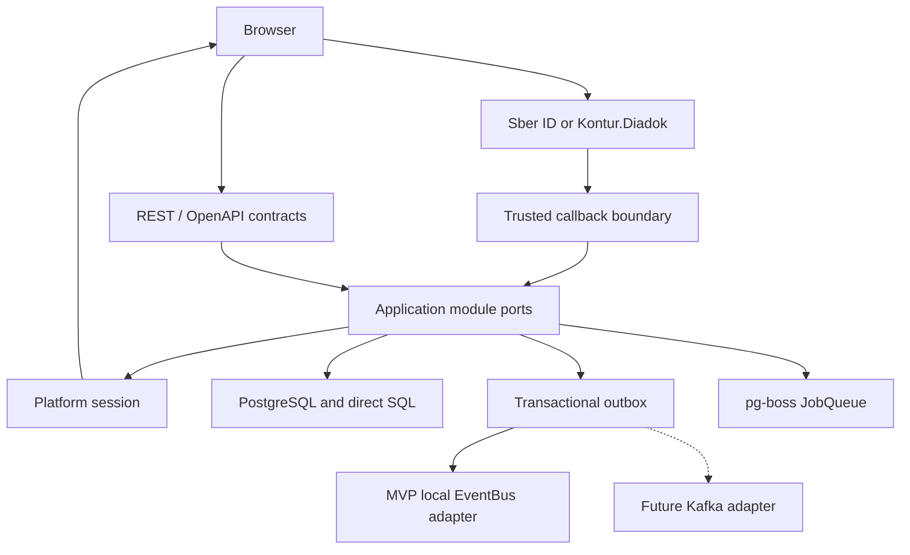
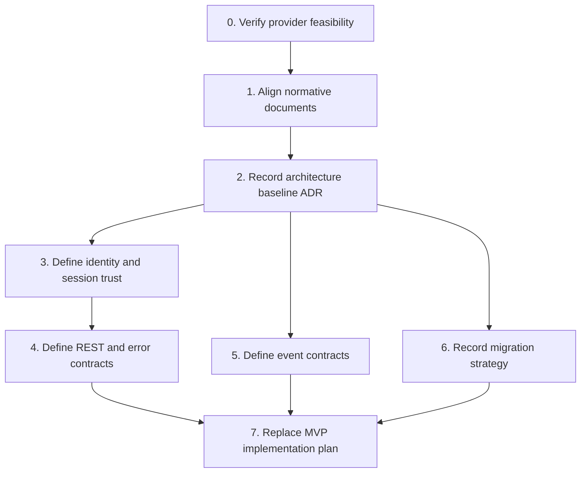
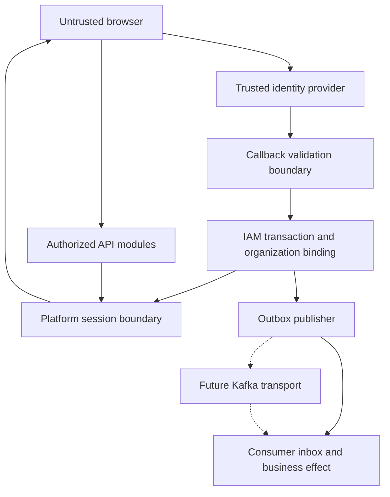

# feat: Stabilize architecture baseline and define contracts

## Overview

Before application development starts, align the formal technical assignment and active planning documents with the approved MVP architecture, then define the external REST contracts, domain-event contracts, and operational SQL-migration strategy. This creates one unambiguous architecture baseline for the Node.js modular monolith and preserves the intended migration path to Platform V.

## Problem Frame

The current architecture documents already establish the target shape: separate `web`, `api`, and `worker` containers; a NestJS/Fastify backend; direct PostgreSQL access through `pg`; AWS S3 behind a storage port; pg-boss behind `JobQueue`; and transactional outbox behind an `EventBus` compatible with a later Kafka adapter.

However, several active documents still describe the superseded stack and registration flow. The contract technical assignment still names Next.js full-stack, Prisma, and Redis/BullMQ; the active MVP implementation plan is built around the same stack plus participant passwords and manual verification; and the backlog describes an INN check as participant verification reviewed by a moderator. Starting implementation from those documents would produce incompatible code and acceptance criteria.

## Requirements Trace

- R1. Establish a single authoritative MVP architecture baseline consistent with `docs/implementation-plans/M00-technical-requirements.md`.
- R2. Preserve participant authentication and access recovery exclusively through Sber ID or Kontur.Diadok, with no participant-local password or registration moderation.
- R3. Define trusted Sber ID/Kontur.Diadok profiles, platform-session security, identity linking, and foundation REST/OpenAPI contracts for access, participants, and organizations before endpoint implementation.
- R4. Define foundation domain-event schemas plus governance rules that let later vertical slices add versioned events for local delivery and a future Kafka adapter without changing domain handlers.
- R5. Select and document a direct-SQL migration strategy and the required bootstrap, privilege, locking, recovery, and validation conventions before executable migrations are created.
- R6. Replace the obsolete active MVP implementation plan with a dependency-ordered plan based on the approved contracts and database model.

## Scope Boundaries

- No application feature implementation, Node.js scaffolding, executable migrations, or runtime integration tests in this architecture milestone.
- No microservice extraction, Kafka deployment, or Platform V SDK integration in MVP 1.0.
- No change to the product boundary: contracts, EDO, payments, and execution of the deal remain outside MVP.
- No local password flow for participants and no manual participant-registration decision.
- No choice of production email, messenger, malware-scanning, or Kubernetes vendor unless required to define a portable contract.

### Deferred to Separate Tasks

- Application scaffolding and business-feature implementation: begin only after this plan is complete and the replacement MVP plan is approved.
- Executable bootstrap SQL, migration runner configuration, foundation DDL, contract tests, and migration integration tests: first implementation milestone governed by the replacement MVP plan.
- Physical migration to Platform V services: future environment-specific work using the ports and contracts defined here.
- Microservice extraction: only after measurable isolation, scaling, availability, or team-ownership triggers are met.

## Context & Research

### Relevant Code and Patterns

- `docs/implementation-plans/M00-technical-requirements.md` defines the approved MVP stack and container shape.
- `docs/architecture/module-boundaries-and-data-ownership.md` defines module ownership, synchronous ports, outbox delivery, and the next required architecture artifact.
- `docs/architecture/postgresql-data-model.md` defines schemas, logical tables, constraints, transaction boundaries, and migration order.
- `docs/adr/0005-external-identification-without-registration-moderation.md` supersedes manual registration verification.
- `docs/technical-assignment-contract-appendix-forum.md` is the Markdown source for the contract-oriented technical assignment and must match both DOCX editions.
- `docs/plans/2026-07-04-001-feat-construction-platform-mvp-plan.md` is historically useful but technically obsolete and must not remain active.
- No `docs/solutions/` directory or application-code patterns exist yet.

### Institutional Learnings

- Architecture decisions are currently distributed across M00, ADRs, formal technical assignments, and an old active plan. An explicit precedence and supersession trail is required.
- pg-boss and Kafka solve different concerns: pg-boss remains the job scheduler/queue, while Kafka is a future transport for domain events behind `EventBus`.
- Provider-neutral storage ports and versioned event contracts are portability seams for Platform V, but adapter boundaries alone do not prove compatibility. Database, object-storage, and Kafka capabilities must be checked against the selected Platform V products and versions.

### External References

- Provider-specific documentation is a mandatory input to the identity-profile gate before callback or session contracts are approved.
- `node-pg-migrate` supports PostgreSQL advisory locking, transactional migrations, SQL migration files, and explicit non-transactional migrations while staying inside the Node.js toolchain.
- Flyway and dbmate were considered for SQL-first migrations. Flyway adds built-in checksum validation but introduces a separate Java-based toolchain; dbmate keeps plain SQL but does not prevent pending migrations from being applied out of historical order.

## Key Technical Decisions

| Decision | Current MVP | Portability consequence |
| --- | --- | --- |
| Application shape | Modular monolith; separate `web`, `api`, and `worker` containers | Modules can later be extracted without changing public domain contracts |
| Persistence | PostgreSQL through `pg` and explicit SQL | No ORM metadata dependency; migrations remain inspectable, while compatibility with the selected Platform V PostgreSQL-compatible service must be proven |
| Background jobs | pg-boss behind `JobQueue` | Scheduler semantics remain separate from domain-event transport |
| Domain events | Transactional outbox and local `EventBus` delivery | Kafka changes the adapter and deployment configuration, not publishers or handlers |
| Files | AWS S3 behind a storage port | The adapter is replaceable only after the target storage passes the required capability and conformance checks |
| Participant access | Sber ID or Kontur.Diadok | No participant password schema, reset flow, or registration moderation state |
| Platform session | Server-managed session contract recorded before OpenAPI | Provider tokens never become the application authorization contract |
| SQL migrations | `node-pg-migrate` with grouped SQL up/down files and advisory locking | Direct SQL stays inspectable without adding an ORM or a second runtime stack |

## Open Questions

### Resolved During Planning

- **Update the old MVP plan or create a replacement?** Create a replacement after contracts are fixed and mark the old plan `superseded`; its assumptions are too different for a safe incremental edit.
- **Can Kafka replace pg-boss?** No. Kafka is the future domain-event transport; pg-boss remains the MVP job queue and scheduler unless a separate decision replaces those capabilities.
- **Should contract work wait for application scaffolding?** No. OpenAPI, errors, event payloads, and idempotency rules are architecture inputs to the backend structure and tests.
- **Which migration runner should the baseline use?** Use `node-pg-migrate` with grouped SQL migration units, ordered/indexed filenames, advisory-lock mode `fail`, and a dedicated deployment migration job. It matches Node.js/PostgreSQL, supports direct SQL and non-transactional steps, and avoids an ORM or separate Java runtime. ADR-0008 must still pin the exact supported major version at implementation time.
- **Can registration callback idempotency rely on a client `Idempotency-Key`?** No. Provider callback replay protection, one-time state/authorization response handling, database uniqueness, and concurrent callback locking are server-owned. General API idempotency remains a separate HTTP contract.

### Deferred to Implementation

- **Exact provider URLs and credentials:** resolve per environment after the trusted flow, claim, issuer/audience/JWKS, redirect, replay, and organization-binding profiles are approved in Unit 3.
- **Final Kafka topic naming and registry product:** preserve logical event names and JSON Schema compatibility now; bind them to the selected Platform V environment later.

## Output Structure

```text
docs/
├── adr/
│   ├── 0006-mvp-application-architecture.md
│   ├── 0007-platform-session-security.md
│   └── 0008-direct-sql-migration-strategy.md
├── api/
│   ├── openapi.yaml
│   └── errors.md
├── architecture/
│   ├── domain-event-catalog.md
│   ├── external-identity-profiles.md
│   ├── platform-v-compatibility-matrix.md
│   └── architecture-document-precedence.md
├── events/
│   └── schemas/
├── migrations/
│   └── README.md
└── plans/
    └── <replacement-mvp-plan>.md
```

## High-Level Technical Design

> *This illustrates the intended approach and is directional guidance for review, not implementation specification. The implementing agent should treat it as context, not code to reproduce.*



## Implementation Units



- [ ] **Unit 0: Verify identity-provider and legal feasibility**

**Goal:** Confirm that the selected providers can support the approved registration model, especially evidence for binding a user to a legal entity and appointing its first administrator.

**Requirements:** R2, R3

**Dependencies:** Access to current official Sber ID and Kontur.Diadok partner documentation; product/legal owner available for a fallback decision

**Files:**
- Create: `docs/architecture/external-identity-feasibility.md`
- Modify: `docs/adr/0005-external-identification-without-registration-moderation.md` only if an approved fallback changes its assumptions

**Approach:**
- Time-box provider discovery and record flows, accessible claims/APIs, sandbox/contract prerequisites, and evidence strength separately for a person, organization membership, and organization-administrator authority.
- Treat mailbox access, matching email, or an unverified organization identifier as insufficient authority by default.
- Produce one of four explicit outcomes per provider: supported; supported with contractual/sandbox prerequisite; organization authority unavailable; documentation unavailable.
- If organization authority is unavailable, stop downstream identity work and require a product/ADR decision among an additional trusted authority such as КЭП/МЧД, an invitation/bootstrap authority model, a narrowed provider scope, or a revision of the automatic-first-administrator acceptance criterion. Do not silently restore manual registration moderation.

**Patterns to follow:**
- Registration invariants in ADR-0005 and `docs/architecture/module-boundaries-and-data-ownership.md`.

**Test scenarios:**
- Test expectation: none -- this is a provider/legal feasibility decision gate.

**Verification:**
- The feasibility document distinguishes verified provider capability from assumptions and records an approved path for the first organization administrator.
- Unit 1 cannot proceed if the provider capability required by the formal TЗ is unsupported and no replacement decision is approved.

- [ ] **Unit 1: Align normative documents**

**Goal:** Remove active contradictions in the technical assignment, backlog, and planning status before new contracts are treated as authoritative.

**Requirements:** R1, R2

**Dependencies:** Unit 0

**Files:**
- Modify: `docs/technical-assignment-contract-appendix-forum.md`
- Modify: `docs/technical-assignment-contract-appendix-forum.docx`
- Modify: `docs/technical-assignment-gost34-forum.docx`
- Modify: `docs/backlog.md`
- Modify: `docs/plans/2026-07-04-001-feat-construction-platform-mvp-plan.md`
- Create: `docs/architecture/architecture-document-precedence.md`

**Approach:**
- Replace Next.js full-stack, Prisma, generic S3, and Redis/BullMQ requirements with the approved split web/backend stack, direct `pg`, AWS S3, pg-boss, and outbox/EventBus wording.
- Reframe the backlog INN check as post-registration enrichment or risk monitoring, not a blocking verification reviewed by a moderator.
- Mark the old implementation plan `superseded` and point to this architecture milestone; preserve it as historical context.
- State document precedence and supersession rules so formal TЗ, accepted ADRs, architecture documents, and active plans cannot silently diverge again.

**Patterns to follow:**
- Version and change-log handling in the current technical-assignment editions.
- Supersession wording in `docs/adr/0001-manual-provider-verification.md` and ADR-0005.

**Test scenarios:**
- Test expectation: none -- this unit changes normative documentation, not runtime behavior.

**Verification:**
- Repository searches find no active requirement for Prisma, Redis/BullMQ, participant-local passwords, or manual registration moderation.
- Both DOCX editions render without clipping or broken tables and match the Markdown requirement intent.
- The obsolete MVP implementation plan is `superseded`; this architecture milestone remains the active bridge until Unit 7 publishes exactly one replacement MVP implementation plan.

- [ ] **Unit 2: Record the MVP architecture baseline as an ADR**

**Goal:** Give the approved stack and portability boundaries an explicit, durable decision record.

**Requirements:** R1, R2, R4

**Dependencies:** Unit 1

**Files:**
- Create: `docs/adr/0006-mvp-application-architecture.md`
- Create: `docs/architecture/platform-v-compatibility-matrix.md`
- Modify: `docs/implementation-plans/M00-technical-requirements.md`
- Modify: `docs/architecture/module-boundaries-and-data-ownership.md`
- Modify: `docs/architecture/postgresql-data-model.md`
- Modify: `docs/architecture/architecture-document-precedence.md`

**Approach:**
- Record the modular-monolith rationale, container split, NestJS/Fastify backend, direct `pg`, AWS S3 port, pg-boss `JobQueue`, and outbox `EventBus`.
- Define measurable triggers for future service extraction: independent scaling, availability isolation, regulatory boundary, or stable separate team ownership.
- State explicitly that ports preserve domain contracts and module ownership but do not by themselves guarantee drop-in infrastructure replacement.
- Create a Platform V compatibility matrix that records the candidate product and version, verification status, owner, and evidence for: PostgreSQL DDL/types, advisory locks, extensions, roles/default privileges and backup/PITR; S3 presigned URLs, multipart upload, checksums, conditional requests and IAM; Kafka delivery, partitioning, security and schema-registry compatibility.
- Treat every unverified matrix row as an environment-adoption gate, not as an assumed compatibility claim.

**Patterns to follow:**
- Concise accepted-decision format used by ADR-0002 through ADR-0005.

**Test scenarios:**
- Test expectation: none -- this unit records an architectural decision.

**Verification:**
- M00, `module-boundaries-and-data-ownership.md`, `postgresql-data-model.md`, and `architecture-document-precedence.md` link to ADR-0006 and contain no competing architecture baseline.
- The compatibility matrix distinguishes architectural seams from verified Platform V capabilities and assigns an owner and evidence requirement to every open row.

- [ ] **Unit 3: Define external-identity and platform-session trust contracts**

**Goal:** Validate provider assumptions and fix the trust, account-linking, organization-binding, and platform-session model before those decisions enter OpenAPI or DDL.

**Requirements:** R2, R3

**Dependencies:** Units 0 and 2

**Files:**
- Create: `docs/architecture/external-identity-profiles.md`
- Create: `docs/adr/0007-platform-session-security.md`
- Modify: `docs/architecture/module-boundaries-and-data-ownership.md`
- Modify: `docs/architecture/postgresql-data-model.md`

**Approach:**
- For each provider, record supported authorization flow, PKCE/state/nonce requirements, issuer/audience/JWKS and allowed algorithms, redirect allowlist, TTL/replay handling, trusted claims, logout/revocation capability, and access-recovery handoff.
- Define the claim or verified authority sufficient to create an organization and its first administrator. Never link accounts or grant organization authority by email alone.
- Define positive identity linking: initiate it only from a recently reauthenticated platform session; bind state/callback to the target user and link intent; enforce unique `(provider, subject)`; reject automatic conflict merges; audit accepted and rejected attempts.
- For an existing organization, require a one-time invitation bound atomically to participant, role, authenticated external identity, expiry, cancellation state, and current inviter authority, or require provider-confirmed administrative authority.
- Decide whether external organization authority is point-in-time or revalidated, including triggers, provider-outage behavior, privilege downgrade/removal, and recent-auth requirements for sensitive administrator actions.
- Record the platform-session transport, Secure/HttpOnly/SameSite policy, CSRF/CORS boundary, access/refresh TTL, rotation and reuse detection, fixation protection, logout/revoke-all, and callback binding to the initiating browser.
- Define atomic refresh rotation with one successor, concurrency handling that distinguishes an expected retry from later token reuse, and family revocation semantics.
- Separate provider-response replay protection from general HTTP idempotency. Make callback completion atomic with user/participant creation, role assignment, and outbox insertion.
- Permit post-authentication continuation only as a server-side route identifier or validated same-origin relative path; never place provider tokens or diagnostic claims in redirect URLs.

**Execution note:** Treat Unit 0 evidence and negative trust-boundary scenarios as an architecture gate; do not infer claims from provider-neutral OAuth/OIDC assumptions.

**Patterns to follow:**
- Registration boundaries in `docs/architecture/module-boundaries-and-data-ownership.md`.
- External identities, sessions, uniqueness, and transaction rules in `docs/architecture/postgresql-data-model.md`.

**Required future test scenarios:**
- Happy path: a valid provider response bound to the initiating browser creates one user/participant, assigns only justified roles, opens one platform session, and emits one event.
- Error path: invalid issuer, audience, signature, algorithm, state, nonce, redirect, expired response, or reused response creates no account or session.
- Security: matching email alone never links identities or grants membership in an existing organization.
- Edge case: concurrent callbacks for the same provider subject return one logical registration result without duplicate users, roles, participants, or events.
- Session security: refresh rotation invalidates the previous token; reuse revokes the affected session family and produces an auditable event.
- Invitation security: forwarding, replay, participant substitution, or role substitution cannot create membership.
- Redirect security: absolute, scheme-relative, cross-origin, or malformed continuation targets are rejected.

**Verification:**
- Provider profiles cite current official documentation and distinguish verified claims from assumptions.
- ADR-0007 leaves no ambiguity about OpenAPI security scheme, CSRF/CORS behavior, session revocation, or organization authority.

- [ ] **Unit 4: Define foundation REST/OpenAPI and error contracts**

**Goal:** Make the backend’s public HTTP surface, authorization context, error semantics, and idempotency rules implementation-ready.

**Requirements:** R3

**Dependencies:** Unit 3

**Files:**
- Create: `docs/api/openapi.yaml`
- Create: `docs/api/errors.md`
- Modify: `docs/architecture/module-boundaries-and-data-ownership.md`

**Approach:**
- Describe endpoints by MVP vertical slice, beginning with provider-neutral authorization initiation/result handling, session, participant/profile, and organization membership. Provider-to-platform callback details follow Unit 3 and are not exposed as a generic public API.
- Use one error envelope with stable machine code, human-readable Russian message, safe correlation identifier, optional field violations, and explicit retryability.
- Define authorization requirements per operation and never accept participant scope solely from URL identifiers.
- Define HTTP idempotency-key behavior for retryable client commands separately from provider callback replay protection; document conflict behavior and retention expectations.
- Scope every idempotency record by operation, authenticated principal and participant/tenant (or server-issued anonymous transaction), persist a canonical request fingerprint, reject mismatched reuse, and reauthorize before replaying a safe stored response.
- Keep provider tokens and infrastructure-specific fields out of the public API.
- Map provider, transport, domain, and validation failures to stable HTTP codes; define separate browser-redirect and JSON error channels with log redaction.

**Execution note:** Start contract validation before endpoint implementation so generated or handwritten handlers cannot drift from the approved surface.

**Patterns to follow:**
- Synchronous module ports and access rules in `docs/architecture/module-boundaries-and-data-ownership.md`.
- Data visibility rules in `docs/architecture/postgresql-data-model.md`.

**Required future test scenarios:**
- Happy path: every documented operation has a success response and references a defined schema.
- Error path: authentication, authorization, validation, conflict, rate-limit, and provider-unavailable responses use the common error envelope.
- Edge case: retrying a client-owned profile or invitation command with the same scoped key and fingerprint returns the original safe result; reusing it across operations, principals, tenants, or bodies returns a conflict.
- Integration contract: protected operations declare the required security scheme and participant/organization scope.
- Security: 401/403/404 mappings do not reveal the existence of another participant's resources, and provider tokens/claims never appear in responses or logs.

**Verification:**
- The OpenAPI document validates and all referenced schemas and operation identifiers are unique.
- Contract-scope matrix maps formal TЗ requirements R1 and R2 for registration and access recovery to an explicit operation, browser redirect outcome, or provider-owned recovery action.
- Later business vertical slices are explicitly required to extend OpenAPI before their implementation; Unit 4 does not attempt to define the entire lot/offer/deal API.

- [ ] **Unit 5: Define the versioned domain-event catalog**

**Goal:** Fix event names, envelope fields, payload v1 schemas, ownership, consumers, ordering, retries, and idempotency before worker implementation.

**Requirements:** R4

**Dependencies:** Units 2 and 3

**Files:**
- Create: `docs/architecture/domain-event-catalog.md`
- Create: `docs/events/schemas/event-envelope-v1.schema.json`
- Create: `docs/events/schemas/participant-registered-v1.schema.json`
- Create: `docs/events/schemas/participant-restricted-v1.schema.json`
- Modify: `docs/architecture/module-boundaries-and-data-ownership.md`

**Approach:**
- Define a common envelope with event identifier, event type, schema version, occurrence time, correlation/causation identifiers, producer, and minimal payload.
- For each event, state publisher, consumers, aggregate/partition key, ordering expectation, per-event payload allowlist, sensitive-data classification, retention/redaction rules, and retry/DLQ policy.
- Define separate publisher-outbox and consumer-inbox state machines. Broker or local-bus acknowledgement marks publication, not completion by every consumer.
- For MVP local delivery, atomically materialize one durable delivery record per subscribed consumer before marking an outbox record published; consumers claim their own delivery and commit the inbox marker with the business effect. Kafka publication later replaces the local fan-out adapter, not the handler contract.
- Require at-least-once-safe handlers backed by `processed_events` or an equivalent inbox key committed atomically with the consumer's business effect.
- For each event family, explicitly choose unordered handling or per-aggregate ordering; when ordering is required, document the local serialization mechanism and map the same aggregate key to a Kafka partition.
- Keep logical contracts transport-neutral; map them to Kafka topics only in the Kafka adapter documentation.
- Distinguish delayed/scheduled jobs from domain events so Kafka is not treated as a drop-in replacement for all pg-boss behavior.

**Execution note:** Validate examples against JSON Schema before any publisher or consumer is implemented.

**Patterns to follow:**
- Existing event ownership table and outbox semantics in `docs/architecture/module-boundaries-and-data-ownership.md`.
- Outbox indexes and delivery semantics in `docs/architecture/postgresql-data-model.md`.

**Required future test scenarios:**
- Happy path: valid v1 examples for each foundational event satisfy both the common envelope and payload schema.
- Error path: an event missing `eventId`, schema version, or aggregate key is rejected by contract validation.
- Edge case: the same `eventId` delivered twice is defined to produce one consumer-side effect.
- Crash path: failure before effect, between effect and inbox marker, and after acknowledgement has an explicit retry result with no duplicate business change.
- Compatibility: adding an optional field remains backward compatible; removing or changing a required field requires a new schema version.
- Privacy: schema validation rejects `claims_snapshot`, raw provider subject, email, phone, organization requisites, or other denylisted fields unless a documented consumer requirement explicitly allows them.

**Verification:**
- Every event named in the module-boundary document appears in the governance catalog with owner, consumer, ordering, privacy, and future-schema responsibility.
- Foundation schemas for `ParticipantRegistered` and `ParticipantRestricted` validate and contain no raw Sber ID/Diadok tokens or unnecessary personal data.
- The replacement plan requires each later vertical slice to add its versioned payload schema before publisher or consumer implementation.

- [ ] **Unit 6: Record the direct-SQL migration strategy**

**Goal:** Fix the migration runner, execution ownership, locking, privilege model, and recovery policy before any migration file format or DDL is committed.

**Requirements:** R5

**Dependencies:** Unit 2

**Files:**
- Create: `docs/adr/0008-direct-sql-migration-strategy.md`
- Create: `docs/migrations/README.md`
- Modify: `docs/architecture/postgresql-data-model.md`

**Approach:**
- Record `node-pg-migrate` as the runner and pin its supported major version together with the target PostgreSQL major version.
- Require an explicit grouped-SQL loader configuration, indexed filenames, order checking, PostgreSQL advisory locking in fail-fast mode, and a dedicated migration-history schema and table. Do not rely on filename auto-detection for paired `.up.sql`/`.down.sql` files.
- Use grouped SQL files for ordinary transactional migrations. For operations that cannot run in a transaction, require a separate JavaScript/MJS migration wrapper that explicitly enables the runner's non-transactional mode and executes reviewed SQL; never mix transactional and non-transactional DDL in one migration unit.
- Run migrations only from a one-shot deployment job with dedicated credentials; `api` and `worker` never migrate on startup and never receive migrator credentials.
- Define a role matrix for privileged bootstrap/admin, NOLOGIN schema owners, migrator, API runtime, worker runtime, and the pg-boss adapter, including ownership, inheritance, default privileges, and revoked `PUBLIC` access.
- Treat `search_path` as convenience, not as a security boundary: runtime roles have no `CREATE` on searched schemas, privileged SQL is schema-qualified, and security-definer functions use a safe function-level path.
- Adopt forward-fix as the production recovery default. Allow `down` only for demonstrably reversible structural changes before dependent data/code exists; use backup/PITR and documented cleanup for destructive or partially completed non-transactional operations.
- Require separate migration units for transactional and non-transactional DDL, plus `lock_timeout`, `statement_timeout`, invalid-index cleanup, and expand-backfill-validate-contract sequencing for blocking changes.
- Keep privileged bootstrap and pg-boss-owned schema setup outside the ordinary domain migration chain; name exactly one owner for each.
- Make applied migration files immutable. Because the selected runner does not provide a Flyway-style checksum guarantee, require a CI-maintained content manifest or equivalent ledger plus a normalized schema snapshot/diff check.
- Specify that the replacement MVP plan owns the exact bootstrap artifacts, migration-runner configuration, foundation DDL, clean-install/upgrade/concurrency/failure tests, and database-role tests.

**Execution note:** Approve ADR-0008 before creating migration filenames or directories whose shape depends on the runner.

**Patterns to follow:**
- Schema ownership, constraints, and migration ordering in `docs/architecture/postgresql-data-model.md`.

**Test scenarios:**
- Test expectation: none -- this unit records the runner, security model, and operational policy before executable migrations exist.

**Verification:**
- ADR-0008 names one runner and supported major, target PostgreSQL major, grouped loader configuration, file convention, deployment owner, lock policy, role matrix, transaction policy, migration-integrity check, and forward-recovery model; no Prisma artifacts or application-start migrations are allowed.

- [ ] **Unit 7: Publish the replacement MVP implementation plan**

**Goal:** Produce the implementation sequence that developers can execute after the architecture gate is complete.

**Requirements:** R6

**Dependencies:** Units 4, 5, and 6

**Files:**
- Create: `docs/plans/<replacement-mvp-plan>.md`
- Modify: `docs/technical-assignment-contract-appendix-forum.md`
- Modify: `docs/technical-assignment-contract-appendix-forum.docx`
- Modify: `docs/technical-assignment-gost34-forum.docx`

**Approach:**
- Plan implementation by vertical slices, starting with a minimal Node.js validation scaffold and the external-identification/session/participant foundation.
- Make the first implementation milestone own the package/lock files, test and CI configuration, explicit grouped-SQL loader configuration, privileged bootstrap, foundation migrations, normalized schema snapshot, and clean-install/upgrade/concurrency/failure/role-isolation tests required by ADR-0008.
- Include a minimal append-only security-audit schema and write path in the first authentication slice, before external identity or administrator actions are enabled.
- Reference OpenAPI operations, event schemas, and database migration slices from every feature-bearing unit.
- Keep `web`, `api`, and `worker` deployable separately while sharing backend module code between `api` and `worker`.
- Include contract, integration, authorization, idempotency, and E2E scenarios for every slice.
- Require each later business slice to extend OpenAPI and the event catalog/schema set before its handlers, publishers, or consumers are implemented.
- Give each top-level slice explicit entry dependencies, artifacts, acceptance scenarios, and stop criteria so architecture decisions cannot be bypassed by scaffolding work.
- Update formal TЗ links or delivery-unit wording only where the approved architecture artifacts require it.

**Patterns to follow:**
- Plan structure and traceability format in the superseded MVP plan, excluding its technical decisions.

**Test scenarios:**
- Test expectation: none -- this unit creates an execution plan and synchronizes documentation.

**Verification:**
- The replacement plan contains no Prisma, Redis/BullMQ, participant password reset, or manual registration-verification work.
- Exactly one MVP implementation plan is active after publication, and it contains explicit top-level slices and stop criteria.
- Every feature-bearing implementation unit traces to the formal TЗ, relevant OpenAPI contract, event catalog, and migration slice.

## System-Wide Impact



- **Interaction graph:** Provider profiles constrain callback validation and organization binding; session ADR constrains OpenAPI security; event contracts separate publisher acknowledgement from consumer completion; all contracts constrain DDL and the replacement plan.
- **Error propagation:** Provider and callback failures map to redacted browser redirects or stable JSON errors without leaking tokens/claims. Background publication and consumer failures remain separate retryable states and never masquerade as completed user operations.
- **State lifecycle risks:** Duplicate/concurrent callbacks, session theft or refresh reuse, cross-tenant escalation, duplicate event delivery, crash gaps around inbox markers, partial registration, and partial migrations require explicit negative tests and atomicity rules.
- **API surface parity:** OpenAPI, event schemas, module ports, and database ownership must describe the same lifecycle terms and identifiers.
- **Integration coverage:** The replacement MVP plan must schedule provider-profile validation, registration/session negative tests, OpenAPI/schema validation, outbox/inbox crash-point tests, and migration upgrade/permission tests before the corresponding feature slice is accepted.
- **Unchanged invariants:** MVP remains a modular monolith; PostgreSQL remains the source of truth; participant registration has no manual moderation; Kafka remains a future event adapter rather than a synchronous dependency.

## Risks & Dependencies

| Risk | Mitigation |
| --- | --- |
| Formal DOCX and Markdown editions diverge again | Treat Markdown as editable source, update both DOCX editions in the same unit, and render every page before approval |
| Old active plan is accidentally executed | Mark it `superseded` in Unit 1 and link the architecture milestone that replaces its assumptions |
| OpenAPI becomes a disconnected endpoint inventory | Trace operations to TЗ requirements, module ports, authorization rules, and integration tests |
| Forged or replayed provider callback creates an account | Make current provider trust profiles and an approved negative-test matrix a Unit 3 gate; execute the tests in the first implementation slice |
| Organization membership or administrator rights are captured | Prohibit email-only linking; require invitation or provider-confirmed authority, conflict handling, and audit |
| Session theft, fixation, or refresh reuse is underspecified | Record transport, CSRF/CORS, rotation, reuse detection, revoke-all, and callback binding in ADR-0007 |
| Error handling leaks provider or tenant information | Define redacted browser/JSON channels and non-enumerating 401/403/404 mappings in Unit 4 |
| Event payloads leak personal/provider data | Use per-event field allowlists plus a denylist test specification; execute contract tests when the validation scaffold exists |
| Outbox acknowledgement is confused with consumer completion | Define separate publisher outbox and atomic consumer inbox state machines, then schedule crash-point tests in the replacement plan |
| Kafka compatibility is overstated | Document transport-neutral contracts while keeping scheduling and delayed jobs in `JobQueue` |
| Migration runner or startup behavior changes the architecture | Fix `node-pg-migrate`, grouped SQL, one-shot deployment ownership, and advisory locking in ADR-0008 |
| Production DDL blocks traffic or cannot recover | Separate transactional/non-transactional work, set lock budgets, use expand/contract sequencing, prefer forward-fix, and require the replacement plan to test recovery |
| Runtime database roles gain excessive rights | Define the explicit bootstrap/owner/migrator/API/worker/pg-boss role matrix and require negative permission tests in the replacement plan |
| Platform V portability is inferred from adapter names | Maintain a product/version capability matrix and block environment adoption until required PostgreSQL, S3, and Kafka rows have evidence |
| Microservices are extracted without product need | Require measurable scaling, isolation, regulatory, or team-ownership triggers in ADR-0006 |

## Documentation / Operational Notes

- Unit 1 changes formal deliverables and therefore requires DOCX render-and-verify review.
- Contract and schema files should be validated in CI once the application repository is scaffolded.
- Provider trust profiles require current official documentation before OpenAPI approval; environment URLs and credentials remain deployment configuration.
- Kafka adapter work requires current Platform V documentation, but logical event schemas remain transport-neutral.
- Migration bootstrap, schema ownership, runtime grants, and recovery procedures are part of ADR-0008 and cannot be deferred to application startup scripts.

## Sources & References

- Architecture baseline: `docs/implementation-plans/M00-technical-requirements.md`
- Module boundaries: `docs/architecture/module-boundaries-and-data-ownership.md`
- PostgreSQL model: `docs/architecture/postgresql-data-model.md`
- Authentication decision: `docs/adr/0005-external-identification-without-registration-moderation.md`
- Formal technical assignment: `docs/technical-assignment-contract-appendix-forum.md`
- Superseded implementation basis: `docs/plans/2026-07-04-001-feat-construction-platform-mvp-plan.md`
- Product backlog: `docs/backlog.md`
- node-pg-migrate migration and locking documentation: https://salsita.github.io/node-pg-migrate/migrations/
- node-pg-migrate SQL loader and grouped migration documentation: https://salsita.github.io/node-pg-migrate/migration-loading-strategies
- node-pg-migrate CLI/API options: https://salsita.github.io/node-pg-migrate/cli
- PostgreSQL advisory locking: https://www.postgresql.org/docs/current/explicit-locking.html#ADVISORY-LOCKS
