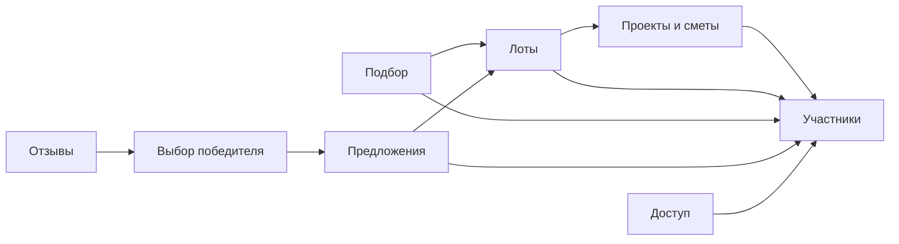

# План реализации: Границы модулей и владение данными

Исторический технический план от 14.08.2026. Статусы и результаты ниже относятся к исходному наблюдению, не подтверждают текущий runtime и не разрешают новый запуск или публикацию. Перед исполнением сверить актуальный код, канонические требования и отдельно разрешённую задачу.

Продуктовое содержание и точный исторический оригинал: [источник в Outline](https://docs.astforum.ru/doc/istochnik-06102026-granicy-modulej-i-vladenie-dannymi-e42c3dd1-Ie46CFctT0).

Действующие требования: [Тех стек](https://docs.astforum.ru/doc/teh-stek-BcrxZGAZxc).

Происхождение: `docs/architecture/module-boundaries-and-data-ownership.md`, SHA-256 `e42c3dd12e42a3ed79accc632ac26c8cbaf3c6ebaed2c03baae0b810e368f977`. Проверка сохранения указана в [реестре миграции](../../artifacts/repository-audits/document-migration-manifest.json).

## Последовательность и проверки

1. Зафиксировать публичные порты модулей и запрет импорта внутренних SQL/repositories.
2. Реализовать RegistrationCoordinator в общей транзакции; конкурентный повтор callback проверить через уникальные ограничения.
3. Связать локальные команды с transactional outbox и адаптерами EventBus/JobQueue; обработчики повторной доставки должны быть идемпотентны.
4. Реализовать FileAccessPolicy и проверки pending_upload/available/rejected без выдачи публичных приватных URL.
5. Проверить негативные импорты/чужие записи, callback races, outbox rollback/retry и запрет скачивания до проверки прав.

## Технические контракты исходного решения

Документ определяет внутреннюю архитектуру модульного монолита FORUM. Его цель — сохранить независимость доменных областей сейчас и обеспечить выделение отдельных сервисов позднее без переработки бизнес-логики.

## 1. Архитектурные правила

MVP состоит из трёх отдельно запускаемых контейнеров: `web`, `api` и `worker`. Контейнеры `api` и `worker` используют одну backend-кодовую базу и одни доменные модули.

Каждый модуль:

- владеет своими таблицами и изменяет их только через собственный прикладной слой;
- предоставляет другим модулям публичные команды и запросы;
- не импортирует внутренние репозитории, SQL и прикладные сервисы другого модуля;
- публикует значимые факты через transactional outbox;
- хранит ссылки на чужие сущности по идентификаторам, не копируя их состояние без необходимости;
- выполняет критичную локальную операцию в одной транзакции PostgreSQL.

Для MVP допустим синхронный вызов публичного интерфейса другого модуля внутри процесса. Асинхронная реакция выполняется через outbox и `EventBus`. Этот контракт сохраняется при замене локальной доставки на Kafka.

Межмодульный сценарий регистрации координирует прикладной сервис `RegistrationCoordinator`. Он вызывает публичные команды модулей доступа и участников в одной общей транзакции PostgreSQL. Ни один модуль не изменяет чужие таблицы напрямую. При будущем разделении этих модулей координатор заменяется оркестрацией с компенсирующими действиями, а внешний контракт регистрации не меняется.

## 2. Направление зависимостей

Инфраструктурные модули файлов, уведомлений и аудита обслуживают доменные модули через порты. Доменная логика не зависит от AWS S3, pg-boss, Kafka или Platform V SDK напрямую.

## 3. Модули и владельцы данных

Названия таблиц ниже задают логическую область владения и детализируются в ERD и SQL-миграциях.

| Модуль | Ответственность | Собственные данные | Публичные возможности |
| --- | --- | --- | --- |
| Доступ | Внешняя идентификация, пользовательская сессия, роли и серверная авторизация | `users`, `external_identities`, `email_confirmation_tokens`, `local_credentials`, `credential_reset_tokens`, `sessions`, `role_assignments` | завершить регистрацию; подтвердить email; открыть и закрыть сессию; проверить право |
| Участники и организации | Customer Company, Provider, пользователи организаций, приглашения, профили и ограничения | `participants`, `organizations`, `memberships`, `invitations`, `participant_profiles`, `offer_profiles`, `assigned_workers`, `profile_documents`, `participant_restrictions` | получить участника; проверить членство; управлять профилем и пользователями |
| Справочники | Категории, регионы, единицы измерения, требования, шаблоны и причины решений | `categories`, `regions`, `units`, `document_requirements`, `offer_templates`, `offer_template_fields`, `moderation_reasons`, `restriction_reasons` | получить активный справочник; опубликовать версию шаблона; управлять значениями |
| Проекты и сметы | Проекты, первичные контракты, объекты, заказы-сметы, импорт и нормализация строк | `projects`, `primary_contracts`, `project_contracts`, `construction_objects`, `construction_orders`, `imported_estimates`, `estimate_lines`, `normalized_estimate_lines` | импортировать смету; уточнить строку; подготовить предложения лотов |
| Лоты и модерация контента | Lot Suggestion, Lot, обязательное раскрытие, состояния, вложения и решение модератора | `lot_suggestions`, `lot_suggestion_lines`, `lots`, `lot_lines`, `lot_disclosures`, `lot_attachments`, `lot_moderation_decisions` | создать и изменить лот; отправить на модерацию; опубликовать или отклонить |
| Подбор исполнителей | Lot-Provider Fit и видимость опубликованных лотов | `lot_provider_matches`, `match_exclusions` | пересчитать соответствие; проверить видимость; перечислить Visible Lots |
| Предложения и комментарии | Финальные Offers, покрытие строк, вложения предложения, вопросы и уточнения по лоту | `offers`, `offer_line_items`, `offer_values`, `offer_attachments`, `lot_comments`, `lot_clarifications` | отправить Offer; добавить комментарий; экспортировать предложения |
| Выбор победителя и пакет сделки | Выбор одного или нескольких победителей, раскрытие контактов, Deal Package | `winner_selections`, `selected_offers`, `contact_disclosures`, `deal_packages`, `deal_confirmations` | выбрать победителей; закрыть сбор; сформировать пакет; подтвердить сделку |
| Отзывы и предпочтения | Отзывы, ответы, избранное и чёрный список | `reviews`, `review_responses`, `favorite_providers`, `provider_blocks` | оставить и модерировать отзыв; ответить; изменить предпочтение |
| Файлы | Метаданные объектов, проверки, карантин и права скачивания | `file_objects`, `file_scan_results` | выдать загрузку; завершить проверку; выдать временное скачивание |
| Уведомления | Настройки каналов, задания доставки и результаты попыток | `notification_settings`, `notification_deliveries`, `delivery_attempts` | запланировать уведомление; повторить доставку; изменить настройки |
| Аудит | Неизменяемый журнал значимых действий | `audit_events` | записать событие аудита; выполнить разрешённый поиск |
| Аналитика | Операционные проекции и агрегаты для кабинетов | `metric_snapshots`, `operational_projections` | обновить проекцию; получить метрики в границах роли |
| Интеграционная доставка | Надёжная публикация событий, идемпотентность потребителей и история доставки | `outbox_events`, `processed_events`, `event_delivery_attempts` | поставить событие; подтвердить обработку; повторить доставку |

## 4. Граница регистрации

### 4.1 Физическое лицо

1. Модуль доступа начинает авторизацию через Сбер ID.
2. Backend проверяет `state`, `nonce`, подпись токена, издателя, аудиторию и срок действия.
3. После успешного ответа модуль участников создаёт Provider физического лица.
4. Модуль доступа создаёт пользователя, внешнюю идентичность и роль Исполнителя.
5. Модуль участников записывает outbox-событие `ParticipantRegistered`.

### 4.2 Юридическое лицо или ИП

1. Модуль доступа начинает авторизацию через Контур.Диадок.
2. Backend проверяет ответ провайдера и получает подтверждённую связь пользователя с организацией.
3. Модуль участников создаёт Customer Company или Provider и назначает первого пользователя администратором организации.
4. Модуль доступа создаёт пользователя, внешнюю идентичность и роли.
5. Модуль участников записывает outbox-событие `ParticipantRegistered`.

Аккаунт, участник и организация создаются только после успешной внешней идентификации. Сущности заявки на регистрацию, ручного решения модератора и статуса верификации не создаются. При повторном callback операция идемпотентно возвращает ранее созданный результат. Уникальность внешнего субъекта провайдера и организации защищается ограничениями PostgreSQL.

## 5. Синхронные контракты

Синхронные вызовы применяются, когда вызывающему модулю нужен ответ для завершения текущей пользовательской операции.

| Контракт | Владелец | Типичные потребители |
| --- | --- | --- |
| `AccessPolicy` | Доступ | Все защищённые прикладные сценарии |
| `ParticipantDirectory` | Участники и организации | Проекты, лоты, подбор, предложения |
| `LotVisibility` | Подбор исполнителей | API видимых лотов и уведомления |
| `OfferEligibility` | Предложения и комментарии | API отправки предложения |
| `FileAccessPolicy` | Файлы | Лоты, предложения, отзывы |
| `DealEligibility` | Выбор победителя | Отзывы и раскрытие контактов |

Публичный контракт возвращает необходимые данные или доменную ошибку. Он не раскрывает таблицы, SQL и внутренние модели хранения владельца.

## 6. Доменные события

События именуются свершившимися фактами и содержат стабильный `eventId`, `occurredAt`, версию схемы, идентификатор корреляции и минимальный payload.

| Событие | Издатель | Основные потребители |
| --- | --- | --- |
| `ParticipantRegistered` | Участники и организации | Аудит, уведомления, аналитика |
| `ParticipantRestricted` | Участники | Доступ, подбор, аудит |
| `EstimateImported` | Проекты и сметы | Аудит, аналитика |
| `LotSubmittedForModeration` | Лоты | Уведомления, аудит |
| `LotPublished` | Лоты | Подбор, уведомления, аналитика |
| `LotRejected` | Лоты | Уведомления, аудит |
| `LotVisibilityChanged` | Подбор | Уведомления, аналитика |
| `OfferSubmitted` | Предложения | Уведомления, аудит, аналитика |
| `WinnersSelected` | Выбор победителя | Уведомления, аудит, отзывы |
| `ContactsDisclosed` | Выбор победителя | Аудит |
| `DealConfirmed` | Выбор победителя | Отзывы, аудит |
| `ReviewPublished` | Отзывы | Уведомления, аналитика |

Доставка имеет семантику at-least-once. Каждый обработчик хранит `eventId` или иной ключ идемпотентности и безопасно повторяет обработку.

## 7. Транзакции и outbox

Команда изменяет данные своего модуля и добавляет запись в `outbox_events` в одной транзакции PostgreSQL. Worker доставляет событие через текущий адаптер `EventBus` и отмечает попытку доставки.

В MVP:

- `JobQueue` использует pg-boss для фоновой работы;
- `EventBus` доставляет outbox-события локальным подписчикам;
- доменные обработчики не зависят от API pg-boss.

При переходе на Platform V Kafka меняется адаптер публикации и конфигурация доставки. Схемы событий, обработчики и транзакционная запись outbox сохраняются.

## 8. Файлы и AWS S3

Модуль файлов владеет ключами объектов и политиками доступа. Доменные модули хранят только `fileId` в связующей таблице владельца файла.

Поток загрузки:

1. API создаёт `file_object` в состоянии `pending_upload`.
2. Клиент загружает объект по ограниченному presigned URL.
3. Worker проверяет размер, тип и результат антивирусной обработки.
4. После успешной проверки файл становится `available`; иначе — `rejected`.
5. Скачивание выполняется только после серверной проверки `FileAccessPolicy`.

Прямые публичные URL и постоянные ссылки на приватные объекты не используются.

## 9. Соответствие Platform V

| Архитектурный порт | MVP | Целевой сервис Platform V |
| --- | --- | --- |
| Реляционная БД | PostgreSQL | Pangolin / Pangolin DB, услуга 1.1 |
| Объектное хранилище | AWS S3 | S3 Platform V, услуги 1.8 и 2.1.3 |
| `EventBus` | PostgreSQL outbox и локальная доставка | Kafka Sber Edition, услуга 1.10 |
| Контейнерная платформа | Kubernetes-ready | Platform V Kubernetes, услуги 1.11 и 2.1.2 |
| Внешний IAM | Сбер ID и Контур.Диадок | Platform V IAM или ESIA Gateway, услуги 1.13 и 1.19 |
| Журналирование | JSON-логи и OpenTelemetry | Platform V Monitor, услуга 1.14 |
| Аудит | PostgreSQL `audit_events` через `AuditSink` | Platform V Audit, услуга 1.15 |
| Мониторинг | OpenTelemetry, health и readiness | Platform V Monitor, услуга 1.16 |
| Секреты | переменные окружения / внешний secret store | Platform V Secret Management, услуга 1.12 |

Совместимость означает сохранение прикладных портов и доменных контрактов. Она не требует подключения Platform V SDK в доменные модули MVP.

## 10. Ограничения границ

- Общей папки `repositories` для всех доменов нет.
- Общие типы ограничены идентификаторами, временем, деньгами, пагинацией и базовыми результатами операций.
- Модуль аналитики не становится источником истины для доменных решений.
- Модуль аудита не используется как очередь событий.
- Kafka не используется для синхронных проверок прав и критичных ответов пользователю.
- Файловый ключ S3 не считается правом доступа к файлу.
- Worker не изменяет таблицы модуля напрямую: он вызывает публичный прикладной сценарий владельца.

## 11. Логическая модель данных

Первичные и внешние ключи, уникальные ограничения, индексы, состояния и транзакционные границы определены в [логической модели данных PostgreSQL](https://docs.astforum.ru/doc/istochnik-06102026-logicheskaya-model-dannyh-postgresql-448ef173-pvjqxVNAnb).

Следующий артефакт — публичные REST-контракты и каталог доменных событий с версиями payload, ошибками и правилами идемпотентности.
