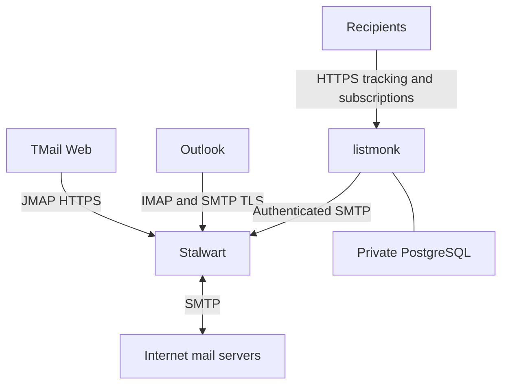

# AST Forum mail stack

Исторический технический план от 2026-09-08. Статусы и результаты ниже относятся к исходному наблюдению, не подтверждают текущий runtime и не разрешают новый запуск или публикацию. Перед исполнением сверить актуальный код, канонические требования и отдельно разрешённую задачу.

Происхождение: `docs/plans/2026-09-08-001-feat-astforum-mail-stack-plan.md`, SHA-256 `c524ad57c0a7f5f1c95e9dab461a479fb6e21f1cf4d18acf3dbd44730cb21462`. Проверка сохранения указана в [реестре миграции](../../artifacts/repository-audits/document-migration-manifest.json).

## Scope and requirements

User explicitly authorized installation and integration on the existing astforum VPS.
R1: administer mailboxes at astforum.ru in Stalwart.
R2: access the same mailbox using TMail Web/JMAP and Outlook/IMAP+SMTP.
R3: prepare listmonk campaigns using an authenticated astforum.ru sender.
R4: preserve existing website, Outline, pgAdmin and Cal.diy services/data.
R5: verify actual protocol behavior and report external dependencies honestly.
Bulk campaigns and external test messages are not authorized by installation alone.

## Context and sources

- Existing production access: SSH alias forum-prod, Debian 13 AMD64, passwordless sudo.
- VM network: 172.16.160.16 behind an external gateway at 84.47.165.130; only origin HTTP 80 currently published. Public HTTPS terminates outside the VM.
- Available resources: approximately 4.6 GiB available memory, 45 GiB free storage.
- Docker Compose is already in use; existing Caddy container is outline-caddy-1, network outline_frontend.
- Follow additive host routes and reload patterns in deployment/dev-landing/deploy.sh, without invoking its unrelated full deployment.
- Existing separation pattern: cal-diy-astforum/deployment/astforum/compose.yaml.
- Earlier deployment: docs/superpowers/plans/2026-08-21-outline-production-deployment.md.
- No docs/solutions or applicable local root AGENTS file found; user-provided instructions apply.
- https://stalw.art/docs/install/platform/docker/
- https://github.com/stalwartlabs/stalwart/releases
- https://github.com/linagora/tmail-flutter
- https://listmonk.app/docs/installation/
- https://listmonk.app/docs/configuration/
- https://listmonk.app/docs/bounces/

## Technical decisions

| Component | Decision | Reason |
|---|---|---|
| Installation | Separate astforum-mail Compose project, remote installation directory /opt/astforum-mail | Independent lifecycle and persistent data |
| Mail | Pinned stable Stalwart image, domain astforum.ru, host mail.astforum.ru | SMTP, IMAP, JMAP and common mailbox store |
| Webmail | Pinned official TMail Web image at webmail.astforum.ru | Browser client; validate auth/discovery interoperability |
| Campaigns | Pinned listmonk image at campaigns.astforum.ru and private PostgreSQL | Campaign UI and public tracking/subscription endpoints |
| HTTP | Add routes to existing origin Caddy; public HTTPS via existing gateway | Preserve working service ingress |
| Credentials | Generate on VPS; restricted files; never print or commit | Repeatable bootstrap without exposing credentials |
| DNS | Add service A records; publish generated DKIM and appropriate SPF/DMARC; switch MX only when public SMTP works | Avoid directing inbound mail at an unavailable server |

This illustrates the intended approach and is directional guidance for review, not implementation specification.

## Implementation units

- [x] **1. Inventory and prerequisites** — R4, R5. Inspect existing deployment, live resources, DNS, network, sudo, port conflicts. No tests added: read-only inventory. Confirmed inbound network and DNS access are external dependencies; asked user where the gateway is managed.
- [x] **2. Isolated installation and bootstrap** — R1, R4. Depends on 1. Files: deployment/mail/compose.yaml, deployment/mail/README.md and remote /opt/astforum-mail configuration/secrets/data. Pin verified upstream releases, private listmonk database, restart policies, Stalwart domain/admin and separate mailbox/service identities. Scenarios: services healthy after restart; admin can create account; passwords are rejected when incorrect; unauthenticated relay is refused. Verification via upstream APIs/protocol probes; no mirrored unit tests for configuration.
- [x] **3. Integrations and origin access** — R2, R3, R4. Depends on 2. Files: deployment/mail/tmail configuration, additive Caddy routes, listmonk settings, deployment/mail/verify.py. Configure TMail JMAP authentication against actual Stalwart capabilities; use registered OAuth client if discovery requires it. Authenticated SMTP from listmonk; private POP3S bounce access if supported. Scenarios: TMail logs into mailbox; message submitted to a local test mailbox appears over IMAP/JMAP; listmonk SMTP settings validate; admin routes require authentication; public subscription/tracking routes remain reachable. Use disposable test recipients only under user-owned astforum.ru.
- [ ] **4. Public ingress, DNS and handoff** — R1–R5. Depends on 3 and external gateway/DNS access. Files: deployment/mail/dns-records.txt, deployment/mail/README.md and remote backup configuration. Configure required public mail TCP ports, trusted TLS certificates, DNS forward/reverse records; test independently from outside VM. Preserve existing REG.RU sender authorization if still used by Outline/Cal.diy. Do not claim public mail readiness until external port/TLS/DNS checks pass. Verify existing websites still respond normally. Prepare admin access instructions, mailbox creation and Outlook settings. Document bounded backups and restoration, and explicitly identify any unsatisfied external prerequisite.

## Risk and uncertainty

- Gateway ownership/configuration and dedicated public SMTP ingress remain unknown; no assumptions that an HTTP edge proxies SMTP/IMAP.
- Mail subdomains, SPF, DKIM and DMARC are published as of September10. Current MX still points at non-resolving 0.astforum.ru; replacing it is dependent on public SMTP readiness and recipient inventory.
- Stalwart stable 0.16 uses a different configuration/API layout from archived 0.15 docs. Use matching current release documentation and inspect actual container capabilities.
- TMail basic/OIDC discovery and feature compatibility require execution-time testing; do not silently replace the selected webmail.
- Outbound TCP 25 and actual egress IP must be verified. Successful SMTP submission proves acceptance only, not delivery/inbox placement.
- Existing external SMTP sending must not be broken by an overly restrictive SPF or changing credentials of existing applications.
- Backups of live mail storage must use a consistent supported snapshot/export or brief bounded stop; listmonk PostgreSQL uses a logical dump. Initial local backup is not an offsite backup.
- Root credentials are retained only in restricted files; handoff must give paths and access method without exposing secrets in logs.

## Execution posture

Deployment is explicitly authorized. Planning serves execution; no additional plan-approval pause is necessary. Resolve runtime compatibility during installation, verify every claim, and continue all work independent of external access while awaiting the user's gateway details.

## Historical execution records

Execution/mailbox/delivery observations remain in the exact pinned original and private backup. They do not prove the current server or authorize another message. Repeat the technical health/restore checks from the implementation units against the named authorized target.
