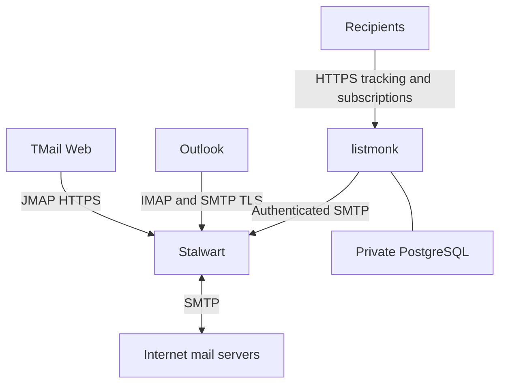

# AST Forum mail stack

## Scope and requirements

User explicitly authorized installation and integration on the existing astforum VPS.
R1: administer mailboxes at astforum.ru in Stalwart.
R2: access the same mailbox using TMail Web/JMAP and Outlook/IMAP+SMTP.
R3: prepare listmonk campaigns using an authenticated astforum.ru sender.
R4: preserve existing website, Outline, pgAdmin and Cal.diy services/data.
R5: verify actual protocol behavior and report external dependencies honestly.
Bulk campaigns and external test messages are not authorized by installation alone.

## Context and sources

- Existing production access: SSH alias forum-prod, Debian 13 AMD64, passwordless sudo.
- VM network: 172.16.160.16 behind an external gateway at 84.47.165.130; only origin HTTP 80 currently published. Public HTTPS terminates outside the VM.
- Available resources: approximately 4.6 GiB available memory, 45 GiB free storage.
- Docker Compose is already in use; existing Caddy container is outline-caddy-1, network outline_frontend.
- Follow additive host routes and reload patterns in deployment/dev-landing/deploy.sh, without invoking its unrelated full deployment.
- Existing separation pattern: cal-diy-astforum/deployment/astforum/compose.yaml.
- Earlier deployment: docs/superpowers/plans/2026-08-21-outline-production-deployment.md.
- No docs/solutions or applicable local root AGENTS file found; user-provided instructions apply.
- https://stalw.art/docs/install/platform/docker/
- https://github.com/stalwartlabs/stalwart/releases
- https://github.com/linagora/tmail-flutter
- https://listmonk.app/docs/installation/
- https://listmonk.app/docs/configuration/
- https://listmonk.app/docs/bounces/

## Technical decisions

| Component | Decision | Reason |
|---|---|---|
| Installation | Separate astforum-mail Compose project, remote installation directory /opt/astforum-mail | Independent lifecycle and persistent data |
| Mail | Pinned stable Stalwart image, domain astforum.ru, host mail.astforum.ru | SMTP, IMAP, JMAP and common mailbox store |
| Webmail | Pinned official TMail Web image at webmail.astforum.ru | Browser client; validate auth/discovery interoperability |
| Campaigns | Pinned listmonk image at campaigns.astforum.ru and private PostgreSQL | Campaign UI and public tracking/subscription endpoints |
| HTTP | Add routes to existing origin Caddy; public HTTPS via existing gateway | Preserve working service ingress |
| Credentials | Generate on VPS; restricted files; never print or commit | Repeatable bootstrap without exposing credentials |
| DNS | Add service A records; publish generated DKIM and appropriate SPF/DMARC; switch MX only when public SMTP works | Avoid directing inbound mail at an unavailable server |

This illustrates the intended approach and is directional guidance for review, not implementation specification.

## Implementation units

- [x] **1. Inventory and prerequisites** — R4, R5. Inspect existing deployment, live resources, DNS, network, sudo, port conflicts. No tests added: read-only inventory. Confirmed inbound network and DNS access are external dependencies; asked user where the gateway is managed.
- [x] **2. Isolated installation and bootstrap** — R1, R4. Depends on 1. Files: deployment/mail/compose.yaml, deployment/mail/README.md and remote /opt/astforum-mail configuration/secrets/data. Pin verified upstream releases, private listmonk database, restart policies, Stalwart domain/admin and separate mailbox/service identities. Scenarios: services healthy after restart; admin can create account; passwords are rejected when incorrect; unauthenticated relay is refused. Verification via upstream APIs/protocol probes; no mirrored unit tests for configuration.
- [x] **3. Integrations and origin access** — R2, R3, R4. Depends on 2. Files: deployment/mail/tmail configuration, additive Caddy routes, listmonk settings, deployment/mail/verify.py. Configure TMail JMAP authentication against actual Stalwart capabilities; use registered OAuth client if discovery requires it. Authenticated SMTP from listmonk; private POP3S bounce access if supported. Scenarios: TMail logs into mailbox; message submitted to a local test mailbox appears over IMAP/JMAP; listmonk SMTP settings validate; admin routes require authentication; public subscription/tracking routes remain reachable. Use disposable test recipients only under user-owned astforum.ru.
- [ ] **4. Public ingress, DNS and handoff** — R1–R5. Depends on 3 and external gateway/DNS access. Files: deployment/mail/dns-records.txt, deployment/mail/README.md and remote backup configuration. Configure required public mail TCP ports, trusted TLS certificates, DNS forward/reverse records; test independently from outside VM. Preserve existing REG.RU sender authorization if still used by Outline/Cal.diy. Do not claim public mail readiness until external port/TLS/DNS checks pass. Verify existing websites still respond normally. Prepare admin access instructions, mailbox creation and Outlook settings. Document bounded backups and restoration, and explicitly identify any unsatisfied external prerequisite.

## Risk and uncertainty

- Gateway ownership/configuration and dedicated public SMTP ingress remain unknown; no assumptions that an HTTP edge proxies SMTP/IMAP.
- Mail subdomains, SPF, DKIM and DMARC are published as of September10. Current MX still points at non-resolving 0.astforum.ru; replacing it is dependent on public SMTP readiness and recipient inventory.
- Stalwart stable 0.16 uses a different configuration/API layout from archived 0.15 docs. Use matching current release documentation and inspect actual container capabilities.
- TMail basic/OIDC discovery and feature compatibility require execution-time testing; do not silently replace the selected webmail.
- Outbound TCP 25 and actual egress IP must be verified. Successful SMTP submission proves acceptance only, not delivery/inbox placement.
- Existing external SMTP sending must not be broken by an overly restrictive SPF or changing credentials of existing applications.
- Backups of live mail storage must use a consistent supported snapshot/export or brief bounded stop; listmonk PostgreSQL uses a logical dump. Initial local backup is not an offsite backup.
- Root credentials are retained only in restricted files; handoff must give paths and access method without exposing secrets in logs.

## Execution posture

Deployment is explicitly authorized. Planning serves execution; no additional plan-approval pause is necessary. Resolve runtime compatibility during installation, verify every claim, and continue all work independent of external access while awaiting the user's gateway details.

## Execution status — 2026-09-08

Unit 2 is installed: Stalwart0.16.21, TMail0.36.0, listmonk6.2.0 and PostgreSQL17 are running. Domain, admin, six mailbox/service identities including the admin, OAuth client and submission587 are configured. Positive authentication, incorrect-password rejection, STARTTLS587, private POP3S login, restricted envelope sender and refused unauthenticated relay are verified. Protected administration endpoints reject unauthenticated requests.

Unit 3 is partially verified: origin routes and CORS work, local SMTP delivery to Inbox is readable through IMAPS/JMAP. listmonk SMTP and bounce settings are saved with certificate verification enabled. Browser login, real listmonk send and bounce polling await trusted TLS.

Unit 4 is blocked on external prerequisites: three service A records were published in REG.RU, but Mac lock prevents further DNS editing. Gateway access remains unknown; external mail TCP ports time out and HTTPS fails TLS. MX, SPF, DKIM, DMARC, PTR and public certificates are pending. Certbot's manual attempt was cancelled without issuing a certificate.

Created and validated a consistent local backup in `/var/backups/astforum-mail/20260908T114946Z`; services restarted successfully. Handoff and exact pending DNS records are in `deployment/mail/README.md` and `deployment/mail/dns-records.txt`. Existing application origins still return200.

The deployment is not marked complete: user-facing mail and campaigns still require gateway/DNS/TLS completion and browser verification.

## Execution status — 2026-09-10

Public HTTPS is working for all three interfaces. Fixed a false-positive ban on the origin Caddy IP by preserving the real client address from the observed edge172.16.160.13, removing untrusted Forwarded, and enabling useXForwarded. The CORS response header is deferred so it overrides the upstream wildcard on OIDC endpoints. TMail now redirects to Stalwart's OAuth form in Chrome. Public HTTPS OAuth authorization with PKCE, code exchange, ID/access/refresh token issuance, JMAP Inbox and refresh were verified with the dedicated test mailbox. A complete interactive browser login is still unverified.

Production Let's Encrypt certificate for mail.astforum.ru is installed and served on SMTP/IMAP. Certificate lifetime ends December9,2026. Certbot timer and deploy hook own automatic renewal; dry-run renewal passed. The hook validates the chain, hostname, key and expiry, imports/updates its own Stalwart certificate, reloads TLS and verifies the served leaf. Both create and update paths passed, including TLS after container restart. The former staging certificate is preserved; native ACME management was replaced by external Certbot automation without deleting certificates.

SPF, RSA and Ed25519 DKIM and DMARC records are published in REG.RU and checked on ns1.reg.ru. MX remains unchanged. listmonk's SMTP test delivered locally to mailtest@astforum.ru with bounces@astforum.ru as the envelope sender. Bounce polling is enabled and successful authenticated POP3S access was confirmed in Stalwart logs. Stored SMTP/POP3 passwords were privately compared with their original secret files after accounting for API password masking.

Consistent backup /var/backups/astforum-mail/20260910T162543Z includes PostgreSQL dump, Stalwart data, settings/secrets, uploads, Caddy and Certbot state. Checksums and archive/dump contents passed; all four containers restarted. Existing origin sites astforum.ru, docs, pg, dev and cal still return200.

External TCP25/465/587/993 still time out; PTR is empty. User will forward exact DNAT/firewall/PTR instructions to their administrator. No external recipient was mailed; external deliverability, MX cutover and Outlook remain pending. The deployment is not marked complete. Current handoff is deployment/mail/README.md.

## Verification status — 2026-09-11

Public TCP25/465/587/993 are now enabled and MX is0 mail.astforum.ru. All four ports pass external protocol/TLS checks. Public SMTP465 submission and IMAP993 receipt of the same synthetic message passed; STARTTLS587 authentication passed. SMTP25 accepts the local test recipient, rejects unknown recipients and denies unauthenticated relay before DATA. Outbound25 connections to Gmail and Yandex MX work.

TMail was tested in an isolated browser: OAuth sign-in, Inbox, reading an existing test message, composing and sending a new message. The browser-created message was independently found in IMAP Inbox. The initial apparent loading screen was an accessibility snapshot limitation of Flutter; enabling semantics exposed the already rendered UI without production changes.

listmonk SMTP test delivery and recent successful POP3S polling passed. Published SPF/DKIM/DMARC and matching selectors in outgoing test messages were inspected. Containers are healthy/running and the Certbot timer is active.

Remaining external prerequisite: PTR84.47.165.130→mail.astforum.ru. All three authoritative reverse-zone nameservers under naukanet.ru return NXDOMAIN. External inbox delivery/reputation was not tested, no messages were sent to external recipients, and Outlook itself was not launched. Unit4 remains incomplete pending PTR and external delivery validation. See deployment/mail/README.md for current details.

Public listmonk form login and rendered dashboard were also verified in an isolated browser. Existing counts: two lists, two subscribers, one draft campaign, zero campaign messages sent; these records were not modified by verification.

## Mailbox inventory update — 2026-09-11

The user deleted docs@astforum.ru and mailtest@astforum.ru. Live Stalwart account inventory confirms only admin, postmaster, newsletter and bounces remain. Removed both deleted mailbox entries from the generated credential exports on the VPS and in Downloads; README now reflects the active inventory. Historical integration results remain valid for the earlier test, but verify.py still requires its dedicated test recipient and should not be rerun without adaptation. No accounts were recreated.
