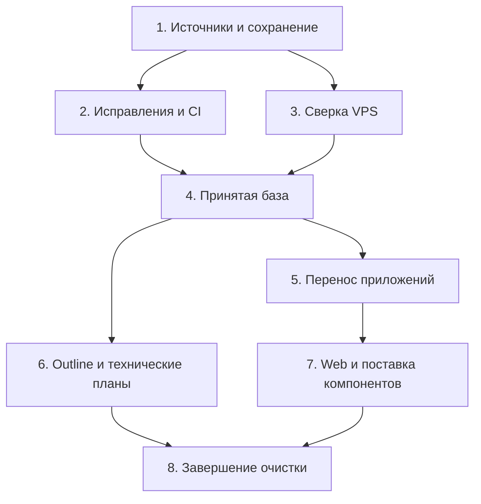

# План наведения порядка в Forum

**Целевой репозиторий:** `mcvvvnukova-bit/forum`. Основание — запрос владельца и [живой аудит 6 октября](../../artifacts/repository-audits/2026-10-06-forum-repository-audit.md).

## Проблема и результат

Актуальная работа сохранена в GitHub, но распределена по 13 открытым PR. Main не содержит принятую версию работающего приложения. Локальный checkout смешивает старую ветку, untracked исходники других веток, макеты и доказательства публикации. Публичный сайт собирается последовательными публикациями нескольких пакетов; следующая публикация способна нарушить общую авторизацию. SSH к VPS пока недоступен.

Результат: чистый checkout принятой ветки собирает согласованное приложение; каждому серверному компоненту соответствуют source SHA, конфигурация и проверенный артефакт; документы и архивы имеют понятное назначение. Перестройка каталогов проводится после установления этой базы.

## Требования и границы

- R1. Сохранить локальные изменения, историю всех веток/worktrees и двух вложенных Git-репозиториев; не потерять ignored материалы восстановления.
- R2. Устранить F1–F6 из аудита и определить принятые версии всех компонентов.
- R3. Иметь воспроизводимые checks из чистого checkout, включая совместную работу homepage/audience/auth и защищённые DB-права.
- R4. Проверить соответствие local → GitHub → build → VPS по manifests/hashes, отдельно для dev и production.
- R5. Разделить приложения, deployment, инструменты, документы, evidence и исторические материалы.
- R6. Каждый кодовый этап проходит проверенную задачу OpenProject, отдельную ветку, commit, push, PR, OP#-коды в body, проверку вкладки GitHub и прикрепление PR в Codex.
- R7. В `docs/` остаются только планы технической реализации, собранные в `docs/plans/`. Все продуктовые описания, требования, спецификации и продуктовые индексы хранятся в Outline `docs.astforum.ru`; в репозитории используются ссылки на них.
- R8. Парсер организаций и финансов по ОКВЭД из закрытого PR №2 исключён из системы: его код, тесты, миграции, конфигурация и задания не принимаются при интеграции веток и не входят в будущую разработку.

Выполнение плана не добавляет новый продуктовый функционал. Переход IAM с sandbox iam/party на public и подключение реальных данных профиля — отдельные задачи. Исторические документы о парсере не создают задания на разработку; общий справочник ОКВЭД рассматривается отдельно от исключённого парсера. Outline — единственное место продуктового описания. Перед удалением продуктового файла из Git подтвердить сохранность его нужного содержания в Outline, включая ссылки и вложения, сохранением и повторным открытием под Кузьмина.

Сегодня сделаны read-only аудит, fetch и подготовка документов. Merge, удаление веток/worktrees, перенос каталогов, migration и deployment ещё не выполнены.

## Решения

| Решение | Почему |
|---|---|
| Сначала матрица источников, затем принятая база, потом переносы | Dirty checkout и серверный staging не определяют автоматически действующую версию |
| Сохранять имеющиеся Node 24, npm, React/Primer/Vite и Python | У новых UI-пакетов уже совпадают основные версии; смена стека не решает найденные дефекты |
| Сначала сохранить UI-пакеты отдельными apps | Отделяет исправление путей от общего router/session/release-контракта |
| Общий публичный сайт получает одного владельца релиза | Составной artifact предотвращает F5–F6 и зависимость от ручной очередности публикаций |
| Deployment использует принятую сборку и manifest | Git HEAD сервера недостаточен для сайта из нескольких PR и postbuild injection |
| Архивы не включать в активную сборку/деплой | №10 содержит старые runtime-файлы, historical scripts привязаны к прежним состояниям |
| `docs/` содержит только технические планы | Продуктовые документы находятся в Outline; эксплуатационные инструкции остаются рядом с кодом/конфигурацией, evidence — в artifacts |
| Исключённый парсер не включать в принятые ветки и планы | Владелец подтвердил, что этот функционал системе не нужен; исторические материалы не служат требованиями |
| Cal.diy сохранять отдельным репозиторием | Его история, upstream и релизный цикл самостоятельны; Forum хранит интеграционный контракт |

Для CI использовать минимальные permissions и устойчивое имя итоговой проверки. Возможность required checks для приватного repo сначала сверить с тарифом; сейчас GitHub rulesets API требует Pro. До доступности enforceable gates применять обязательный ручной gate с ссылкой на успешный CI перед merge, сохраняя repo приватным. [GitHub: protected branches](https://docs.github.com/en/repositories/configuring-branches-and-merges-in-your-repository/managing-protected-branches), [workflow permissions](https://docs.github.com/en/actions/reference/workflows-and-actions/workflow-syntax).

## Единицы выполнения



### 1. Матрица происхождения и сохранение работы — P0

- [ ] Цель/R1,R6: зафиксировать источники и сохранённую копию до первой изменяющей операции.
- **Зависимости:** нет; GitHub/OpenProject уже доступны, SSH не нужен для локальной части.
- **Файлы:** аудит и матрица происхождения в `artifacts/repository-audits/`; техническая карта репозитория в root `README.md`; backup inventory вне Git.
- **Подход:** учесть все 19 local branches, 8 worktrees, dirty tracked/untracked/ignored, Cal.diy и standalone primer-home. Для каждого компонента записать source ref/SHA, local delta, PR, задачу и intended runtime/archive статус. Приватную копию проверять восстановлением в отдельную папку; секреты не помещать в repo/manifests/logs. При активности другого чата повторить snapshot перед переносом.
- **Проверка:** восстановленная копия содержит history и локальные изменения; одинаковые Git blobs не публикуются повторно; неизвестное происхождение явно отмечено. Автотесты приложения не требуются для инвентаризации.
- **OpenProject:** проверить подходящую задачу для всего наведения порядка; если нет — создать до кодовых правок. PROJ-149 покрывает инфраструктуру, PROJ-148 — интеграцию; не подменять ими все продуктовые изменения.

### 2. Исправления и проверки на точных ветках — P0/P1

- [ ] Цель/R2,R3,R6: устранить воспроизведённые ошибки до интеграции веток.
- **Зависимости:** 1. Проверки не обращаются к рабочим БД и реальному провайдеру.
- **Изменяемые файлы:** `deployment/dev-landing/deploy.sh`; `deployment/forum-db/configure_forum_app_role.sh`; `deployment/forum-api/grant-runtime.sql`; `apps/api/test/browser-smoke.mjs`; `deployment/public-auth/src/PublicAuth.tsx`; `deployment/audience-pages/src/App.tsx`; release scripts homepage/audience/auth.
- **Новые/расширяемые tests:** `deployment/dev-landing/tests/test_deploy_rollback.py`; `deployment/forum-db/tests/test_configure_role_contract.py`; `deployment/forum-db/tests/public-schema.sql`; `tests/integration/public-site-composition.test.tsx`; `tests/integration/test_public_site_release.py`.
- **Новые CI-файлы:** `.github/workflows/quality.yml`, `scripts/verification/check-repository-layout.mjs`. Подключить существующие scripts API, Vitest и Python; browser/DB tests получают явно объявленные package dependencies и изолированную тестовую БД. Наличие обязательных пакетов проверять manifest, а не зелёным пропуском отсутствующей директории. Первый CI должен работать на проверяемом candidate SHA, даже пока main ещё не собран.
- **Включение правил структуры:** на этапе 2 layout check проверяет объявленные пакеты и фиксирует текущую инвентаризацию документации. Строгий запрет неплановых файлов в `docs/` включить в PR этапа 6 после проверки переноса в Outline; до этого CI не должен требовать удаления ещё не сверенных источников.
- **Сценарии:** late deploy failure восстанавливает gateway/site/password и прежний ответ HTTP; первая установка откатывается к отсутствующему сервису; повторная роль на schema 003 не получает запрещённые ACL; после recreate passfile ставится в новый контейнер; API acceptance стартует из чистого checkout; pending session → auth modal → 401 → Close/Back сохраняет страницу; auth → home и auth → audience сохраняют loader на каждой странице; ошибки публикации не перетирают параллельный релиз.
- **Execution note:** сначала characterization/regression tests воспроизведённых сценариев. Существующие успешно прошедшие suites сохраняются.
- **Проверка:** по каждому исправлению есть воспроизведение до/после; checks проверяют точный SHA и не используют untracked файлы основного checkout. Полный DB-набор выполняется на временной восстановленной БД, включая negative ACL и повторное применение.

### 3. Read-only сверка VPS и границ окружений — P0

- [ ] Цель/R4: установить, что именно сейчас обслуживается.
- **Зависимости:** 1; восстановленный SSH-доступ к `forum-prod`. HTTPS 200 не заменяет этот этап.
- **Файлы:** новый `deployment/environments.md`; новый `deployment/release-manifest.schema.json`; sanitized audit manifests в `artifacts/releases/`. Серверные каталоги определять по фактическим mounts/Compose, затем фиксировать отображение в manifest.
- **Подход:** проверить hostname/IP, контейнеры/images/digests, сети/volumes, фактически применённые Compose overrides, Caddy routes, build hashes и origin/public responses. Для каждой публичной страницы связать исходный пакет, source SHA и версию injected auth. Раздельно зафиксировать forum/public и forum_sber_sandbox/iam/party; проверить backup и способ восстановления без изменения данных. Получить санитарный diff с repo, а не копировать весь `/opt` в Git.
- **Проверка:** у каждого действующего компонента есть происхождение либо явно зафиксированное расхождение. Отдельные provenance fields для нескольких source SHA допустимы до единичного web artifact. Нет секретов, персональных данных или user uploads в отчёте.
- **При блокировке:** продолжить 1–2 и подготовку документов; переход к 4 и любому deploy не считать завершённым до живой сверки.

### 4. Согласованная база GitHub/main — P1

- [ ] Цель/R2,R3,R6: собрать принятый source tree без исторических подмен.
- **Зависимости:** 2 и 3.
- **Файлы:** содержимое принятых PR; `AGENTS.md`, `README.md`; матрица происхождения в `artifacts/repository-audits/`.
- **Порядок:** актуальные правила №3 → выбранные infrastructure baseline №6/7 → корректировки №16; API/DB №5 после fixes; необходимые gateway/build части №4 без повторной full-site публикации; homepage №12, audience №11 и auth №13 как совместно проверенный candidate. №14 оставлять явно fixture. №8 — самостоятельный набор шаблонов. №9 — только после назначения проверенной задачи. Из №10 извлекать архивные добавления; старые логотипы и активные исходники автоматически не принимать.
- **Подход:** каждый этап — небольшой PR либо обновление соответствующего существующего PR, с видимым diff и OpenProject-связями. Сначала проверять интеграционный candidate в отдельном checkout; архивную ветку нельзя считать просто дочерней текущего head №4. Если большая ветка заменена несколькими PR, сохранить таблицу принятых/отклонённых commits и закрыть старую только после доказательства сохранения.
- **Проверка:** clean checkout принятого candidate содержит все объявленные пакеты и lockfiles; сборка/tests/CI проходят вместе; каждое изменение видно в GitHub и во вкладке GitHub соответствующей реальной задачи, включая нужных родителей. Проверить, что принятие старых веток не возвращает код, тесты, миграции и задания исключённого парсера. Merge не равен deployment.

### 5. Перенос приложений и инструментария — P2

- [ ] Цель/R5,R3: сделать границы каталогов понятными без одновременной переписи поведения.
- **Зависимости:** 4.
- **Файлы:** новый root `package.json` и согласованный lockfile; `deployment/primer-home` → `apps/primer-home`; `deployment/audience-pages` → `apps/audience-pages`; `deployment/public-auth` → `apps/public-auth`; `local-previews/user-profile` → `apps/profile-preview`; действующий Python gateway → `apps/dev-gateway`. Deployment templates/scripts оставить в `deployment/` и `scripts/`.
- **Существующие seams:** `deployment/dev-landing/scripts/prepare-runtime.mjs`, `finalize-landing-build.mjs`, Vite configs, `apps/api/test/browser-smoke.mjs`, deploy scripts и `dist/site` контракт. Сначала определить retained legacy frontend пути по матрице 4.
- **Tests:** существующие tests переносятся вместе с пакетами; `tests/integration/public-site-composition.test.tsx`, `tests/integration/test_public_site_release.py` и `scripts/verification/check-repository-layout.mjs` обновляются для новых путей.
- **Сценарии:** clean install/build не читает прежние local-previews/staging; маршруты/asset URLs/cookies/redirects те же; прямое открытие и reload всех routes работает; Python proxy сохраняет headers/cookies/errors; архив отсутствует в build/deploy input.
- **Проверка:** переносы проходят typecheck/build/test и parity manifest. `packages/` создавать только для действительно общего кода. Cal.diy выносить рядом с Forum только после отдельного backup/provenance check и обновления ссылок, не сливая его историю в Forum.

### 6. Продуктовая документация в Outline, технические планы в Git — P2

- [ ] Цель/R5,R7,R8: оставить в `docs/` только технические планы и сохранить нужное продуктовое содержание в Outline.
- **Зависимости:** 4; может идти параллельно 5.
- **Файлы:** весь существующий `docs/`, включая два product indexes, `docs/implementation-plans` и `docs/superpowers`; root `README.md`; технические README рядом с компонентами; `deployment/environments.md`, `deployment/release.md`; `artifacts/README.md`; `artifacts/repository-audits/document-migration-manifest.json`; `.gitignore`; `.gitnexusignore`; `scripts/verification/check-repository-layout.mjs`.
- **Инвентаризация:** классифицировать каждый документ по содержанию, а не имени/папке. Проверить продуктовые копии также в README, artifacts и архивных каталогах: перенос из docs в другой каталог Git не выполняет R7. Для смешанного документа отделить продуктовую часть в Outline, оставив в техническом плане только шаги реализации, зависимости, проверки и ссылки на действующие требования.

| Содержание | Конечное место |
|---|---|
| Продуктовые описания, требования, спецификации, исследования, дизайн и продуктовые индексы | Outline; локальные файлы удаляются из Git после подтверждённой сверки/переноса |
| Планы технической реализации действующего функционала | `docs/plans/`; объединить разрозненные каталоги планов с сохранением статусов и ссылок |
| Техническая карта, запуск, API/компонентные инструкции | Root или компонентный `README.md`; без дублирования продуктового описания |
| Эксплуатация окружений и релизы | `deployment/environments.md`, `deployment/release.md` и инструкции рядом с конфигурацией |
| Технические аудиты, manifests и доказательства проверок | `artifacts/repository-audits/`, `artifacts/releases/`; только необходимые материалы без секретов |
| Исторические задания исключённого парсера | Удалить из действующих планов; история Git/приватная резервная копия сохраняет происхождение без возвращения функционала |

- **Перенос в Outline:** перед действиями проверить identity Кузьмина. Сопоставить файлы с существующими страницами и их актуальной редакцией; не заменять более новые требования старой локальной копией. Переносить только отсутствующее нужное содержание, разрешать расхождения явно, обновить навигацию в Outline. Manifest фиксирует source path/hash, URL/ID страницы, результат сверки и проверки; продуктовый текст в manifest не копировать. Сохранить страницы и повторно открыть; проверить текст, таблицы, ссылки и вложения. Лишь после этого удалять соответствующие файлы из Git в видимом PR и заменять ссылки ссылками на Outline. Проверка переноса не возвращает отменённые требования в активные страницы.
- **Архивы/evidence:** продуктовый архив не создавать внутри репозитория. Старые технические staging/maintenance варианты сохранять только при необходимости восстановления, с origin/version и отдельно от runtime; остальное остаётся в Git history/приватной резервной копии. Доказательства сохранять по allowlist, журналы/сборки/кэши исключить. Уже tracked logs удалять из индекса отдельным видимым diff после сохранения нужного evidence.
- **Проверка:** каждый бывший продуктовый файл имеет подтверждённый результат сверки/переноса или явно обоснованный статус устаревшего; в `docs/` остаются только технические планы, нет product/specs/architecture/adr/design/runbooks/reviews/archive. Layout check запрещает эти каталоги и неплановые файлы; содержательную границу проверять ревью. Markdown-ссылки работают, ссылки на Outline ведут к проверенным страницам; отсутствуют действующие планы парсера и продуктовые дубли в других каталогах Git. Для этого блока нужны link/layout checks; новые поведенческие tests не требуются.

### 7. Общий публичный web и поставка изменённых компонентов — P1

- [ ] Цель/R3,R4: один согласованный router/session/build/release контракт.
- **Зависимости:** 5; runtime rollout также зависит от подтверждённой 3.
- **Файлы:** `apps/web/` собирает принятые homepage/audience/auth; `deployment/web/`; принятые `deployment/forum-api/`, `deployment/forum-db/`, `deployment/pgadmin/` и изменённые инфраструктурные templates; `scripts/deployment/`; `deployment/release-manifest.schema.json`; `deployment/release.md`; `tests/e2e/public-site.spec.ts`; обе composition suites из 2.
- **Подход:** сначала единая композиция/ownership всех routes и auth в сборке; затем объединение повторяющихся root/session/navigation seams. Не добавлять router library без обоснования в техническом плане. Fixture profile остаётся `apps/profile-preview` до самостоятельной интеграции backend. На dev поставлять проверенный неизменяемый artifact с source SHA, dependency/build/config fingerprints и hashes. Зафиксировать предыдущий релиз и проверенный rollback.
- **Поставка остальных компонентов:** по diff из 3 определить отдельно изменения source-only архивных сценариев и действующих API/configuration/ACL. Для каждого принятого runtime-изменения — целевое окружение, source SHA/image digest, backup прежней конфигурации и ACL, проверенный rollback, readiness и post-apply evidence. API sandbox поставляется с фактическими overrides, включая DNS, и своей БД; переход к public не производится. На public БД корректировать ACL только при подтверждённом расхождении, после проверки на восстановленной копии; historical bootstrap автоматически не запускать. Для pgAdmin подтверждать новый container ID, сохранение registrations и соединения после повторного restart. Неизменённые компоненты считать совпадающими только по проверенным manifests/hashes; не пересоздавать их ради формальной синхронизации. Поставка non-web компонентов может начинаться после 3–4; завершение 8 зависит и от неё.
- **Сохранение открытых страниц:** hashed assets поставляются добавлением; ресурсы текущей и rollback сборок продолжают обслуживаться после переключения. До первой очистки старых hashes зафиксировать retention по действительным session/cache TTL в runbook; в рамках первоначального перехода старые ресурсы не удалять. Проверить открытый предыдущий релиз → переключение → поздняя загрузка его JS/CSS/изображений через origin и HTTPS, затем тот же сценарий после rollback.
- **Сценарии:** routes `/`, `/customers/`, `/suppliers/`, `/work/`, `/participate/`, `/login`, `/register` доступны напрямую и после reload; открытие/закрытие формы и Back/Forward сохраняют фон/фокус; guest/unknown/authenticated и provider failure не ломают страницы; demo embed остаётся работоспособным; narrow 320/390 и desktop без переполнения. Forced failure после переключения возвращает прежний served artifact и действующие sessions в рамках прежнего контракта. Manifest/hashes совпадают на origin и public HTTPS.
- **Проверка:** новый clean checkout → CI artifact → dev release → served hashes и browser smoke доказаны одной цепочкой. Отдельно подтверждены source/runtime correspondence и post-apply checks принятых API/DB/pgAdmin/infrastructure изменений. Production — отдельный последующий rollout с конкретной границей, backup и проверками; dev-публикация не означает production-синхронизацию. Если production diff требует применения, полную синхронизацию всех окружений и завершение 8 объявлять только после этого rollout; до него фиксировать незавершённое окружение.
- При recreate старый container ID не использовать; после восстановления конфигурации сверять действующий runtime. [Docker: Compose networking](https://docs.docker.com/compose/how-tos/networking/).

### 8. Завершение очистки — P2

- [ ] Цель/R1,R4,R5,R6: убрать лишние рабочие копии после принятия и доказанной поставки.
- **Зависимости:** 6 и 7.
- **Файлы:** итоговый аудит в `artifacts/repository-audits/`; release manifests; техническая карта в `README.md`; ignore/index configuration.
- **Подход:** для каждого branch/worktree подтвердить сохранение всех нужных commits/dirty/ignored материалов, состояние PR и отсутствие активной работы другого чата. Managed Codex worktrees архивировать штатным средством с recoverable snapshot; локальные standalone repos сохранять отдельно. Лишь после этого закрывать/архивировать устаревшие ветки и копии. Секретные backup остаются вне Git.
- **Проверка:** нет потерянных изменений; активный checkout соответствует принятой ветке; у всех работающих компонентов есть актуальные manifests. GitNexus переиндексирован для итоговой ветки, старые префиксы и access paths отсутствуют, реальный query/context/trace работает на новых путях.

## Предлагаемая конечная структура

```text
README.md
package.json
apps/
  api/
  web/
  dev-gateway/
  profile-preview/
deployment/
  environments.md
  release.md
  release-manifest.schema.json
  web/
  forum-api/
  forum-db/
  mail/
  openproject/
  pgadmin/
scripts/
  deployment/
  verification/
  maintenance/
docs/
  plans/
tests/
  integration/
  e2e/
artifacts/
  README.md
  repository-audits/
  releases/
```

Это направление переноса, а не требование одномоментной перестройки. До 7 сохраняются отдельные apps/primer-home, apps/audience-pages и apps/public-auth. Продуктовые документы находятся в Outline; в технических планах и README остаются ссылки на них. Production данные, uploads, secrets, backups и dependency caches в дерево исходников не включаются.

## Системное влияние и критерии завершения

Затронуты homepage/audience/auth, dev gateway/API, DB grants, Caddy/Compose, pgAdmin, CI и OpenProject↔GitHub. Пользователи должны сохранить маршруты, вход, demo и sessions; сопровождающие — воспроизводимые проверки и восстановление. Ошибка любого deployment этапа завершает релиз как неуспешный с доказательством rollback либо конкретным residual state, без сообщения об успешной синхронизации.

План выполнен, когда: принятая main воспроизводима в clean checkout; F1–F6 закрыты тестами; local/GitHub/build/VPS соответствие доказано; в `docs/` только технические планы; нужное продуктовое содержание подтверждено в Outline без дублей в Git; исключённый парсер отсутствует в принятом коде и действующих планах; secrets и технические архивы изолированы; PR и задачи связаны; устаревшие рабочие копии архивированы с восстановлением; GitNexus отражает итоговую ветку. Сейчас выполнены аудит и fetch, остальные критерии остаются работой по плану.

## Неопределённости и риски

- SSH connect timeout блокирует живую сверку VPS; причину сетевой недоступности нужно установить перед серверными операциями.
- Неизвестны актуальные deployed bytes и состав overrides; старые verification отчёты не заменяют новую сверку.
- GitHub Pro/доступный merge gate требуют отдельного решения владельца, если нужна принудительная защита приватной main. Покупка и смена visibility не входят в этот план.
- Не определены новая задача всего наведения порядка и задача PR №9; реальные коды назначаются до реализации, а не выдумываются в плане.
- Объём остаточных локальных документов/evidence и необходимый retention уточняется по backup inventory. Физическое удаление материалов не является первым шагом.
- Объём уникального продуктового содержания и расхождения двух indexes определяются сверкой с Outline; пока сохранение/перенос не подтверждены, локальные источники не удаляются. Перенос не является самостоятельным изменением требований.
- Полный переход sandbox IAM к public, real Sber Professional profile и новые бизнес-модули вынесены в отдельные задачи.

## Проверка самого плана

Факты привязаны к текущему аудиту и SHA; серверные неизвестные сохранены явными зависимостями. Независимая проверка покрыла согласованность/границы, выполнимость/безопасность и интерфейс/релизные сценарии. По её результатам дополнены поставка non-web компонентов и доступность старых hashed assets при открытых страницах. Уточнения владельца 6 октября закреплены в R7–R8, этапе 6, конечной структуре и критериях завершения: парсер исключён из системы, `docs/` содержит только технические планы, продуктовое описание — в Outline. Применение этих уточнений меняет документы, а не сервер. Источник требований — текущий запрос владельца; совпадающего upstream requirements-документа о наведении порядка в repo не найдено.
